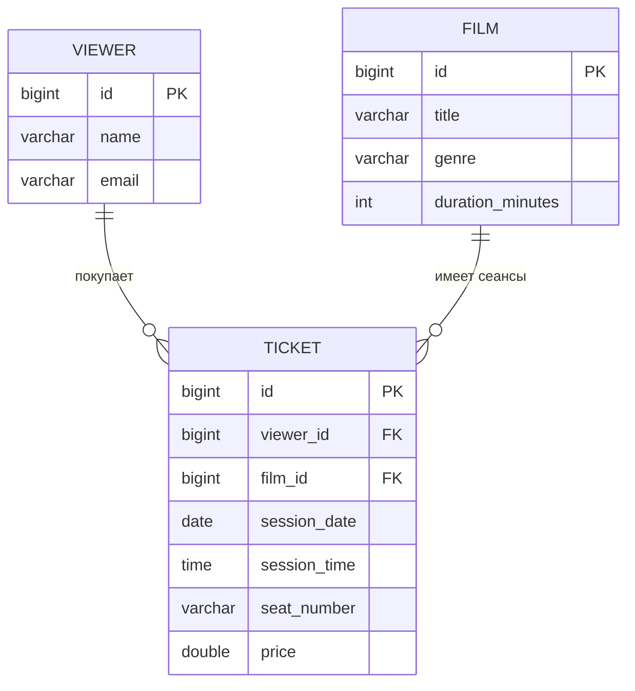

# Лабораторная работа №2: Spring Data JPA + PostgreSQL (Кинотеатр)

## Быстрый запуск
**Требования:** Java 17+, IntelliJ IDEA, Docker Desktop.

### 1. Запуск базы данных
В терминале в корне проекта выполните:
```bash
docker compose up -d
```
Дождитесь статуса Up для контейнеров postgres и pgadmin.
### 2. Запуск приложения
Откройте проект в IntelliJ IDEA, дождитесь загрузки зависимостей Maven и запустите класс Lab2Application.java
### 3. Проверка
В консоли должно появиться:
Started Lab2Application in ... seconds
✅ Тестовые данные успешно добавлены в БД!
### 4. Остановка
```bash
docker compose down
```
---
## Описание проекта
Проект демонстрирует работу с реляционной базой данных PostgreSQL через Spring Data JPA в рамках предметной области «Кинотеатр».
Реализована система бронирования билетов, включающая связь One-to-Many между сущностями:
- Film (Фильм): один фильм может иметь много билетов.
- Viewer (Зритель): один зритель может купить много билетов.
- Ticket (Билет): связующая сущность, которая ассоциирует зрителя с конкретным фильмом, датой и местом.
###  Что реализовано:
-  Подключение PostgreSQL через Docker
- Создание сущностей с аннотациями JPA
- Репозитории для работы с БД
- Автоматическое создание таблиц при запуске
- Наполнение БД тестовыми данными
- Визуальное управление через pgAdmin
  #### Техническая часть
 - Инфраструктура (Docker): Развертывание PostgreSQL и pgAdmin в изолированном окружении через docker-compose.
 -  ORM-маппинг (JPA): Настройка Hibernate для автоматического создания таблиц (ddl-auto=update) и связи Java-классов со структурой БД.
 -  Типизация данных: Корректное маппинг Java-типов (LocalDate, LocalTime, Double) на типы данных PostgreSQL (DATE, TIME, DOUBLE PRECISION).
 -  Аналитика (JPQL): Реализация кастомного запроса в репозитории для группировки и поиска дня с максимальной посещаемостью конкретного фильма.
  #### Бизнес-логика (Домен «Кинотеатр»)
  Сущности:
- Film (Фильм): название, жанр, длительность.
- Viewer (Зритель): имя, уникальный email.
- Ticket (Билет): место, цена, дата и время сеанса.

Связи:
-  One-to-Many: Один фильм может иметь много билетов.
-  One-to-Many: Один зритель может купить много билетов.
- Целостность данных: Настройка каскадных операций (cascade = ALL) и автоудаления сирот (orphanRemoval = true) — билет удаляется автоматически при удалении зрителя или фильма.
- Инициализация (Data Seeding): Автоматическое наполнение базы тестовыми сеансами и зрителями при старте приложения через CommandLineRunner.
- Управление: Возможность просмотра и редактирования данных через веб-интерфейс pgAdmin.
---

## Используемые технологии

| Технология | Версия | Назначение |
|------------|--------|------------|
| Java | 17/25 | Язык программирования |
| Spring Boot | 3.2.4 | Фреймворк |
| Spring Data JPA | - | Работа с БД |
| Hibernate | 6.4.4 | ORM |
| PostgreSQL | latest | База данных |
| Docker Compose | - | Контейнеризация |
| Maven | - | Сборка проекта |

---

## Структура проекта

```text
lab2_rovnyagin/
├── src/main/java/ru/hse/lab2/
│   ├── Lab2Application.java        # Точка входа
│   ├── DataInitializer.java        # Заполнение БД данными
│   ├── entity/
│   │   ├── Film.java               # Сущность "Фильм"
│   │   ├── Viewer.java             # Сущность "Зритель"
│   │   └── Ticket.java             # Сущность "Билет" (связка)
│   └── repository/
│       ├── FilmRepository.java     # CRUD для фильмов
│       ├── ViewerRepository.java   # CRUD для зрителей
│       └── TicketRepository.java   # CRUD + аналитические запросы
├── src/main/resources/
│   └── application.properties      # Конфигурация
├── docker-compose.yml              # Инфраструктура (Postgres + pgAdmin)
└── README.md                       # Этот файл
```

## Структура базы данных

При первом запуске приложения Hibernate автоматически генерирует DDL-скрипты и создаёт таблицы на основе JPA-аннотаций в классах `Viewer`, `Film` и `Ticket`.

### Таблица `viewers`

| Поле | Тип данных | Ограничения | Описание |
|------|------------|-------------|----------|
| `id` | `BIGSERIAL` | `PRIMARY KEY`, `NOT NULL` | Уникальный идентификатор (автоинкремент) |
| `name` | `VARCHAR(255)` | `NOT NULL` | Имя зрителя |
| `email` | `VARCHAR(255)` | `UNIQUE`, `NOT NULL` | Адрес электронной почты |

### Таблица `films`

| Поле | Тип данных | Ограничения | Описание |
|------|------------|-------------|----------|
| `id` | `BIGSERIAL` | `PRIMARY KEY`, `NOT NULL` | Уникальный идентификатор (автоинкремент) |
| `title` | `VARCHAR(255)` | `NOT NULL` | Название фильма |
| `genre` | `VARCHAR(255)` | — | Жанр фильма |
| `duration_minutes` | `INTEGER` | — | Длительность в минутах |

### Таблица `tickets`

| Поле | Тип данных | Ограничения | Описание |
|------|------------|-------------|----------|
| `id` | `BIGSERIAL` | `PRIMARY KEY`, `NOT NULL` | Уникальный идентификатор (автоинкремент) |
| `viewer_id` | `BIGINT` | `NOT NULL`, `FOREIGN KEY` | Ссылка на `viewers.id` (владелец билета) |
| `film_id` | `BIGINT` | `NOT NULL`, `FOREIGN KEY` | Ссылка на `films.id` (фильм на сеансе) |
| `session_date` | `DATE` | `NOT NULL` | Дата сеанса |
| `session_time` | `TIME` | `NOT NULL` | Время начала сеанса |
| `seat_number` | `VARCHAR(10)` | `NOT NULL` | Номер места (напр. "A12") |
| `price` | `DOUBLE PRECISION` | — | Цена билета |
###  Схема связей
FILM (1) ───< (N) TICKET >─── (1)  VIEWER

## Полезные SQL-запросы

### Просмотр данных

**Все фильмы:**
```sql
SELECT * FROM films ORDER BY title;
```
**Все зрители:**
```sql
SELECT * FROM viewers ORDER BY name;
```
**Все билеты с информацией о фильме и зрителе:**
```sql
SELECT 
    t.id AS ticket_id,
    v.name AS viewer_name,
    f.title AS film_title,
    t.session_date,
    t.session_time,
    t.seat_number,
    t.price
FROM tickets t
JOIN viewers v ON t.viewer_id = v.id
JOIN films f ON t.film_id = f.id
ORDER BY t.session_date, t.session_time;
```
### Аналитика
**Максимальное количество зрителей на фильме за день (из задания):**
```sql
SELECT 
    f.title AS film_title,
    t.session_date,
    COUNT(t.id) AS viewer_count
FROM tickets t
JOIN films f ON t.film_id = f.id
WHERE f.title = 'Интерстеллар'
GROUP BY f.title, t.session_date
ORDER BY viewer_count DESC
LIMIT 1;
```
**Количество билетов по каждому фильму:**
```sql
SELECT 
    f.title AS film_title,
    COUNT(t.id) AS tickets_sold,
    SUM(t.price) AS total_revenue
FROM films f
LEFT JOIN tickets t ON f.id = t.film_id
GROUP BY f.id, f.title
ORDER BY tickets_sold DESC;
```
**Средняя цена билета по жанрам:**
```sql
SELECT 
    f.genre,
    COUNT(t.id) AS tickets_count,
    ROUND(AVG(t.price), 2) AS avg_price
FROM films f
JOIN tickets t ON f.id = t.film_id
GROUP BY f.genre
ORDER BY avg_price DESC;
```
**Зрители, купившие больше одного билета:**
```sql
SELECT 
    v.name,
    v.email,
    COUNT(t.id) AS tickets_count
FROM viewers v
JOIN tickets t ON v.id = t.viewer_id
GROUP BY v.id, v.name, v.email
HAVING COUNT(t.id) > 1
ORDER BY tickets_count DESC;
```
### Управление данными
**Добавить нового зрителя:**
```sql
INSERT INTO viewers (name, email) 
VALUES ('Анна Смирнова', 'anna@test.ru');
```
**Удалить зрителя:**
```sql
DELETE FROM viewers WHERE id = 1;
```
**Удалить фильм:**
```sql
DELETE FROM films WHERE id = 1;
```
**Забронировать билет:**
```sql
INSERT INTO tickets (viewer_id, film_id, session_date, session_time, seat_number, price)
VALUES (1, 2, '2026-04-25', '19:00', 'C5', 500.0);
```
**Удалить все билеты на определенную дату:**
```sql
DELETE FROM tickets WHERE session_date = '2026-04-20';
```
**Обновить цену билета:**
```sql
UPDATE tickets 
SET price = 600.0 
WHERE film_id = 1 AND session_date = '2026-04-25';
```
## Локальные адреса и порты

| Адрес | Сервис | Назначение |
|-------|--------|------------|
| `http://localhost:8080` | Spring Boot | Основное приложение (веб-сервер / REST API) |
| `http://localhost:15432` | pgAdmin 4 | Веб-интерфейс для визуального управления БД |
| `localhost:5432` | PostgreSQL | База данных (используется приложением для подключения) |

### Учетные данные

**pgAdmin (доступ через браузер):**
- **Email:** `admin@admin.com`
- **Password:** `admin_password`

**PostgreSQL (для подключения из Spring Boot):**
- **Username:** `postgres`
- **Password:** `lab2_password`
- **Database:** `lab2_db`
- **Host (в приложении):** `lab2_postgres` (имя Docker-контейнера)