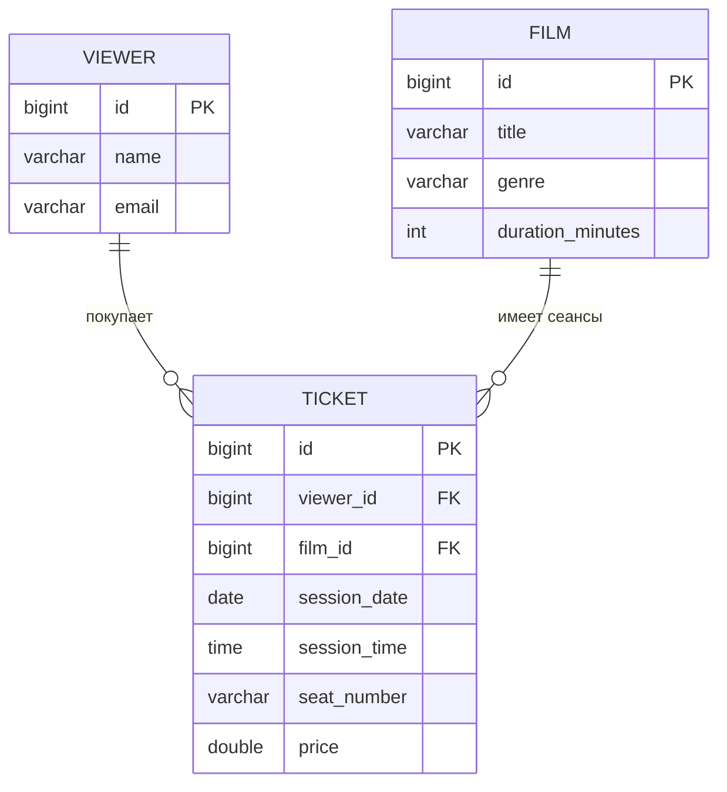

# Лабораторная работа №2: Cinema (Spring Boot + JPA + Flyway)

Проект после merge Task 02-08: REST + HTML слой, default-путь через `JPA/Flyway/PostgreSQL`, и opt-in профиль совместимости `inmemory`.

## Эндпоинты

### HTML (страницы и формы)

| Метод | Путь | Назначение |
|---|---|---|
| GET | `/` | Главная HTML-страница с навигацией по разделам. |
| GET | `/films/page` | Список фильмов в веб-интерфейсе. |
| GET | `/films/page/create` | Форма создания фильма. |
| POST | `/films/page/create` | Создание фильма из HTML-формы. |
| GET | `/viewers/page` | Список зрителей в веб-интерфейсе. |
| GET | `/viewers/page/create` | Форма создания зрителя. |
| POST | `/viewers/page/create` | Создание зрителя из HTML-формы. |
| GET | `/tickets/page` | Список билетов в веб-интерфейсе. |
| GET | `/tickets/page/create` | Форма создания билета. |
| POST | `/tickets/page/create` | Создание билета из HTML-формы. |

### REST API: Films

| Метод | Путь | Назначение |
|---|---|---|
| GET | `/api/films` | Получить список фильмов. |
| POST | `/api/films` | Создать новый фильм. |
| GET | `/api/films/{id}` | Получить фильм по идентификатору. |
| PUT | `/api/films/{id}` | Обновить фильм по идентификатору. |
| DELETE | `/api/films/{id}` | Удалить фильм по идентификатору. |

### REST API: Viewers

| Метод | Путь | Назначение |
|---|---|---|
| GET | `/api/viewers` | Получить список зрителей. |
| POST | `/api/viewers` | Создать нового зрителя. |
| GET | `/api/viewers/{id}` | Получить зрителя по идентификатору. |
| PUT | `/api/viewers/{id}` | Обновить зрителя по идентификатору. |
| DELETE | `/api/viewers/{id}` | Удалить зрителя по идентификатору. |

### REST API: Tickets

| Метод | Путь | Назначение |
|---|---|---|
| GET | `/api/tickets` | Получить список билетов. |
| POST | `/api/tickets` | Создать новый билет. |
| GET | `/api/tickets/{id}` | Получить билет по идентификатору. |
| PUT | `/api/tickets/{id}` | Обновить билет по идентификатору. |
| DELETE | `/api/tickets/{id}` | Удалить билет по идентификатору. |

### REST API: Analytics

| Метод | Путь | Назначение |
|---|---|---|
| GET | `/api/tickets/analytics/max-viewers?filmId=...` | Найти день с максимальным числом уникальных зрителей для выбранного фильма. |
| GET | `/api/tickets/analytics/top-film-by-day?date=YYYY-MM-DD` | Найти самый посещаемый фильм за указанную дату. |

## Требования

- Java 25
- Docker + Docker Compose
- Gradle Wrapper (`./gradlew`)

## Быстрый старт (default: JPA + Flyway + PostgreSQL)

1) Поднять инфраструктуру:

```bash
docker compose up -d
```

2) Запустить приложение:

```bash
./gradlew bootRun
```

3) Проверить, что приложение стартовало:

- в логах есть `Started Lab2Application`
- доступна HTML главная: `http://localhost:8080/`

4) Остановить:

```bash
docker compose down
```

## Профили запуска

### Default (без профиля)

- Используется PostgreSQL (`spring.datasource.*` в `application.properties`)
- Включены Flyway миграции (`V1`, `V2`)
- Hibernate работает в `ddl-auto=validate`

### `inmemory` (режим совместимости)

Запуск:

```bash
./gradlew bootRun --args='--spring.profiles.active=inmemory'
```

Особенности:

- отключены автоконфигурации DataSource/JPA/Flyway;
- используются in-memory store на `HashMap`;
- сохраняется поведение доменных инвариантов (включая аналитику max viewers и каскадное удаление зависимых ticket).

## API (REST)

Базовые CRUD ресурсы:

- `/api/films`
  - `GET /api/films`
  - `GET /api/films/{id}`
  - `POST /api/films`
  - `PUT /api/films/{id}`
  - `DELETE /api/films/{id}`
- `/api/viewers`
  - `GET /api/viewers`
  - `GET /api/viewers/{id}`
  - `POST /api/viewers`
  - `PUT /api/viewers/{id}`
  - `DELETE /api/viewers/{id}`
- `/api/tickets`
  - `GET /api/tickets`
  - `GET /api/tickets/{id}`
  - `POST /api/tickets`
  - `PUT /api/tickets/{id}`
  - `DELETE /api/tickets/{id}`
  - `GET /api/tickets/analytics/max-viewers?filmId={id}`
  - `GET /api/tickets/analytics/top-film-by-day?date=YYYY-MM-DD`

## HTML страницы

- `GET /` - главная страница навигации
- `GET /films/page` - список фильмов
- `GET /films/page/create` - форма создания фильма
- `GET /viewers/page` - список зрителей
- `GET /viewers/page/create` - форма создания зрителя
- `GET /tickets/page` - список билетов
- `GET /tickets/page/create` - форма создания билета

Формы создают сущности через POST:

- `POST /films/page/create`
- `POST /viewers/page/create`
- `POST /tickets/page/create`

## Миграции и БД

- SQL миграции: `src/main/resources/db/migration`
  - `V1__create_schema.sql`
  - `V2__seed_test_data.sql`
- По умолчанию Flyway применяет миграции на старте приложения.
- Таблицы домена: `films`, `viewers`, `tickets`.

## Postman

Артефакты:

- `postman/cinema-lab2.postman_collection.json`
- `postman/local.postman_environment.json`

Как запустить smoke:

1) Импортировать collection и environment в Postman.
2) Выбрать environment `Cinema LAB2 Local`.
3) Выполнить базовый сценарий: создать `film`, `viewer`, `ticket`, затем вызвать аналитику.

## Что перенесено из lab1 и что изменено

Перенесено:

- бизнес-сущности `Film/Viewer/Ticket`;
- CRUD сценарии в REST и HTML;
- прикладной сценарий аналитики max viewers.

Изменено/не перенесено намеренно:

- канонический формат id после merge: `Long` (JPA/DB identity);
- legacy UUID back-compat из lab1 не поддерживается;
- источником данных по умолчанию является PostgreSQL (не HashMap).

Подробнее по контрактам:

- `docs/merge-contract-lab1-lab2.md`
- `docs/domain-id-api-contract.md`

## Проверка и runbook

- Пошаговый runbook: `docs/RUNBOOK.md`
- Verification checklist (Task 07): `docs/verification-checklist.md`
# Лабораторная работа №2: Spring Data JPA + PostgreSQL (Кинотеатр)

## Быстрый запуск
**Требования:** Java 25, Docker Desktop (или Docker Engine + Compose), Gradle Wrapper (`./gradlew`).

### 1. Запуск базы данных
В терминале в корне проекта выполните:
```bash
docker compose up -d
```
Дождитесь статуса Up для контейнеров postgresdb и pgadmin.
### 2. Запуск приложения (Gradle)
В терминале в корне проекта выполните:
```bash
./gradlew bootRun
```
Если порт `8080` занят, запустите на альтернативном порту:
```bash
./gradlew bootRun --args='--server.port=8081'
```
Альтернатива в IntelliJ IDEA: запустите класс `Lab2Application.java` как Gradle/Spring Boot приложение.

### 2.1 Режим совместимости `inmemory` (opt-in)
По умолчанию приложение работает в режиме `JPA + Flyway + PostgreSQL`.

Для запуска режима совместимости с HashMap-данными явно включите профиль:
```bash
./gradlew bootRun --args='--spring.profiles.active=inmemory'
```

В этом профиле:
- отключаются `DataSource/JPA/Flyway` автоконфигурации;
- используются in-memory хранилища на базе `HashMap`;
- бизнес-инварианты согласованы с JPA: аналитика `/api/tickets/analytics/max-viewers` считает `DISTINCT` зрителей по дню, а удаление `Film/Viewer` каскадно удаляет связанные `Ticket`;
- поднимаются демо-данные для базовых сценариев (`films`, `viewers`, `tickets`).

### 3. Проверка запуска приложения
В консоли должно появиться:
Started Lab2Application in ... seconds
После старта Flyway автоматически применит миграции `V1` и `V2`.

Корневой URL (`http://localhost:8080/`) обслуживается `HtmlPageController` и возвращает HTML home page.
### 4. Postman: где файлы и smoke-check
Postman-артефакты лежат в директории `postman/`:
- `postman/cinema-lab2.postman_collection.json`
- `postman/local.postman_environment.json`

Быстрый smoke (после старта приложения, без ручного редактирования payload):
1. Импортируйте коллекцию и environment в Postman.
2. Выберите environment `Cinema LAB2 Local` (в нем уже есть `baseUrl` и id-переменные для типового запуска).
3. Последовательно выполните запросы:
   - `POST /api/films`
   - `POST /api/viewers`
   - `POST /api/tickets`
   - `GET /api/tickets/analytics/max-viewers?filmId=...`
4. Убедитесь, что первые 3 запроса возвращают `201`, аналитика — `200`.

### 5. Остановка
```bash
docker compose down
```
---
## Описание проекта
Проект демонстрирует работу с реляционной базой данных PostgreSQL через Spring Data JPA в рамках предметной области «Кинотеатр».
Реализована система бронирования билетов, включающая связь One-to-Many между сущностями:
- Film (Фильм): один фильм может иметь много билетов.
- Viewer (Зритель): один зритель может купить много билетов.
- Ticket (Билет): связующая сущность, которая ассоциирует зрителя с конкретным фильмом, датой и местом.

### Шаблонный проект (референс)
Текущая реализация повторяет структуру и ключевые практики шаблонного проекта из Bitbucket (ветка со Spring Data JPA + PostgreSQL), но в доменной области «Кинотеатр».
Краткое соответствие «в шаблоне -> в этом проекте»:
- JPA-сущности и таблицы -> `Film`, `Viewer`, `Ticket`; таблицы `films`, `viewers`, `tickets` создаются Flyway-миграцией `V1__create_schema.sql`.
- Связи One-to-Many / Many-to-One -> `Film 1:N Ticket` и `Viewer 1:N Ticket` через `@OneToMany` и `@ManyToOne`.
- Репозитории Spring Data -> отдельные `FilmRepository`, `ViewerRepository`, `TicketRepository` (на базе `JpaRepository`).
- Кастомный JPQL-запрос -> аналитический запрос в `TicketRepository` для поиска дня с максимальным числом зрителей по фильму.
- Инициализация схемы и тестовых данных -> Flyway-миграции (`V1__create_schema.sql`, `V2__seed_test_data.sql`) применяются при старте.
- PostgreSQL-конфигурация -> подключение к PostgreSQL (Docker Compose) и настройки в `application.properties` вместо in-memory БД.
Ссылка на шаблон (ветка `feature/spring-boot-data-jpa`): https://bitbucket.org/zil-courses/hl-module1/src/feature/spring-boot-data-jpa/
###  Что реализовано:
-  Подключение PostgreSQL через Docker
- Создание сущностей с аннотациями JPA
- Репозитории для работы с БД
- Создание схемы БД через Flyway-миграции
- Наполнение БД тестовыми данными через Flyway-миграции
- Визуальное управление через pgAdmin
  #### Техническая часть
 - Инфраструктура (Docker): Развертывание PostgreSQL и pgAdmin в изолированном окружении через docker-compose.
 -  ORM-маппинг (JPA): Hibernate работает в режиме валидации схемы (`ddl-auto=validate`), а создание структуры и сидирование выполняет Flyway.
 -  Типизация данных: Корректное маппинг Java-типов (LocalDate, LocalTime, Double) на типы данных PostgreSQL (DATE, TIME, DOUBLE PRECISION).
 -  Аналитика (JPQL): Реализация кастомного запроса в репозитории для группировки и поиска дня с максимальной посещаемостью конкретного фильма.
  #### Бизнес-логика (Домен «Кинотеатр»)
  Сущности:
- Film (Фильм): название, жанр, длительность.
- Viewer (Зритель): имя, уникальный email.
- Ticket (Билет): место, цена, дата и время сеанса.

Связи:
-  One-to-Many: Один фильм может иметь много билетов.
-  One-to-Many: Один зритель может купить много билетов.
- Целостность данных: Настройка каскадных операций (cascade = ALL) и автоудаления сирот (orphanRemoval = true) — билет удаляется автоматически при удалении зрителя или фильма.
- Инициализация (Data Seeding): Автоматическое наполнение базы тестовыми сеансами и зрителями через Flyway-миграции (`V2__seed_test_data.sql`).
- Управление: Возможность просмотра и редактирования данных через веб-интерфейс pgAdmin.
---

## Используемые технологии

| Технология | Версия | Назначение |
|------------|--------|------------|
| Java | 25 | Язык программирования |
| Spring Boot | 4.0.3 | Фреймворк |
| Spring Data JPA | - | Работа с БД |
| Hibernate | управляется Spring Boot 4.0.3 | ORM |
| PostgreSQL | latest | База данных |
| Docker Compose | - | Контейнеризация |
| Gradle | wrapper | Сборка и запуск проекта |

---

## Структура проекта

```text
lab2_rovnyagin/
├── src/main/java/ru/hse/lab2/
│   ├── Lab2Application.java        # Точка входа
│   ├── entity/
│   │   ├── Film.java               # Сущность "Фильм"
│   │   ├── Viewer.java             # Сущность "Зритель"
│   │   └── Ticket.java             # Сущность "Билет" (связка)
│   └── repository/
│       ├── FilmRepository.java     # CRUD для фильмов
│       ├── ViewerRepository.java   # CRUD для зрителей
│       └── TicketRepository.java   # CRUD + аналитические запросы
├── src/main/resources/
│   ├── application.properties      # Конфигурация
│   └── db/migration/               # Flyway-миграции (V1, V2)
├── docker-compose.yml              # Инфраструктура (Postgres + pgAdmin)
└── README.md                       # Этот файл
```

## Структура базы данных

При первом запуске Flyway применяет SQL-миграции из `src/main/resources/db/migration`:
- `V1__create_schema.sql` — создание структуры БД;
- `V2__seed_test_data.sql` — тестовые данные.

Таблицы создаются Flyway (SQL-скриптами), а не Hibernate. Hibernate работает в режиме валидации схемы (`spring.jpa.hibernate.ddl-auto=validate`).

### Проверка Flyway
Подключитесь к PostgreSQL и выполните:
```sql
SELECT installed_rank, version, description, success
FROM flyway_schema_history
ORDER BY installed_rank;
```
Ожидаемо должны присутствовать успешные записи для версий `1` и `2`.

### Таблица `viewers`

| Поле | Тип данных | Ограничения | Описание |
|------|------------|-------------|----------|
| `id` | `BIGSERIAL` | `PRIMARY KEY`, `NOT NULL` | Уникальный идентификатор (автоинкремент) |
| `name` | `VARCHAR(255)` | `NOT NULL` | Имя зрителя |
| `email` | `VARCHAR(255)` | `UNIQUE`, `NOT NULL` | Адрес электронной почты |

### Таблица `films`

| Поле | Тип данных | Ограничения | Описание |
|------|------------|-------------|----------|
| `id` | `BIGSERIAL` | `PRIMARY KEY`, `NOT NULL` | Уникальный идентификатор (автоинкремент) |
| `title` | `VARCHAR(255)` | `NOT NULL` | Название фильма |
| `genre` | `VARCHAR(255)` | — | Жанр фильма |
| `duration_minutes` | `INTEGER` | — | Длительность в минутах |

### Таблица `tickets`

| Поле | Тип данных | Ограничения | Описание |
|------|------------|-------------|----------|
| `id` | `BIGSERIAL` | `PRIMARY KEY`, `NOT NULL` | Уникальный идентификатор (автоинкремент) |
| `viewer_id` | `BIGINT` | `NOT NULL`, `FOREIGN KEY` | Ссылка на `viewers.id` (владелец билета) |
| `film_id` | `BIGINT` | `NOT NULL`, `FOREIGN KEY` | Ссылка на `films.id` (фильм на сеансе) |
| `session_date` | `DATE` | `NOT NULL` | Дата сеанса |
| `session_time` | `TIME` | `NOT NULL` | Время начала сеанса |
| `seat_number` | `VARCHAR(255)` | `NOT NULL` | Номер места (напр. "A12") |
| `price` | `DOUBLE PRECISION` | — | Цена билета |
###  Схема связей
FILM (1) ───< (N) TICKET >─── (1)  VIEWER

## Полезные SQL-запросы

### Просмотр данных

**Все фильмы:**
```sql
SELECT * FROM films ORDER BY title;
```
**Все зрители:**
```sql
SELECT * FROM viewers ORDER BY name;
```
**Все билеты с информацией о фильме и зрителе:**
```sql
SELECT 
    t.id AS ticket_id,
    v.name AS viewer_name,
    f.title AS film_title,
    t.session_date,
    t.session_time,
    t.seat_number,
    t.price
FROM tickets t
JOIN viewers v ON t.viewer_id = v.id
JOIN films f ON t.film_id = f.id
ORDER BY t.session_date, t.session_time;
```
### Аналитика
**Максимальное количество зрителей на фильме за день (из задания):**
Считаются уникальные зрители за день (эквивалент бизнес-логики max viewers).
```sql
SELECT 
    f.title AS film_title,
    t.session_date,
    COUNT(DISTINCT t.viewer_id) AS viewer_count
FROM tickets t
JOIN films f ON t.film_id = f.id
WHERE t.film_id = :filmId -- placeholder: подставьте filmId из API-контракта
GROUP BY f.title, t.session_date
ORDER BY viewer_count DESC, t.session_date ASC
LIMIT 1;
```
**Количество билетов по каждому фильму:**
```sql
SELECT 
    f.title AS film_title,
    COUNT(t.id) AS tickets_sold,
    SUM(t.price) AS total_revenue
FROM films f
LEFT JOIN tickets t ON f.id = t.film_id
GROUP BY f.id, f.title
ORDER BY tickets_sold DESC;
```
**Средняя цена билета по жанрам:**
```sql
SELECT 
    f.genre,
    COUNT(t.id) AS tickets_count,
    ROUND(AVG(t.price), 2) AS avg_price
FROM films f
JOIN tickets t ON f.id = t.film_id
GROUP BY f.genre
ORDER BY avg_price DESC;
```
**Зрители, купившие больше одного билета:**
```sql
SELECT 
    v.name,
    v.email,
    COUNT(t.id) AS tickets_count
FROM viewers v
JOIN tickets t ON v.id = t.viewer_id
GROUP BY v.id, v.name, v.email
HAVING COUNT(t.id) > 1
ORDER BY tickets_count DESC;
```
### Управление данными
**Добавить нового зрителя:**
```sql
INSERT INTO viewers (name, email) 
VALUES ('Анна Смирнова', 'anna@test.ru');
```
**Удалить зрителя:**
```sql
DELETE FROM viewers WHERE id = 1;
```
**Удалить фильм:**
```sql
DELETE FROM films WHERE id = 1;
```
**Забронировать билет:**
```sql
INSERT INTO tickets (viewer_id, film_id, session_date, session_time, seat_number, price)
VALUES (1, 2, '2026-04-25', '19:00', 'C5', 500.0);
```
**Удалить все билеты на определенную дату:**
```sql
DELETE FROM tickets WHERE session_date = '2026-04-20';
```
**Обновить цену билета:**
```sql
UPDATE tickets 
SET price = 600.0 
WHERE film_id = 1 AND session_date = '2026-04-25';
```
## Локальные адреса и порты

| Адрес | Сервис | Назначение |
|-------|--------|------------|
| `http://localhost:8080` | Spring Boot | Основное приложение (веб-сервер / REST API) |
| `http://localhost:15432` | pgAdmin 4 | Веб-интерфейс для визуального управления БД |
| `localhost:5432` | PostgreSQL | База данных (используется приложением для подключения) |

### Учетные данные

**pgAdmin (доступ через браузер):**
- **Email:** `admin@admin.com`
- **Password:** `admin_password`

**PostgreSQL (для приложения Spring Boot):**
- **Username:** `postgres`
- **Password:** `lab2_password`
- **Database:** `lab2_db`
- **Host:** `localhost`
- **Port:** `5432`

**PostgreSQL (для добавления сервера в pgAdmin):**
- **Host name/address:** `postgresdb` (имя сервиса в `docker-compose.yml`)
- **Port:** `5432`
- **Maintenance DB:** `lab2_db`
- **Username:** `postgres`
- **Password:** `lab2_password`