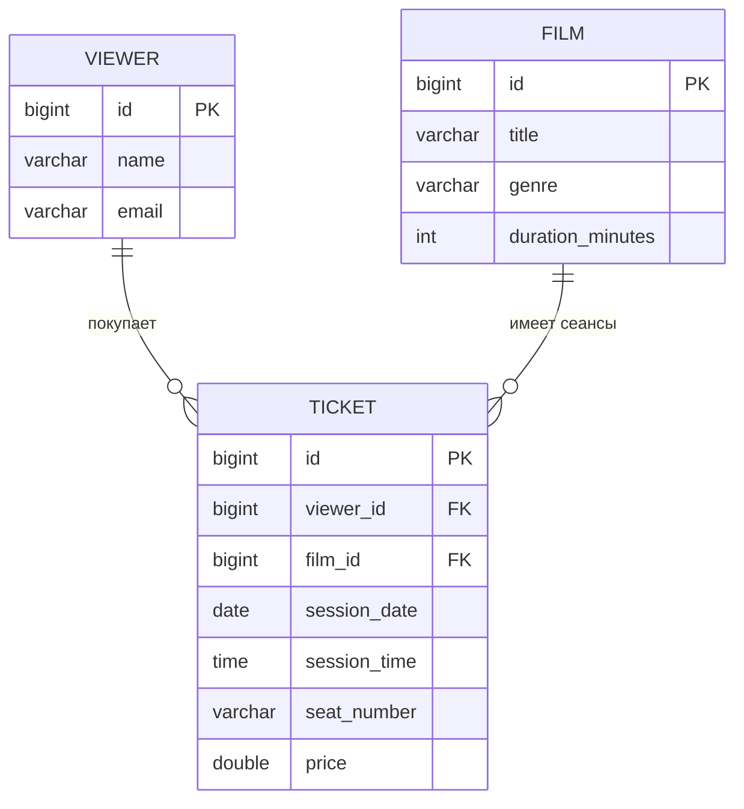

# Лабораторная работа №5: «Кинотеатр» (Cinema)

Учебный проект: **Spring Boot 4**, **Spring Data JPA**, **PostgreSQL**, **Flyway**, **Docker Compose** (приложение, БД, **pgAdmin**). Предметная область — бронирование билетов (**Film**, **Viewer**, **Ticket**): REST API, HTML-формы, аналитика по билетам. Опциональный профиль **`inmemory`** (без БД).

**Фокус лаб. 5:** подготовка данных перед нагрузочными тестами — эндпоинты **`DELETE /api/admin/clear/*`**, Python-скрипт **`tools/seed_rest_data.py`** (`requests` + **Faker**), обёртка **`tools/run-seed.sh`**. Ранее по курсу в том же репозитории: контейнеризация и миграции (**лаб. 3**), сценарии **[k6](https://k6.io/)** (**лаб. 4**).

**Фокус лаб. 6** (см. **`ТЗ_6лаба.txt`**): развёртывание на учебной ВМ, образ приложения в **Docker Hub** (**`docker compose push` / `pull`**), **лимиты CPU/RAM** сервиса `app` в Compose, **переменные окружения** для JDBC и Tomcat (`server.tomcat.threads.max`), отключение **`spring.jpa.show-sql`**, доступ через **SSH-туннель**, нагрузочные прогоны **k6 с постоянными VU** и соотношениями POST/GET **5/95, 50/50, 95/5** для графиков «время отклика vs число CPU».

**Навигация:** ниже по порядку — таблицы **эндпоинтов** (в т.ч. **OpenAPI / Swagger**), **требования**, **быстрый старт** (Docker), **обновление контейнера после правок кода**, **профили**, **миграции**, **структура проекта**, **скрипты Bash** (подробно), **лаб. 6** (шпаргалка **`docs/lab6-one-pager.md`**, отчёт **`docs/lab6-report-png_k6.md`**, «**с нуля**», **если всё забыли**, соответствие ТЗ, **как сдать преподавателю**, файлы, **порты**, **переменные**, SSH, k6), **лаб. 5** (сидирование), **лаб. 4** (k6), описание проекта, **SQL**, прочие **порты** в конце.

## Эндпоинты

### OpenAPI / Swagger UI (документация REST)

Подключён **SpringDoc OpenAPI 3** (`springdoc-openapi-starter-webmvc-ui`). В спецификацию попадают только пути **`/api/**`** (HTML-страницы и служебные пути в Swagger не дублируются).

| Метод | Путь | Назначение |
|---|---|---|
| GET | `/v3/api-docs` | OpenAPI 3 в формате JSON. |
| GET | `/swagger-ui.html` | Интерактивная документация и **Try it out** для REST. |

На главной HTML-странице (`GET /`) в навигации есть ссылка **Swagger UI**. **Один порт** (по умолчанию **8080**) обслуживает и веб-страницы, и REST, и Swagger — это нормальная схема для Spring Boot.

**Важно:** глобальный обработчик ошибок приложения настроен только на контроллеры пакета `ru.hse.lab2.controller`, чтобы не маскировать сбои SpringDoc ответом «Unexpected server error».

### HTML (страницы и формы)

| Метод | Путь | Назначение |
|---|---|---|
| GET | `/` | Главная HTML-страница с навигацией по разделам. |
| GET | `/films/page` | Список фильмов в веб-интерфейсе. |
| GET | `/films/page/create` | Форма создания фильма. |
| POST | `/films/page/create` | Создание фильма из HTML-формы. |
| GET | `/viewers/page` | Список зрителей в веб-интерфейсе. |
| GET | `/viewers/page/create` | Форма создания зрителя. |
| POST | `/viewers/page/create` | Создание зрителя из HTML-формы. |
| GET | `/tickets/page` | Список билетов в веб-интерфейсе. |
| GET | `/tickets/page/create` | Форма создания билета. |
| POST | `/tickets/page/create` | Создание билета из HTML-формы. |

### REST API: Films

| Метод | Путь | Назначение |
|---|---|---|
| GET | `/api/films` | Получить список фильмов. |
| POST | `/api/films` | Создать новый фильм. |
| GET | `/api/films/{id}` | Получить фильм по идентификатору. |
| PUT | `/api/films/{id}` | Обновить фильм по идентификатору. |
| DELETE | `/api/films/{id}` | Удалить фильм по идентификатору. |

### REST API: Viewers

| Метод | Путь | Назначение |
|---|---|---|
| GET | `/api/viewers` | Получить список зрителей. |
| POST | `/api/viewers` | Создать нового зрителя. |
| GET | `/api/viewers/{id}` | Получить зрителя по идентификатору. |
| PUT | `/api/viewers/{id}` | Обновить зрителя по идентификатору. |
| DELETE | `/api/viewers/{id}` | Удалить зрителя по идентификатору. |

### REST API: Tickets

| Метод | Путь | Назначение |
|---|---|---|
| GET | `/api/tickets` | Получить список билетов. |
| POST | `/api/tickets` | Создать новый билет. |
| GET | `/api/tickets/{id}` | Получить билет по идентификатору. |
| PUT | `/api/tickets/{id}` | Обновить билет по идентификатору. |
| DELETE | `/api/tickets/{id}` | Удалить билет по идентификатору. |

### REST API: Analytics

| Метод | Путь | Назначение |
|---|---|---|
| GET | `/api/tickets/analytics/max-viewers?filmId=...` | Найти день с максимальным числом уникальных зрителей для выбранного фильма. |
| GET | `/api/tickets/analytics/top-film-by-day?date=YYYY-MM-DD` | Найти самый посещаемый фильм за указанную дату. |

### REST API: администрирование (очистка таблиц; только БД, профиль не `inmemory`)

| Метод | Путь | Назначение |
|---|---|---|
| DELETE | `/api/admin/clear/tickets` | Очистить таблицу `tickets` (`TRUNCATE … RESTART IDENTITY CASCADE`). |
| DELETE | `/api/admin/clear/films` | Удалить билеты и фильмы. |
| DELETE | `/api/admin/clear/viewers` | Удалить билеты и зрителей. |
| DELETE | `/api/admin/clear/all` | Очистить `tickets`, `films`, `viewers`. |

Ответы: **204 No Content**. В учебном стенде без авторизации; в реальном проекте такие операции нужно защищать.

## Требования

- Java 25
- Docker + Docker Compose
- Gradle Wrapper (`./gradlew`)
- **Лаб. 4:** [k6](https://k6.io/docs/get-started/installation/) (или Docker-образ `grafana/k6`), Python 3 + `matplotlib` для графика: `pip install "matplotlib>=3.7"`
- **Лаб. 5:** Python 3.10+; зависимости сидера — `pip install -r tools/requirements-seed.txt` **или** запуск **`./tools/run-seed.sh`** (на Linux при ограничении системного `pip`, PEP 668, скрипт создаёт **`tools/.venv`** и ставит пакеты туда)

## Быстрый старт: Docker Compose

1) Поднять **весь стек** (PostgreSQL + приложение + pgAdmin).

- **Первый раз / локальная разработка:** собрать приложение и поднять всё:
  ```bash
  docker compose up -d --build
  ```
- **Сервер + образ уже в Docker Hub:** подтянуть только приложение и поднять стек:
  ```bash
  docker compose pull app
  docker compose up -d
  ```

Подробнее про **push/pull** образа **`app`** — в разделе **«Лабораторная работа №6»**, подпункт **Docker Hub**.

2) Проверить приложение:

- в логах: `docker compose logs -f app` — должно быть `Started Lab2Application`;
- в браузере: `http://localhost:8080/` (HTML), `http://localhost:8080/swagger-ui.html` (Swagger), `http://localhost:8080/v3/api-docs` (JSON OpenAPI), например `http://localhost:8080/api/films` (REST).

3) Остановить:

```bash
docker compose down
```

Полный сброс данных БД (миграции Flyway с нуля при следующем старте):

```bash
docker compose down -v
```

**Вариант для разработки на хосте:** сервис **`app` в Docker и `./gradlew bootRun` на хосте не могут одновременно слушать один и тот же порт 8080.** Либо остановите контейнер приложения (`docker stop lab2_app`), либо поднимите локальный запуск на другом порту: `SERVER_PORT=8081 ./gradlew bootRun`. Подробнее — в **«Подробный runbook»**, п. 2.

## Обновление приложения в Docker (после правок Java / HTML в контроллерах)

Имя образа задаётся **`DOCKER_IMAGE_APP`** (см. **`.env`**). Внутри контейнера **`lab2_app`** выполняется собранный **`app.jar`**. Пока не подтянут **новый** образ и не пересоздан контейнер, в браузере будет старая версия.

**Вариант A — Docker Hub (как на учебном сервере):** на машине с исходниками после правок:

```bash
docker compose build app
docker compose push app
```

На сервере:

```bash
docker compose pull app
docker compose up -d --force-recreate app
```

**Вариант B — только локально, без Hub:**

```bash
docker compose up -d --build --force-recreate app
```

Полная пересборка без кэша: **`docker compose build --no-cache app`** (затем **`push`** или **`up`**).

**Проверка, что отдаётся новая главная** (плашка с пояснением про порт в текущей версии кода отсутствует):

```bash
curl -s http://localhost:8080/ | grep -i 'Почему сайт' || echo "OK: старого текста нет"
```

## Профили запуска

### Default (без профиля)

- Используется PostgreSQL (`spring.datasource.*` в `application.properties`, URL на `localhost` при запуске с хоста)
- Включены Flyway-миграции **`V1`** (DDL) и **`V2`** (стартовые тестовые строки)
- Hibernate работает в `ddl-auto=validate`

### `docker` (запуск приложения в контейнере)

- Включается переменной `SPRING_PROFILES_ACTIVE=docker` в сервисе `app` в `docker-compose.yml`
- В `application-docker.properties` задан JDBC URL на хост БД в сети Compose: `jdbc:postgresql://postgresdb:5432/lab2_db` (логин/пароль те же, что в основном `application.properties`)

### `inmemory` (режим совместимости)

Запуск:

```bash
./gradlew bootRun --args='--spring.profiles.active=inmemory'
```

Особенности:

- отключены автоконфигурации DataSource/JPA/Flyway;
- используются in-memory store на `HashMap`;
- сохраняется поведение доменных инвариантов (включая аналитику max viewers и каскадное удаление зависимых ticket).

## API (REST)

Базовые CRUD ресурсы:

- `/api/films`
  - `GET /api/films`
  - `GET /api/films/{id}`
  - `POST /api/films`
  - `PUT /api/films/{id}`
  - `DELETE /api/films/{id}`
- `/api/viewers`
  - `GET /api/viewers`
  - `GET /api/viewers/{id}`
  - `POST /api/viewers`
  - `PUT /api/viewers/{id}`
  - `DELETE /api/viewers/{id}`
- `/api/tickets`
  - `GET /api/tickets`
  - `GET /api/tickets/{id}`
  - `POST /api/tickets`
  - `PUT /api/tickets/{id}`
  - `DELETE /api/tickets/{id}`
  - `GET /api/tickets/analytics/max-viewers?filmId={id}`
  - `GET /api/tickets/analytics/top-film-by-day?date=YYYY-MM-DD`

## HTML страницы

- `GET /` - главная страница навигации
- `GET /films/page` - список фильмов
- `GET /films/page/create` - форма создания фильма
- `GET /viewers/page` - список зрителей
- `GET /viewers/page/create` - форма создания зрителя
- `GET /tickets/page` - список билетов
- `GET /tickets/page/create` - форма создания билета

Формы создают сущности через POST:

- `POST /films/page/create`
- `POST /viewers/page/create`
- `POST /tickets/page/create`

## Миграции и БД

Схема и небольшой стартовый набор строк задаются **Flyway** при старте приложения; массовое наполнение перед k6 — через **`tools/`** (лаб. 5).

- Каталог: `src/main/resources/db/migration`
  - `V1__create_schema.sql` — **DDL** (создание таблиц `viewers`, `films`, `tickets`, ключи и ограничения)
  - `V2__seed_test_data.sql` — **DML** (небольшой набор `INSERT` и `setval` для последовательностей)
- Для **большого** объёма данных перед k6 можно дополнительно использовать `tools/seed_rest_data.py` (см. **лаб. 5**): он вызывает `DELETE /api/admin/clear/...` и создаёт сущности через REST.
- Flyway применяет скрипты при старте приложения (в контейнере или при `./gradlew bootRun`).
- Таблицы домена: `films`, `viewers`, `tickets`.

## Postman

Артефакты:

- `postman/cinema-lab2.postman_collection.json`
- `postman/local.postman_environment.json`

Как запустить smoke:

1) Импортировать collection и environment в Postman.
2) Выбрать environment `Cinema LAB2 Local`.
3) Выполнить базовый сценарий: создать `film`, `viewer`, `ticket`, затем вызвать аналитику.

## Что перенесено из lab1 и что изменено

Перенесено:

- бизнес-сущности `Film/Viewer/Ticket`;
- CRUD сценарии в REST и HTML;
- прикладной сценарий аналитики max viewers.

Изменено/не перенесено намеренно:

- канонический формат id после merge: `Long` (JPA/DB identity);
- legacy UUID back-compat из lab1 не поддерживается;
- источником данных по умолчанию является PostgreSQL (не HashMap).

Подробнее по контрактам:

- `docs/merge-contract-lab1-lab2.md`
- `docs/domain-id-api-contract.md`

## Проверка и runbook

- Пошаговый runbook: `docs/RUNBOOK.md`
- Verification checklist (Task 07): `docs/verification-checklist.md`

## Подробный runbook

**Требования:** Java 25, Docker Desktop (или Docker Engine + Compose), Gradle Wrapper (`./gradlew`).

### 1. Полный стенд: БД + приложение + pgAdmin в Compose

В корне проекта:

```bash
docker compose up -d --build
```

После изменения кода: **локально** — `docker compose up -d --build --force-recreate app`; **через Hub** — `docker compose build app && docker compose push app`, на сервере — `docker compose pull app && docker compose up -d --force-recreate app`.

Дождитесь **Healthy** у `postgresdb` и успешного старта контейнера приложения (`docker compose ps`, `docker compose logs app`).

### 2. Запуск приложения на хосте при БД в Docker

Поднимите **только инфраструктуру**, если не хотите конфликт порта **8080** с контейнером `lab2_app`:

```bash
docker compose up -d postgresdb pgadmin
```

Либо поднимите всё, но тогда **остановите** приложение в Docker перед локальным запуском:

```bash
docker stop lab2_app
./gradlew bootRun
```

Если **`lab2_app` запущен** на `8080`, `bootRun` завершится с ошибкой *Port 8080 was already in use*. Варианты: остановить контейнер (см. выше) или запустить локально на другом порту:

```bash
SERVER_PORT=8081 ./gradlew bootRun
```

или:

```bash
./gradlew bootRun --args='--server.port=8081'
```

Альтернатива в IntelliJ IDEA: переменная окружения **`SERVER_PORT=8081`** в Run Configuration или аргумент **`--server.port=8081`**, если Docker держит **8080**.

### 2.1 Режим совместимости `inmemory` (opt-in)
По умолчанию приложение работает в режиме `JPA + Flyway + PostgreSQL`.

Для запуска режима совместимости с HashMap-данными явно включите профиль:
```bash
./gradlew bootRun --args='--spring.profiles.active=inmemory'
```

В этом профиле:
- отключаются `DataSource/JPA/Flyway` автоконфигурации;
- используются in-memory хранилища на базе `HashMap`;
- бизнес-инварианты согласованы с JPA: аналитика `/api/tickets/analytics/max-viewers` считает `DISTINCT` зрителей по дню, а удаление `Film/Viewer` каскадно удаляет связанные `Ticket`;
- поднимаются демо-данные для базовых сценариев (`films`, `viewers`, `tickets`).

### 3. Проверка запуска приложения

В логах контейнера `app` или консоли `bootRun` должно быть: `Started Lab2Application in ... seconds`. После старта Flyway применит миграции `V1` и `V2`.

Корневой URL (`http://localhost:8080/`, если порт не меняли) обслуживается `HtmlPageController` и возвращает HTML home page. Документация REST: **`/swagger-ui.html`**, **`/v3/api-docs`**.

### 4. Postman: где файлы и smoke-check
Postman-артефакты лежат в директории `postman/`:
- `postman/cinema-lab2.postman_collection.json`
- `postman/local.postman_environment.json`

Быстрый smoke (после старта приложения, без ручного редактирования payload):
1. Импортируйте коллекцию и environment в Postman.
2. Выберите environment `Cinema LAB2 Local` (в нем уже есть `baseUrl` и id-переменные для типового запуска).
3. Последовательно выполните запросы:
   - `POST /api/films`
   - `POST /api/viewers`
   - `POST /api/tickets`
   - `GET /api/tickets/analytics/max-viewers?filmId=...`
4. Убедитесь, что первые 3 запроса возвращают `201`, аналитика — `200`.

### 5. Остановка
```bash
docker compose down
```
---
## Описание проекта
Проект демонстрирует работу с PostgreSQL через Spring Data JPA в области «Кинотеатр» и **развёртывание в Docker Compose**.
Реализована система бронирования билетов, включающая связь One-to-Many между сущностями:
- Film (Фильм): один фильм может иметь много билетов.
- Viewer (Зритель): один зритель может купить много билетов.
- Ticket (Билет): связующая сущность, которая ассоциирует зрителя с конкретным фильмом, датой и местом.

### Шаблонный проект (референс)
Текущая реализация повторяет структуру и ключевые практики шаблонного проекта из Bitbucket (ветка со Spring Data JPA + PostgreSQL), но в доменной области «Кинотеатр».
Краткое соответствие «в шаблоне -> в этом проекте»:
- JPA-сущности и таблицы -> `Film`, `Viewer`, `Ticket`; таблицы `films`, `viewers`, `tickets` создаются Flyway-миграцией `V1__create_schema.sql`.
- Связи One-to-Many / Many-to-One -> `Film 1:N Ticket` и `Viewer 1:N Ticket` через `@OneToMany` и `@ManyToOne`.
- Репозитории Spring Data -> отдельные `FilmRepository`, `ViewerRepository`, `TicketRepository` (на базе `JpaRepository`).
- Кастомный JPQL-запрос -> аналитический запрос в `TicketRepository` для поиска дня с максимальным числом зрителей по фильму.
- Инициализация схемы и базовых тестовых данных -> Flyway-миграции `V1__create_schema.sql` и `V2__seed_test_data.sql` применяются при старте; при необходимости — доп. сид **лаб. 5** (`tools/seed_rest_data.py`).
- PostgreSQL-конфигурация -> подключение к PostgreSQL (Docker Compose), в контейнере приложения — профиль `docker` и `application-docker.properties`.
- Контейнеризация (лаб. 3) -> `Dockerfile` (multi-stage, Java 25), сервис `app` в `docker-compose.yml`.
Ссылка на шаблон (ветка `feature/spring-boot-data-jpa`): https://bitbucket.org/zil-courses/hl-module1/src/feature/spring-boot-data-jpa/
###  Что реализовано:
-  Контейнеризация Spring Boot (`Dockerfile`) и запуск приложения вместе с БД в `docker compose`
-  Подключение PostgreSQL через Docker
- Создание сущностей с аннотациями JPA
- Репозитории для работы с БД
- Создание схемы БД через Flyway-миграции
- Наполнение БД тестовыми данными через Flyway (`V2`) и при необходимости через Python-скрипт (лаб. 5)
- Визуальное управление через pgAdmin
  #### Техническая часть
 - Инфраструктура (Docker): PostgreSQL, pgAdmin и приложение в одном `docker-compose.yml`; образ приложения собирается из `Dockerfile`.
 -  ORM-маппинг (JPA): Hibernate работает в режиме валидации схемы (`ddl-auto=validate`), а создание структуры и базовый сид выполняет Flyway; массовое сидирование — опционально скрипт **лаб. 5**.
 -  Типизация данных: Корректное маппинг Java-типов (LocalDate, LocalTime, Double) на типы данных PostgreSQL (DATE, TIME, DOUBLE PRECISION).
 -  Аналитика (JPQL): Реализация кастомного запроса в репозитории для группировки и поиска дня с максимальной посещаемостью конкретного фильма.
  #### Бизнес-логика (Домен «Кинотеатр»)
  Сущности:
- Film (Фильм): название, жанр, длительность.
- Viewer (Зритель): имя, уникальный email.
- Ticket (Билет): место, цена, дата и время сеанса.

Связи:
-  One-to-Many: Один фильм может иметь много билетов.
-  One-to-Many: Один зритель может купить много билетов.
- Целостность данных: Настройка каскадных операций (cascade = ALL) и автоудаления сирот (orphanRemoval = true) — билет удаляется автоматически при удалении зрителя или фильма.
- Инициализация (Data Seeding): базовый набор через Flyway `V2__seed_test_data.sql`; расширенное — через `tools/seed_rest_data.py` после `DELETE /api/admin/clear/...`.
- Управление: Возможность просмотра и редактирования данных через веб-интерфейс pgAdmin.
---

## Используемые технологии

| Технология | Версия | Назначение |
|------------|--------|------------|
| Java | 25 | Язык программирования |
| Spring Boot | 4.0.3 | Фреймворк |
| Spring Data JPA | - | Работа с БД |
| Hibernate | управляется Spring Boot 4.0.3 | ORM |
| PostgreSQL | 15-alpine (образ в compose) | База данных |
| Docker / Compose | - | Контейнеры БД, pgAdmin и приложения |
| Dockerfile | multi-stage Temurin 25 | Сборка и запуск Spring Boot в контейнере |
| Gradle | wrapper | Сборка и запуск проекта |
| SpringDoc OpenAPI | 3.x (starter webmvc-ui) | `/v3/api-docs`, Swagger UI |
| Python | 3.10+ | Сидирование: `requests`, `faker`; график k6: `matplotlib` |
| k6 | см. [документацию](https://k6.io/docs/) | Нагрузочное тестирование (лаб. 4) |

---

## Структура проекта

```text
lab2_rovnyagin/
├── Dockerfile                      # Образ приложения (multi-stage)
├── src/main/java/ru/hse/lab2/
│   ├── Lab2Application.java        # Точка входа
│   ├── config/OpenApiConfig.java   # Заголовок/описание OpenAPI для Swagger
│   ├── controller/                 # REST, HTML (`HtmlPageController`), admin clear, `GlobalExceptionHandler`
│   ├── entity/
│   │   ├── Film.java               # Сущность "Фильм"
│   │   ├── Viewer.java             # Сущность "Зритель"
│   │   └── Ticket.java             # Сущность "Билет" (связка)
│   └── repository/
│       ├── FilmRepository.java     # CRUD для фильмов
│       ├── ViewerRepository.java   # CRUD для зрителей
│       └── TicketRepository.java   # CRUD + аналитические запросы
├── src/main/resources/
│   ├── application.properties       # Конфигурация (хост: localhost), порт, `springdoc.paths-to-match=/api/**`
│   ├── application-docker.properties # URL БД для контейнера (postgresdb)
│   └── db/migration/               # Flyway: V1 DDL, V2 DML
├── docker-compose.yml # postgresdb + app + pgadmin; лаб. 6: limits, env для JDBC/Tomcat/JPA
├── .env.example        # Шаблон переменных для Compose (скопировать в .env)
├── tools/              # Лаб. 5: seed_rest_data.py, run-seed.sh, requirements-seed.txt
├── k6/                 # Лаб. 4/6: cinema-mixed.js, cinema-lab6-constant.js, run-sweep.sh, run-lab6-ratio-sweep.sh
├── scripts/            # Лаб. 6: ssh-tunnel-personal-vm.sh
└── README.md                       # Этот файл
```

## Скрипты Bash: подробное описание

В репозитории **шесть** исполняемых оболочечных скриптов (запуск из корня проекта или с указанием пути). Они **не** заменяют **`./gradlew`**: это автоматизация **Docker / k6 / SSH / сидирования**.

### `scripts/ssh-tunnel-personal-vm.sh` (лаб. 6, ТЗ п. 5)

| | |
|---|---|
| **Зачем** | Поднять на **ПК** SSH-туннель **`8080:localhost:8080`** к **персональной учебной ВМ**, чтобы открывать приложение в браузере как **`http://localhost:8080`**. |
| **Где запускать** | Только на **вашем компьютере**, не на hl03. |
| **Как** | `./scripts/ssh-tunnel-personal-vm.sh` — по умолчанию **`hl@hlssh.zil.digital`**, SSH-порт **2303**. Переопределение: **`SSH_PORT=…`**, **`SSH_USER`**, **`LOCAL_PORT`** (если 8080 занят). Доп. флаги SSH: например **`./scripts/ssh-tunnel-personal-vm.sh -N -f`** (туннель в фоне). |
| **Пока работает** | Сессия SSH должна оставаться открытой (или фоновый `ssh`). |

### `k6/run-sweep.sh` (лаб. 4)

| | |
|---|---|
| **Зачем** | Серия нагрузочных прогонов с **растущим** числом VU (**10 → 20 → 40 → 80 → 160**) по сценарию **`k6/cinema-mixed.js`**; экспорт summary JSON и опционально график **среднего времени отклика vs VU**. |
| **Где** | На машине с установленным **k6** или с Docker (см. ниже). Рабочий каталог — **`k6/`** (скрипт сам вычисляет пути). |
| **Переменные** | **`BASE_URL`** (по умолчанию `http://localhost:8080`), **`FILM_ID`**, **`POST_SHARE`**. **`USE_DOCKER_K6=1`** — запуск через контейнер **`grafana/k6`** (на Linux для API на хосте часто **`BASE_URL=http://host.docker.internal:8080`**). **`NO_CLEAN=1`** — не удалять старые **`k6/reports/*.json`**. **`NO_PLOT=1`** — не вызывать **`plot_avg_vs_vus.py`**. |
| **Результат** | Файлы **`k6/reports/summary-vus-*.json`**; при включённом графике — **`k6/reports/avg_vs_vus.png`** (через **`k6/plot_avg_vs_vus.py`**). |

### `k6/run-lab6-ratio-sweep.sh` (лаб. 6, ТЗ п. 10)

| | |
|---|---|
| **Зачем** | Три прогона подряд с **постоянными** VU и разными долями POST/GET (**5/95, 50/50, 95/5**) по сценарию **`k6/cinema-lab6-constant.js`**. |
| **Где** | Из **корня репозитория**; вызывает **`k6 run`** локально (**k6** должен быть в **`PATH`**). |
| **Переменные** | **`BASE_URL`**, **`TARGET_VUS`**, **`DURATION`**, **`FILM_ID`**. Если задан **`RESULT_CPU`** (0.5, 1.0, 1.5 или 2), после прогона JSON копируются в **`results/cpu-<метка>/`** (папка перед копированием очищается от старых **`lab6-summary-*.json`**). |
| **Результат** | **`k6/reports/lab6-summary-post05-get95-…json`** и аналогично для 50/50 и 95/5; при **`RESULT_CPU`** — дубликаты в **`results/cpu-*`**. |
| **Создаёт каталоги** | **`results/cpu-0.5`** … **`cpu-2`** для удобства дальнейшей укладки отчётов. |

### `k6/remote-k6-sync-and-run.sh` (лаб. 6)

| | |
|---|---|
| **Зачем** | Синхронизировать весь каталог **`k6/`** на **общую k6-ВМ** (**rsync** по SSH), затем **на удалённой машине** выполнить **`./k6/run-lab6-ratio-sweep.sh`**. Удобно, когда k6 установлен только на учебной «нагрузочной» машине. |
| **Где запускать** | С **ПК** или **персональной ВМ**, откуда есть **`rsync`**, **`ssh`**, **`curl`** и настроен **безпарольный SSH** на k6-хост (**`ssh-copy-id -p $K6_SSH_PORT …`**). |
| **Обязательные env** | **`K6_SSH_HOST`**, **`BASE_URL`** (URL приложения **с точки зрения k6-ВМ**, например внутренний IP), **`RESULT_CPU`**. Обычно также **`K6_SSH_PORT`** (пример **2311**), **`K6_REMOTE_DIR`** (каталог на удалёнке, напр. **`~/ermakov_k6`**). |
| **Проверки перед стартом** | **`curl`** к **`BASE_URL/`** и предупреждение по **`GET .../analytics/max-viewers?filmId=`**; наличие **`k6`** на удалённой стороне. |
| **Особенность rsync** | Локальный **`k6/reports/`** не затирает удалённый **`reports/`** (на удалёнке копятся/остаются JSON текущих прогонов по замыслу скрипта). |

### `k6/lab6-full-automation.sh` (лаб. 6, «всё в одном»)

| | |
|---|---|
| **Зачем** | На **персональной ВМ** с Docker и клоном репо: для каждого значения **`APP_CPU_LIMIT`** из списка **`LAB6_CPUS`** (по умолчанию **0.5 1.0 1.5 2**) — правка **`.env`**, **`docker compose up -d --force-recreate app`**, ожидание HTTP, вызов **`remote-k6-sync-and-run.sh`** с соответствующим **`RESULT_CPU`**, затем **один раз** забирает **`results/`** с k6-ВМ (**`scp`**) и строит PNG в **`png_k6/`** через **`plot_lab6_from_results.py`**. |
| **Требования** | Docker Compose, **curl**, **rsync**, **scp**, **python3** + **matplotlib**, SSH-ключ на k6 (**порт по умолчанию 2311**). |
| **Обязательные env** | **`K6_SSH_HOST`**, **`BASE_URL`** (доступен **с k6-ВМ**). Остальное — как у **`remote-k6-sync-and-run.sh`**. **`LOCAL_APP_URL`** — ожидание готовности приложения **на этой же ВМ** (по умолчанию **`http://127.0.0.1:8080`**). |

### `tools/run-seed.sh` (лаб. 5)

| | |
|---|---|
| **Зачем** | Обёртка над **`tools/seed_rest_data.py`**: массовое создание/очистка данных через REST (**Faker** + **requests**). |
| **Где** | Из корня репозитория; внутри при необходимости создаётся **`tools/.venv`** и ставятся зависимости из **`tools/requirements-seed.txt`**. |
| **Без аргументов** | Берёт **`BASE_URL`** (по умолчанию `http://localhost:8080`), **`ENDPOINT`** (по умолчанию **`all`**), **`COUNT`** (по умолчанию **500**). **`CLEAR=1`** — только очистка выбранного **`ENDPOINT`**. **`NO_PIP_INSTALL=1`** — не трогать pip/venv. |
| **С аргументами** | Всё передаётся в Python: **`./tools/run-seed.sh --endpoint tickets --count 100`** и т.д. |

### Вспомогательные Python-скрипты (не Bash, кратко)

| Файл | Роль |
|------|------|
| **`k6/plot_avg_vs_vus.py`** | Строит график по отчётам лаб. 4 (**`summary-vus-*.json`**). Вызывается из **`run-sweep.sh`**. |
| **`k6/plot_lab6_from_results.py`** | Строит PNG по папкам **`results/cpu-*`** (лаб. 6). |
| **`tools/seed_rest_data.py`** | Реализация сидирования; вызывается из **`run-seed.sh`**. |

## Структура базы данных

При первом запуске Flyway применяет SQL-миграции из `src/main/resources/db/migration`:
- `V1__create_schema.sql` — создание структуры БД;
- `V2__seed_test_data.sql` — небольшой набор тестовых строк.

Дополнительно большой объём данных перед k6 можно создать скриптом `tools/seed_rest_data.py` (лаб. 5).

Таблицы создаются Flyway (SQL-скриптами), а не Hibernate. Hibernate работает в режиме валидации схемы (`spring.jpa.hibernate.ddl-auto=validate`).

### Проверка Flyway
Подключитесь к PostgreSQL и выполните:
```sql
SELECT installed_rank, version, description, success
FROM flyway_schema_history
ORDER BY installed_rank;
```
Ожидаемо должны присутствовать успешные записи для версий `1` и `2`.

### Таблица `viewers`

| Поле | Тип данных | Ограничения | Описание |
|------|------------|-------------|----------|
| `id` | `BIGSERIAL` | `PRIMARY KEY`, `NOT NULL` | Уникальный идентификатор (автоинкремент) |
| `name` | `VARCHAR(255)` | `NOT NULL` | Имя зрителя |
| `email` | `VARCHAR(255)` | `UNIQUE`, `NOT NULL` | Адрес электронной почты |

### Таблица `films`

| Поле | Тип данных | Ограничения | Описание |
|------|------------|-------------|----------|
| `id` | `BIGSERIAL` | `PRIMARY KEY`, `NOT NULL` | Уникальный идентификатор (автоинкремент) |
| `title` | `VARCHAR(255)` | `NOT NULL` | Название фильма |
| `genre` | `VARCHAR(255)` | — | Жанр фильма |
| `duration_minutes` | `INTEGER` | — | Длительность в минутах |

### Таблица `tickets`

| Поле | Тип данных | Ограничения | Описание |
|------|------------|-------------|----------|
| `id` | `BIGSERIAL` | `PRIMARY KEY`, `NOT NULL` | Уникальный идентификатор (автоинкремент) |
| `viewer_id` | `BIGINT` | `NOT NULL`, `FOREIGN KEY` | Ссылка на `viewers.id` (владелец билета) |
| `film_id` | `BIGINT` | `NOT NULL`, `FOREIGN KEY` | Ссылка на `films.id` (фильм на сеансе) |
| `session_date` | `DATE` | `NOT NULL` | Дата сеанса |
| `session_time` | `TIME` | `NOT NULL` | Время начала сеанса |
| `seat_number` | `VARCHAR(255)` | `NOT NULL` | Номер места (напр. "A12") |
| `price` | `DOUBLE PRECISION` | — | Цена билета |
###  Схема связей
FILM (1) ───< (N) TICKET >─── (1)  VIEWER

## Полезные SQL-запросы

### Просмотр данных

**Все фильмы:**
```sql
SELECT * FROM films ORDER BY title;
```
**Все зрители:**
```sql
SELECT * FROM viewers ORDER BY name;
```
**Все билеты с информацией о фильме и зрителе:**
```sql
SELECT 
    t.id AS ticket_id,
    v.name AS viewer_name,
    f.title AS film_title,
    t.session_date,
    t.session_time,
    t.seat_number,
    t.price
FROM tickets t
JOIN viewers v ON t.viewer_id = v.id
JOIN films f ON t.film_id = f.id
ORDER BY t.session_date, t.session_time;
```
### Аналитика
**Максимальное количество зрителей на фильме за день (из задания):**
Считаются уникальные зрители за день (эквивалент бизнес-логики max viewers).
```sql
SELECT 
    f.title AS film_title,
    t.session_date,
    COUNT(DISTINCT t.viewer_id) AS viewer_count
FROM tickets t
JOIN films f ON t.film_id = f.id
WHERE t.film_id = :filmId -- placeholder: подставьте filmId из API-контракта
GROUP BY f.title, t.session_date
ORDER BY viewer_count DESC, t.session_date ASC
LIMIT 1;
```
**Количество билетов по каждому фильму:**
```sql
SELECT 
    f.title AS film_title,
    COUNT(t.id) AS tickets_sold,
    SUM(t.price) AS total_revenue
FROM films f
LEFT JOIN tickets t ON f.id = t.film_id
GROUP BY f.id, f.title
ORDER BY tickets_sold DESC;
```
**Средняя цена билета по жанрам:**
```sql
SELECT 
    f.genre,
    COUNT(t.id) AS tickets_count,
    ROUND(AVG(t.price), 2) AS avg_price
FROM films f
JOIN tickets t ON f.id = t.film_id
GROUP BY f.genre
ORDER BY avg_price DESC;
```
**Зрители, купившие больше одного билета:**
```sql
SELECT 
    v.name,
    v.email,
    COUNT(t.id) AS tickets_count
FROM viewers v
JOIN tickets t ON v.id = t.viewer_id
GROUP BY v.id, v.name, v.email
HAVING COUNT(t.id) > 1
ORDER BY tickets_count DESC;
```
### Управление данными
**Добавить нового зрителя:**
```sql
INSERT INTO viewers (name, email) 
VALUES ('Анна Смирнова', 'anna@test.ru');
```
**Удалить зрителя:**
```sql
DELETE FROM viewers WHERE id = 1;
```
**Удалить фильм:**
```sql
DELETE FROM films WHERE id = 1;
```
**Забронировать билет:**
```sql
INSERT INTO tickets (viewer_id, film_id, session_date, session_time, seat_number, price)
VALUES (1, 2, '2026-04-25', '19:00', 'C5', 500.0);
```
**Удалить все билеты на определенную дату:**
```sql
DELETE FROM tickets WHERE session_date = '2026-04-20';
```
**Обновить цену билета:**
```sql
UPDATE tickets 
SET price = 600.0 
WHERE film_id = 1 AND session_date = '2026-04-25';
```

## Лабораторная работа №6: ВМ, Docker, env, лимиты ресурсов, SSH, k6

Текст задания: **`ТЗ_6лаба.txt`**. Одностраничная шпаргалка (порты, команды, env, k6): **`docs/lab6-one-pager.md`**. Пример текстового отчёта по графикам **`png_k6/`** с отсылками к пунктам ТЗ: **`docs/lab6-report-png_k6.md`**. Ниже — что уже **реализовано в репозитории** и как этим пользоваться на сервере и локально.

### Быстрый запуск лаб. 6 «с нуля» (одна шпаргалка)

Ниже — минимальная цепочка «ничего не настроено → можно показать работающую лабу». Детали, порты и переменные — в следующих подразделах.

**A. Персональная ВМ (первый раз)**  
1. Подключение: `ssh -p <порт_из_таблицы> hl@hlssh.zil.digital` (пример порта **2303**).  
2. По методичке: обновление ОС, свой **`id_rsa.pub`** в **`~/.ssh/authorized_keys`**, **git**, SSH-ключ к GitHub, **`docker login`**.  
3. Клон репозитория и конфиг:
   ```bash
   git clone git@github.com:<ваш_логин>/lab2_rovnyagin.git
   cd lab2_rovnyagin
   git checkout <нужная_ветка>   # например lab_4_plus_lab5
   cp .env.example .env
   nano .env   # DOCKER_IMAGE_APP; POSTGRES_DB и SPRING_DATASOURCE_URL — одно имя БД (часто hl3)
   ```
4. Чистый старт БД и подъём стека:
   ```bash
   docker compose down -v
   docker compose pull app
   docker compose up -d
   docker compose ps    # lab2_app, lab2_postgres — Up
   curl -s -o /dev/null -w "%{http_code}\n" http://127.0.0.1:8080/   # ожидается 200
   ```
5. При необходимости данных для аналитики k6: на ВМ или с ПК через туннель — **`./tools/run-seed.sh`** (см. лаб. 5), **`FILM_ID`** в k6 должен существовать в БД.

**B. ПК: туннель и проверка ТЗ п. 5–6**  
1. Остановите локальный **`docker compose`** на ПК, если он занимает **8080**, либо не запускайте его параллельно туннелю.  
2. В каталоге клона на ПК: **`./scripts/ssh-tunnel-personal-vm.sh`** (при другом SSH-порте: **`SSH_PORT=... ./scripts/ssh-tunnel-personal-vm.sh`**).  
3. Браузер: **`http://localhost:8080/`**, **`http://localhost:8080/swagger-ui.html`**.

**C. Нагрузка п. 10 (минимум)**  
- **С ПК на сервер** (туннель открыт): на ПК установлен **k6**, затем  
  `export BASE_URL=http://127.0.0.1:8080 TARGET_VUS=30` и **`./k6/run-lab6-ratio-sweep.sh`**.  
- **Сервер на сервер**: на машине, откуда виден API (часто та же ВМ или общая k6-ВМ),  
  `export BASE_URL=http://127.0.0.1:8080` (или **`http://<IP_приложения>:8080`**) и снова **`./k6/run-lab6-ratio-sweep.sh`**.  
- Серия по CPU: на ВМ в **`.env`** меняете **`APP_CPU_LIMIT`** (0.5, 1.0, 1.5, 2), **`docker compose up -d --force-recreate app`**, после каждого — sweep с **`RESULT_CPU=0.5`** … **`2`**.  
- Графики: **`python3 k6/plot_lab6_from_results.py results`** (нужен **matplotlib**).

**D. Локально на ПК без ВМ (только разработка)**  
```bash
cd lab2_rovnyagin && cp -n .env.example .env
docker compose up -d --build
curl -s -o /dev/null -w "%{http_code}\n" http://127.0.0.1:8080/
```  
Для сдачи по ТЗ опирайтесь на стенд **на учебной ВМ**, а не только на этот вариант.

### Если открыли лаб. 6 через время и ничего не помните

**За что отвечает лабораторная (одно предложение):** поднять **кинотеатр** в **Docker Compose** на **учебной ВМ**, настроить **CPU/RAM** и **переменные окружения** (БД, Tomcat, отключение SQL в логах), открыть API с **ПК** через **SSH-туннель**, снять **k6**-прогоны с **постоянными VU** и тремя смесями **POST/GET**, построить **графики** «время отклика vs лимит CPU».

**Карта «кто где живёт» (запомнить раз и навсегда):**

- **ПК** — браузер, опционально **k6**, скрипт **`ssh-tunnel-personal-vm.sh`**. `localhost:8080` на ПК при туннеле — это **не** локальный Docker, а «окно» на порт **8080 ВМ**.
- **Персональная ВМ (hl03)** — **`docker compose`**: PostgreSQL, **pgAdmin**, контейнер **`lab2_app`**. Здесь правите **`.env`**, **`APP_CPU_LIMIT`**, делаете **`pull`/`up`**.
- **Общая k6-ВМ** (если есть в курсе) — машина, куда **`rsync`** каталога **`k6/`** и откуда запускают **`k6 run`**; **`BASE_URL`** должен быть **доступен с неё** (внутренний IP приложения, не `localhost` ПК).

**В каком порядке листать этот README, если память обнулилась:**

1. Подраздел **«Быстрый запуск … с нуля»** — восстановить рабочую цепочку.  
2. Таблица **«Соответствие пунктам ТЗ»** — вспомнить, что от вас ждут по номерам.  
3. **«Как показать преподавателю…»** — что приложить к отчёту.  
4. **«Порты»** и **«Переменные окружения»** — когда снова ловите «не подключается» / «не тот хост».

**Запишите себе в заметки (подставьте свои значения):**

| Что | Пример | Зачем |
|-----|--------|--------|
| SSH к персональной ВМ | `ssh -p 2303 hl@hlssh.zil.digital` | не искать порт в переписке |
| Имя БД в `.env` | `hl3` или `lab2_db` | **`POSTGRES_DB`** = суффикс в **`SPRING_DATASOURCE_URL`** |
| Образ приложения | `логин/lab2_rovnyagin:latest` | **`DOCKER_IMAGE_APP`** |
| IP приложения для k6 с другой ВМ | из таблицы курса | **`BASE_URL`**, иначе k6 бьёт не туда |

**Три диагностических вопроса перед паникой:**

1. **Где сейчас должен работать `lab2_app`?** Только ВМ / только ПК / оба? От этого зависит, что значит **`curl localhost:8080`** на ПК.  
2. **`docker compose ps` на ВМ** — **`lab2_app` Up или Restarting?** Если **Restarting** — почти всегда **`docker compose logs app`** (частые причины: нет БД **`hl3`**, несовпадение **`.env`** и тома Postgres).  
3. **k6 пишет ошибки соединения?** Проверьте **`BASE_URL`** с **той машины, где запущен k6**, а не «как удобно с ПК».

**Частые симптомы (лаб. 6) — куда копать**

| Симптом | Вероятная причина | Что сделать |
|--------|-------------------|-------------|
| На ПК `localhost:8080` открывает не то / пусто | Нет туннеля или локальный Docker перехватил порт | **`ss -tlnp \| grep 8080`** на ПК: если **`ssh`** — туннель к ВМ; если **`docker-proxy`** — это локальный контейнер. |
| `address already in use` при `docker compose up` на ПК | Туннель или другой процесс на **8080** | Остановить туннель / локальный **`lab2_app`** или сменить публикацию порта в compose. |
| `database "hl3" does not exist` | **`SPRING_DATASOURCE_URL`** с **`hl3`**, а в Postgres база не создана | Выровнять **`.env`** и том: **`docker compose down -v`** и **`up -d`**, либо **`CREATE DATABASE hl3`**. |
| k6: много **4xx/5xx** на GET аналитики | Нет билетов / неверный **`FILM_ID`** | Flyway **V2**, **`./tools/run-seed.sh`**, проверить **`GET /api/films`**. |
| Забыли, какие JSON уже относились к какому CPU | Не задавали **`RESULT_CPU`** | Перегонять sweep с **`RESULT_CPU=0.5`** … для каждого лимита — скрипт раскладывает по **`results/cpu-*`**. |

**Микро-шпаргалка команд «всё остановить и поднять чисто» (на ВМ, в каталоге проекта):**

```bash
docker compose down -v
docker compose pull app
docker compose up -d
docker compose ps
curl -s -o /dev/null -w "%{http_code}\n" http://127.0.0.1:8080/
```

**Смысл лабы простыми словами:** вы учитесь вести приложение как **сервис в проде**: образ из **реестра**, конфиг через **env**, ресурсы в **лимитах**, доступ админа через **безопасный канал (SSH)**, нагрузка и **метрики** — отдельным инструментом (**k6**), а не «на глаз».

### Соответствие пунктам `ТЗ_6лаба.txt`

| № | Требование ТЗ | Репозиторий / ваши действия |
|---|----------------|----------------------------|
| **1** | ВМ, порт из таблицы курса, обновление ОС | Выполняете на ВМ; в репозитории не фиксируется. |
| **2** | Свой `id_rsa.pub` в `authorized_keys`; не менять пароли `hl` / `root` | На ВМ; см. раздел «Подготовка на ВМ». |
| **3** | Git, ключ в GitHub, clone, `docker login` | На ВМ; образ задаётся **`DOCKER_IMAGE_APP`** (см. ниже). |
| **4** | Развернуть в Docker Compose | **`docker-compose.yml`**: `postgresdb`, `app`, `pgadmin`. |
| **5** | SSH `-L 8080:localhost:8080` | Скрипт **`scripts/ssh-tunnel-personal-vm.sh`** и команда в разделе «SSH-туннель». |
| **6** | Проверка приложения, Swagger | **`OpenApiConfig`**, SpringDoc: **`/swagger-ui.html`**, **`/v3/api-docs`**. |
| **7** | Явно CPU/RAM контейнера приложения | У сервиса **`app`**: **`deploy.resources.limits` / `reservations`** (`APP_CPU_LIMIT`, …). |
| **8** | БД и потоки Tomcat через **переменные окружения** (`server.tomcat.max-threads` в ТЗ) | В Compose: **`SPRING_DATASOURCE_*`**, **`SERVER_TOMCAT_THREADS_MAX`** → свойство **`server.tomcat.threads.max`** (актуальный аналог `max-threads`). См. [Spring: внешняя конфигурация](https://docs.spring.io/spring-boot/reference/features/external-config.html), [Baeldung: env → properties](https://www.baeldung.com/spring-boot-properties-env-variables). |
| **9** | Отключение `spring.jpa.show-sql` через переменную | **`SPRING_JPA_SHOW_SQL`** в Compose и плейсхолдер в **`application.properties`**. |
| **10** | График: время отклика vs CPU (шаг **0.5**), **const VU**, смеси **5/95, 50/50, 95/5**; опыты **с ПК на сервер** и **с сервера на сервер** | **`k6/cinema-lab6-constant.js`**, **`k6/run-lab6-ratio-sweep.sh`**, папки **`results/cpu-*`**, **`k6/plot_lab6_from_results.py`** → PNG. Пошагово — в подразделе «П. 10 ТЗ: два сценария прогона». |

### Как в коде и скриптах выполнена лабораторная 6

- **Контейнеризация и конфигурация:** в **`docker-compose.yml`** у сервиса **`app`** заданы лимиты **CPU/RAM** (`deploy.resources`), все чувствительные параметры приложения и БД пробрасываются через **`.env`** / **`environment`** (JDBC, Tomcat, JPA, образ Hub).
- **Доступ с ПК к приложению на ВМ:** отдельный скрипт **`scripts/ssh-tunnel-personal-vm.sh`** повторяет требование ТЗ **`ssh -L 8080:localhost:8080`** (с учётом нестандартного SSH-порта курса).
- **Нагрузка по ТЗ п. 10:** сценарий **`k6/cinema-lab6-constant.js`** держит **постоянное число VU** и делит их между **POST** (вставка) и **GET** (чтение аналитики); **`k6/run-lab6-ratio-sweep.sh`** три раза подряд гоняет смеси **5/95, 50/50, 95/5**. Меняя **`APP_CPU_LIMIT`** и перезапуская **`app`**, вы снимаете ряд точек «время отклика vs выделенный CPU»; **`k6/plot_lab6_from_results.py`** собирает **PNG** для отчёта.
- **Автоматизация полного цикла лаб. 6 (опционально):** **`k6/lab6-full-automation.sh`** на персональной ВМ меняет CPU в **`.env`**, пересоздаёт контейнер приложения, синхронизирует k6 на общую ВМ и забирает результаты; **`k6/remote-k6-sync-and-run.sh`** — только выгрузка каталога **`k6/`** и запуск прогона по SSH на машине с установленным **k6**.

### Файлы, связанные с лаб. 6 (что делает каждый)

| Файл | Назначение |
|------|------------|
| **`scripts/ssh-tunnel-personal-vm.sh`** | Запуск на **ПК**: SSH с **`-L 8080:localhost:8080`** к персональной ВМ (по умолчанию порт SSH **2303**). Пока скрипт/сессия живы, браузер на ПК открывает приложение по **`http://localhost:8080`**. |
| **`k6/cinema-lab6-constant.js`** | Сценарий k6: **constant VU**, **`POST_SHARE`**, **`POST /api/films`**, **`GET /api/tickets/analytics/max-viewers`**, метрики **`k6_post_film_ms`** / **`k6_get_analytics_ms`**. |
| **`k6/run-lab6-ratio-sweep.sh`** | Три прогона подряд с **`POST_SHARE`** 0.05 / 0.5 / 0.95; пишет **`k6/reports/lab6-summary-*.json`**; опционально **`RESULT_CPU`** копирует отчёты в **`results/cpu-*`**. |
| **`k6/plot_lab6_from_results.py`** | По папкам **`results/cpu-*`** строит графики (среднее POST/GET vs смесь) — **PNG** для отчёта. Нужен **matplotlib**. |
| **`k6/remote-k6-sync-and-run.sh`** | С машины с репозиторием (ПК или hl03): **rsync** каталога **`k6/`** на общую k6-ВМ и запуск sweep по SSH (**`K6_SSH_*`**, **`BASE_URL`**). |
| **`k6/lab6-full-automation.sh`** | «Всё в одном» на ВМ с Docker и клоном репо: смена **`APP_CPU_LIMIT`**, перезапуск **`app`**, удалённый k6, копирование **`results`**, вызов построения графиков. |
| **`k6/plot_avg_vs_vus.py`** | В основном для **лаб. 4** (VU vs время отклика); к лаб. 6 не обязателен, если используете **`plot_lab6_from_results.py`**. |
| **`ТЗ_6лаба.txt`** | Текст задания из курса. |
| **`.env.example`** | Шаблон переменных для Compose и приложения (скопировать в **`.env`**). |

### Порты: что куда стучится

| Порт (на хосте, если не указано иначе) | Где используется | Зачем |
|----------------------------------------|------------------|--------|
| **8080** | Публикует сервис **`app`** (`8080:8080`) | HTTP: HTML, REST, Swagger. На **ПК** тот же номер часто занят **SSH-туннелем** к ВМ — тогда локальный Docker на 8080 одновременно не поднять. |
| **5432** | **`postgresdb`** | PostgreSQL с хоста (для **psql**, DBeaver и т.д.). Внутри сети Compose приложение ходит на хост **`postgresdb`**, не `localhost`. |
| **15432** | **`pgadmin`** (`15432:80`) | Веб-интерфейс pgAdmin: **`http://localhost:15432`** (логин/пароль из **`docker-compose.yml`**). |
| **SSH к персональной ВМ** | Из [таблицы курса](https://docs.google.com/spreadsheets/) (пример **2303**) | Не HTTP: вход **`ssh -p <порт> hl@…`**. |
| **SSH к общей k6-ВМ** | В примерах скриптов часто **2311** | Отдельный форвард курса для машины с **k6**; не путать с портом персональной ВМ. |

### Переменные окружения (`.env` / Compose): зачем каждая

Значения задаются в **`.env`** в корне репозитория (шаблон — **`.env.example`**). Compose подставляет их в контейнеры.

**Образ и профиль приложения**

| Переменная | Где | Смысл |
|------------|-----|--------|
| **`DOCKER_IMAGE_APP`** | `app` | Полное имя образа на Docker Hub (`логин/репозиторий:тег`). На ВМ после **`docker compose pull app`** поднимается этот образ без сборки Gradle. |
| **`SPRING_PROFILES_ACTIVE`** | задано в **`docker-compose.yml`** как `docker` | Включает настройки из **`application-docker.properties`** и согласованное поведение с БД в контейнере. В **`.env`** обычно не дублируют. |

**PostgreSQL (инициализация контейнера `postgresdb`)**

| Переменная | Смысл |
|------------|--------|
| **`POSTGRES_USER`**, **`POSTGRES_PASSWORD`** | Суперпользователь БД в контейнере. |
| **`POSTGRES_DB`** | Имя базы, которую создаёт контейнер при **первом** запуске тома. **Должно совпадать** с именем БД в **`SPRING_DATASOURCE_URL`** (например **`hl3`** по таблице курса). |

**Приложение Spring Boot (п. 8–9 ТЗ)**

| Переменная | Смысл |
|------------|--------|
| **`SPRING_DATASOURCE_URL`** | JDBC URL; в Docker хост БД — **`postgresdb`**, порт **5432**. |
| **`SPRING_DATASOURCE_USERNAME`**, **`SPRING_DATASOURCE_PASSWORD`** | Учётка подключения к БД (как правило совпадает с **`POSTGRES_*`**). |
| **`SERVER_TOMCAT_THREADS_MAX`** | Верхняя граница потоков встроенного Tomcat (`server.tomcat.threads.max`). |
| **`SPRING_JPA_SHOW_SQL`** | `false` — не печатать SQL Hibernate в лог (тише контейнер, п. 9 ТЗ). |
| **`SPRING_JPA_PROPERTIES_HIBERNATE_FORMAT_SQL`** | Форматирование SQL в логе; на нагрузочных прогонах обычно `false`. |

**Лимиты ресурсов контейнера `app` (п. 7 ТЗ)**

| Переменная | Смысл |
|------------|--------|
| **`APP_CPU_LIMIT`** | Лимит CPU (число или дробь, напр. `0.5`, `1.5`, `2`). Меняете **шагом 0.5** для серии экспериментов. |
| **`APP_MEMORY_LIMIT`** | Потолок RAM (например `1536M`). |
| **`APP_CPU_RESERVATION`**, **`APP_MEMORY_RESERVATION`** | Гарантированный минимум планировщику контейнеров. |

**Переменные только для запуска k6 (не в Compose)**

| Переменная | Смысл |
|------------|--------|
| **`BASE_URL`** | Базовый URL API для k6 (с ПК через туннель часто **`http://127.0.0.1:8080`**; с k6-ВМ — URL, **доступный с той машины**, например **`http://10.x.x.x:8080`**). |
| **`TARGET_VUS`**, **`DURATION`**, **`FILM_ID`** | Постоянное число виртуальных пользователей, длительность ступени, id фильма для аналитики. |
| **`RESULT_CPU`** | Метка для копирования JSON в **`results/cpu-0.5`** … **`cpu-2`** после sweep. |
| **`K6_SSH_HOST`**, **`K6_SSH_PORT`**, **`K6_SSH_USER`**, **`K6_REMOTE_DIR`** | Для **`remote-k6-sync-and-run.sh`** / **`lab6-full-automation.sh`**: доступ по SSH к машине с k6. |

### Пошагово: подключиться к ВМ и запустить стек

Все команды — с **персональной ВМ** (после SSH), в каталоге с клоном репозитория, если не сказано иначе.

1. **SSH с ПК на ВМ** (порт из таблицы курса):
   ```bash
   ssh -p 2303 hl@hlssh.zil.digital
   ```
2. **Репозиторий и конфиг:**
   ```bash
   cd ~/lab2_rovnyagin   # или ваш путь
   cp -n .env.example .env
   # отредактируйте .env: DOCKER_IMAGE_APP, POSTGRES_DB и SPRING_DATASOURCE_URL (одинаковое имя БД), при необходимости hl3
   ```
3. **Docker Hub (один раз на ВМ):** `docker login`
4. **Поднять сервисы:**
   ```bash
   docker compose pull app
   docker compose up -d
   ```
5. **Проверка на ВМ:**
   ```bash
   docker compose ps
   curl -s -o /dev/null -w "%{http_code}\n" http://127.0.0.1:8080/
   ```

**Доступ с ПК через туннель (п. 5 ТЗ):** на **своём компьютере** в каталоге репозитория:

```bash
./scripts/ssh-tunnel-personal-vm.sh
```

В браузере ПК: **`http://localhost:8080/`**, Swagger: **`http://localhost:8080/swagger-ui.html`**. На ПК при этом не должен занимать **8080** другой локальный **`lab2_app`** (или остановите локальный compose).

**Полный сброс данных БД на ВМ** (если меняли **`POSTGRES_DB`** или «битый» том):

```bash
docker compose down -v
docker compose up -d
```

### Замечания (чтобы не путаться при сдаче)

- **Два стенда:** приложение может крутиться и **на ПК** в Docker, и **на ВМ**. Для формулировок ТЗ опирайтесь на **ВМ**; локальный compose — удобство разработки.
- **Лимит CPU в Compose** — это **ограничение планировщика Docker**, а не «физические ядра»; для лабы важно менять **`APP_CPU_LIMIT`** предсказуемо и фиксировать значения в отчёте.
- **Имя БД:** ошибка `database "hl3" does not exist` означает рассинхрон **`POSTGRES_DB`** и **`SPRING_DATASOURCE_URL`** или старый том PostgreSQL — см. **`.env.example`** и **`docker compose down -v`**.
- **Два типа прогонов k6 (п. 10):** обязательно сохраните артефакты и для сценария «**ПК → сервер**» (туннель + k6 на ПК), и для «**сервер → сервер**» (k6 там, откуда виден **`BASE_URL`** приложения, часто общая k6-ВМ).

### Как показать преподавателю, что лабораторная 6 сделана и работает

Преподаватель обычно смотрит на **соответствие пунктам ТЗ** и на **воспроизводимые артефакты**. Имеет смысл подготовить отчёт (PDF/Docs) или репозиторий с приложенными файлами и **краткой инструкцией повторения** из блока «Быстрый запуск» выше.

**1. Пункты 1–3 (ВМ, SSH, git, Docker Hub)**  
- Устно / скрин: вход на персональную ВМ **без пароля** по ключу; **пароли `hl`/`root` не менялись**.  
- Скрин или вывод: **`git remote -v`**, **`git log -1 --oneline`** на ВМ в каталоге проекта.  
- Устно: выполнен **`docker login`**; в **`.env`** указан ваш **`DOCKER_IMAGE_APP`**.

**2. Пункт 4 (Compose)**  
- Файл **`docker-compose.yml`** из репозитория (уже с тремя сервисами).  
- Скрин или текст вывода на ВМ:
  ```bash
  docker compose ps
  ```
  Все нужные контейнеры в статусе **Up**, **`lab2_postgres`** — **healthy**.

**3. Пункты 5–6 (туннель, приложение, Swagger)**  
- Скрин браузера на **ПК**: **`http://localhost:8080/`** и **Swagger** при **открытом** **`./scripts/ssh-tunnel-personal-vm.sh`** (или эквивалентная команда **`ssh -L ...`**).  
- Либо вывод на ПК: **`curl -s -o /dev/null -w "%{http_code}\n" http://127.0.0.1:8080/swagger-ui.html`** (часто **302** — нормально).

**4. Пункт 7 (лимиты CPU/RAM)**  
- Фрагмент **`docker-compose.yml`** с блоком **`deploy.resources`** у **`app`**.  
- Дополнительно на ВМ (показывает фактические лимиты у контейнера):
  ```bash
  docker inspect lab2_app --format '{{.HostConfig.NanoCpus}} {{.HostConfig.Memory}}'
  ```
  (интерпретация: NanoCpus / 1e9 ≈ доля CPU; Memory — лимит RAM в байтах.)

**5. Пункты 8–9 (переменные окружения)**  
- Скрин **`.env`** с **замазанными** паролями или список имён переменных без секретов.  
- Вывод на ВМ (видно, что приложение получило env из Compose):
  ```bash
  docker compose exec app env | sort | grep -E 'SPRING_DATASOURCE|SERVER_TOMCAT|SPRING_JPA_SHOW_SQL'
  ```
- В отчёте: одна фраза, что **`SERVER_TOMCAT_THREADS_MAX`** соответствует **`server.tomcat.threads.max`** (аналог **`max-threads`** из формулировки ТЗ).

**6. Пункт 10 (k6 и графики)**  
- Каталог **`k6/reports/`** с **`lab6-summary-*.json`** (лучше сохранить копии для каждого **`APP_CPU_LIMIT`** в **`results/cpu-0.5`**, **`cpu-1.0`**, …).  
- Файлы **PNG** из **`python3 k6/plot_lab6_from_results.py …`** (например **`png_k6/lab6-cpu-*.png`**).  
- В тексте отчёта **явно разделите два эксперимента**:  
  - **«ПК → сервер»:** k6 запускался на ПК, **`BASE_URL=http://127.0.0.1:8080`**, SSH-туннель к ВМ.  
  - **«Сервер → сервер»:** k6 запускался на указанной машине (ВМ приложения или общая k6-ВМ), **`BASE_URL`** — URL, **доступный с этой машины** (например внутренний IP приложения).  
- По желанию: вставить в отчёт фрагмент **`k6/cinema-lab6-constant.js`** с **`constant-vus`** и пояснить **`POST_SHARE`** 0.05 / 0.5 / 0.95.

**7. Если просят «показать на паре»**  
На ВМ: **`docker compose ps`**, **`curl localhost:8080`**. На ПК: поднять туннель, открыть Swagger. При необходимости один короткий прогон k6 с **`TARGET_VUS=5`** и **`DURATION=30s`**, чтобы не ждать минуты.

### Подготовка на ВМ (выполняете вы)

- Подключение по SSH (порт из [таблицы курса](https://docs.google.com/spreadsheets/); пример для порта **2303**):  
  `ssh -p 2303 hl@hlssh.zil.digital`
- Обновление ОС, **`~/.ssh/authorized_keys`** со своим `id_rsa.pub`, **git**, ключ для GitHub, **`docker login`**, клонирование репозитория — по методичке; пароли пользователей **`hl`** и **root** не менять.

### Образ приложения в Docker Hub (сборка → push, на сервере → pull)

Сервис **`app`** в **`docker-compose.yml`** использует **`image: ${DOCKER_IMAGE_APP:-…}`** и **`build:`**: локально (или в CI) образ **собирается и тегируется** тем же именем, что потом пушится в Hub; **на учебной ВМ** достаточно **`git pull`** репозитория (compose-файл + `.env`), **`docker login`** и подтянуть образ **без сборки Gradle на сервере**.

1. На [Docker Hub](https://hub.docker.com/) создайте **публичный** репозиторий, например **`lab2_rovnyagin`** (имя должно совпадать с путём образа).
2. В **`.env`** задайте **`DOCKER_IMAGE_APP=<ваш_логин>/lab2_rovnyagin:latest`** (по умолчанию в репозитории указан пример **`lavrentiyermakov/lab2_rovnyagin:latest`** — замените логин при необходимости).
3. Для **`docker push`** нужен токен с правами **Read & Write** (не только *Public read-only*). Выполните **`docker login`**, затем на машине, где собираете образ:
   ```bash
   docker compose build app
   docker compose push app
   ```
4. **На сервере** (после `docker login` тем же аккаунтом, если репозиторий приватный):
   ```bash
   docker compose pull app
   docker compose up -d
   ```
   Не используйте на сервере **`docker compose up --build`**, если хотите брать только то, что уже в Hub (иначе снова пойдёт локальная сборка).

После правок Java: снова **`build` + `push`**, на сервере — **`pull app`** и **`up -d`**.

### Docker Compose: лимиты CPU/RAM и переменные окружения

В **`docker-compose.yml`** для сервиса **`app`** задано:

- **`deploy.resources.limits` / `reservations`** — верхняя граница и резерв CPU/RAM (поддерживается современным **`docker compose`**; при необходимости обновите Docker / Compose).
- Значения по умолчанию можно переопределить через **`.env`** (шаблон — **`.env.example`**) или экспорт переменных перед `docker compose up`:
  - **`APP_CPU_LIMIT`**, **`APP_MEMORY_LIMIT`**, **`APP_CPU_RESERVATION`**, **`APP_MEMORY_RESERVATION`**

**Подключение к БД и Tomcat через env** (п. 8 ТЗ; см. [внешнюю конфигурацию Spring Boot](https://docs.spring.io/spring-boot/reference/features/external-config.html) и [переменные окружения → свойства](https://www.baeldung.com/spring-boot-properties-env-variables)):

| Переменная | Назначение |
|------------|------------|
| **`SPRING_DATASOURCE_URL`** | JDBC URL (в Docker по умолчанию `jdbc:postgresql://postgresdb:5432/lab2_db`) |
| **`SPRING_DATASOURCE_USERNAME`**, **`SPRING_DATASOURCE_PASSWORD`** | Учётка БД |
| **`POSTGRES_DB`**, **`POSTGRES_USER`**, **`POSTGRES_PASSWORD`** | Инициализация контейнера PostgreSQL; **имя БД в URL и в `POSTGRES_DB` должно совпадать** (для строки из таблицы, например **hl3**: и `POSTGRES_DB=hl3`, и `SPRING_DATASOURCE_URL=jdbc:postgresql://postgresdb:5432/hl3`) |
| **`SERVER_TOMCAT_THREADS_MAX`** | Эквивалент свойства **`server.tomcat.threads.max`** (в старых версиях ТЗ фигурировало `server.tomcat.max-threads`) |
| **`SPRING_JPA_SHOW_SQL`** | `true` / `false` — вывод SQL Hibernate в лог |
| **`SPRING_JPA_PROPERTIES_HIBERNATE_FORMAT_SQL`** | форматирование SQL в логе |
| **`DOCKER_IMAGE_APP`** | Полное имя образа приложения на Hub, например **`логин/lab2_rovnyagin:latest`** |

В **`application.properties`** заданы плейсхолдеры для **`spring.jpa.show-sql`**, **`hibernate.format_sql`** и **`server.tomcat.threads.max`**, чтобы локально без Docker можно было задавать те же переменные.

В Docker по умолчанию **`SPRING_JPA_SHOW_SQL=false`** (тише логи контейнера).

### SSH-туннель к приложению на сервере

Если приложение в контейнере слушает **8080** на ВМ:

```bash
ssh -p <ВАШ_SSH_ПОРТ> -L 8080:localhost:8080 hl@hlssh.zil.digital
```

То же одной командой из корня репозитория (на ПК; порт **2303** можно заменить через `SSH_PORT=...`):

```bash
./scripts/ssh-tunnel-personal-vm.sh
```

Дальше на своём ПК: **`http://localhost:8080/`**, **`http://localhost:8080/swagger-ui.html`**.

### Swagger

OpenAPI/Swagger уже подключены (**`/swagger-ui.html`**, **`/v3/api-docs`**). После деплоя проверьте в браузере или `curl -s -o /dev/null -w "%{http_code}\n" http://localhost:8080/v3/api-docs`.

### Нагрузочное тестирование (лаб. 6, п. 10)

Нужны **постоянные VU** (`executor: constant-vus`) и три соотношения **вставка/чтение** по методичке (секция «Дополнительно»): **POST** создание сущности / **GET** аналитики — в сценарии это **`POST /api/films`** и **`GET /api/tickets/analytics/max-viewers`**. Смеси **5/95**, **50/50**, **95/5** задаются **`POST_SHARE`**: **`0.05`**, **`0.5`**, **`0.95`**.

- Сценарий: **`k6/cinema-lab6-constant.js`**
- Три прогона подряд: **`./k6/run-lab6-ratio-sweep.sh`** (результаты: **`k6/reports/lab6-summary-*.json`**)
- Серия CPU: после каждого значения **`APP_CPU_LIMIT`** (шаг **0.5**) задайте **`RESULT_CPU`** при прогоне sweep — JSON попадут в **`results/cpu-0.5`**, **`cpu-1.0`**, … (см. скрипт).
- Графики для отчёта: **`python3 k6/plot_lab6_from_results.py <каталог_results>`** (или путь к **`results`** на машине, где лежат папки **`cpu-*`**).

Переменные: **`BASE_URL`**, **`TARGET_VUS`**, **`DURATION`**, **`FILM_ID`** (в БД должны быть билеты на этот фильм — Flyway **`V2`** или сидер лаб. 5).

**Серия «время отклика vs число CPU»:** на ВМ меняйте **`APP_CPU_LIMIT`** в **`.env`**, перезапуск: **`docker compose up -d --force-recreate app`**. Для каждого лимита выполните sweep (три смеси). Повторите для всех нужных CPU (например **0.5, 1.0, 1.5, 2**).

#### П. 10 ТЗ: сценарий «локальная машина → сервер»

На **ПК** установите [k6](https://k6.io/docs/get-started/installation/). На **ВМ** приложение слушает **8080**.

1. Поднимите стек на ВМ: **`docker compose up -d`**.
2. На ПК откройте туннель: **`./scripts/ssh-tunnel-personal-vm.sh`** (или `ssh -p <порт> -L 8080:localhost:8080 …`).
3. На ПК выполните (пример постоянных **30 VU**):
   ```bash
   export BASE_URL=http://127.0.0.1:8080
   export TARGET_VUS=30
   ./k6/run-lab6-ratio-sweep.sh
   ```
   Сохраните **`k6/reports/*.json`** (и при необходимости скопируйте в **`results/cpu-*`**) для отчёта.

Альтернатива без туннеля: **`BASE_URL=http://<доступный_с_ПК_IP_или_DNS>:8080`**, если так разрешено в вашей сети.

#### П. 10 ТЗ: сценарий «сервер на сервер»

k6 запускается на машине, которая **по сети достигает** URL приложения (часто **общая k6-ВМ** → приложение на **ВМ с IP из таблицы**, например **`BASE_URL=http://10.x.x.x:8080`**), либо k6 на **той же ВМ**, что и приложение:

```bash
export BASE_URL=http://127.0.0.1:8080
export TARGET_VUS=30
./k6/run-lab6-ratio-sweep.sh
```

Для выноса k6 на отдельную учебную машину см. **`k6/remote-k6-sync-and-run.sh`** и **`k6/lab6-full-automation.sh`** (переменные **`K6_SSH_*`**, **`BASE_URL`** должен быть доступен **с той машины, где выполняется k6**).

### Быстрый чеклист после правок кода

**На машине разработчика** (сборка и публикация образа):

```bash
docker compose build app
docker compose push app
```

**На сервере** (только подтягивание образа и перезапуск):

```bash
docker compose pull app
docker compose up -d --force-recreate app
```

Локально без Hub по-прежнему можно собрать и запустить: **`docker compose build app && docker compose up -d`**.

---

## Лабораторная работа №5: сидирование REST (Python + Faker)

Цель: при необходимости перед нагрузочным прогоном **очистить** таблицы и **массово** заполнить API тестовыми данными через **HTTP** (базовый набор уже вносит Flyway **`V2`**).

### Скрипт

| Файл | Назначение |
|------|------------|
| `tools/seed_rest_data.py` | `--base-url`, `--endpoint` **`films` \| `viewers` \| `tickets` \| `all`**, `--count` (по умолчанию **500**; при **`--clear`** не нужен). **`--clear`** — только очистка: `films` → clear/films; `viewers` → clear/viewers; `tickets` → те же билеты+зрители (`clear/viewers`); `all` → clear/all. Сидирование: `films`/`viewers` — как раньше; **`tickets`** — `clear/tickets`, затем **`max(1, count // divisor)`** фильмов и столько же зрителей (`--divisor`, по умолчанию **10**), затем **`count`** билетов; **`all`** — по **`count`** каждого типа. |
| `tools/run-seed.sh` | Обёртка в духе `k6/run-sweep.sh`. Если нет `requests`/`faker`, создаёт **`tools/.venv`** и ставит зависимости туда (удобно при **PEP 668** / запрете системного `pip`). Без аргументов — `BASE_URL` / `ENDPOINT` / `COUNT` из окружения; с аргументами — проксирует в `seed_rest_data.py`. Переменная **`NO_PIP_INSTALL=1`** — не трогать venv/pip. |
| `tools/requirements-seed.txt` | `requests`, `faker` |

Установка зависимостей (вручную, если не используете `run-seed.sh`):

```bash
pip install -r tools/requirements-seed.txt
# либо виртуальное окружение:
python3 -m venv tools/.venv && tools/.venv/bin/pip install -r tools/requirements-seed.txt
```

### Типовая цепочка: стенд → сид → k6

1. Поднять API с актуальным кодом (локально: **`docker compose up -d --build --force-recreate app`**; через Hub: **`build` + `push`**, на стенде **`pull app` + `up -d`**).
2. **`./tools/run-seed.sh`** (или `COUNT=100 ENDPOINT=all ./tools/run-seed.sh`).
3. **`./k6/run-sweep.sh`** (при необходимости задать **`FILM_ID`** на существующий фильм — см. `GET /api/films`).

### Проверка и частые ситуации

| Симптом | Что делать |
|--------|------------|
| `GET /api/films` → `[]` | После **`clear`** таблицы пустые — снова запустите сидер; либо проверьте, что смотрите ту же БД, что и приложение. |
| `DELETE /api/admin/clear/...` → не **204** | Профиль **`inmemory`** не поддерживает clear; убедитесь, что образ **`app`** пересобран с классами `AdminMaintenance*`. |
| Данные в pgAdmin есть, API пустой | Разные хост/БД/порт в настройках подключения; сравните с `application.properties` / `application-docker.properties`. |
| `/swagger-ui.html` или `/v3/api-docs` → **500**, JSON с `"Unexpected server error"` | Часто **старый** образ или сбой SpringDoc; **`docker logs lab2_app`**. Пересоберите/подтяните образ и пересоздайте контейнер (**`pull app` + `up -d --force-recreate app`** или **`up -d --build --force-recreate app`** локально). |
| Правили Java, в браузере всё по-старому | С Hub: **`push`** нового образа, на сервере **`pull app`** и **`up -d --force-recreate app`**. Локально: **`up -d --build --force-recreate app`**. |
| `bootRun`: *Port 8080 was already in use* | На **8080** уже слушает **`lab2_app`**: `docker stop lab2_app` или локальный запуск с **`SERVER_PORT=8081`**. |

**IntelliJ IDEA:** Run **`Lab2Application`** (профиль не **`inmemory`**, PostgreSQL доступна), затем в терминале IDE: **`./tools/run-seed.sh`** или Run-конфигурация для **`seed_rest_data.py`** с аргументами `--endpoint all --count 50`.

Примеры:

```bash
# то же через shell (по умолчанию all, count 500, BASE_URL из окружения)
./tools/run-seed.sh

ENDPOINT=films COUNT=100 ./tools/run-seed.sh

# только фильмы (связанные билеты очищаются на стороне сервера)
python3 tools/seed_rest_data.py --endpoint films --count 500

# фильмы + зрители + билеты (по count записей каждого типа)
python3 tools/seed_rest_data.py --endpoint all --count 200

python3 tools/seed_rest_data.py --endpoint tickets --count 100 --divisor 10
python3 tools/seed_rest_data.py --endpoint viewers --clear
python3 tools/seed_rest_data.py --endpoint tickets --clear

./tools/run-seed.sh --endpoint all --count 50 --base-url http://localhost:8080
```

Для `--endpoint tickets` в БД уже должны быть фильмы и зрители (или сначала выполните `--endpoint all` / отдельно `films` и `viewers`).

После `--endpoint all` или `--endpoint films` первый созданный фильм обычно имеет **`id = 1`** (после полной очистки), что удобно для **`FILM_ID=1`** в k6. Без скрипта после чистого Flyway **`V2`** тоже создаёт фильм с **`id = 1`**.

**Профиль `inmemory`:** эндпоинты `/api/admin/clear/*` **не** поднимаются; сидер рассчитан на работу с PostgreSQL.

---

## Лабораторная работа №4: нагрузочное тестирование (k6)

Цель: смоделировать нагрузку на API с **растущим числом виртуальных пользователей (VU)** и построить **график среднего времени отклика** (`http_req_duration.avg`, мс) **от целевых VU**.

### Что тестируется

| Направление | Метод | Эндпоинт | Назначение |
|-------------|--------|----------|------------|
| Создание «простой» сущности (без ссылок на другие сущности в теле запроса) | `POST` | `/api/films` | JSON: `title`, `genre`, `durationMinutes` |
| Статистика (агрегация по билетам/фильму) | `GET` | `/api/tickets/analytics/max-viewers?filmId=…` | Аналитика; для сида обычно `filmId=1` |

Доля нагрузки **POST / GET** задаётся **`POST_SHARE`** в `[0..1]`: **`TARGET_VUS`** делится между двумя параллельными сценариями k6 (пул только POST и пул только GET), без случайного выбора внутри одной итерации.

### Скрипты (коммитятся в репозиторий)

| Файл | Описание |
|------|----------|
| `k6/cinema-mixed.js` | Два параллельных сценария **`ramping-vus`**: **`post_films`** (POST `/api/films`) и **`get_analytics`** (GET аналитики); доля VU между ними — **`POST_SHARE`** от **`TARGET_VUS`**, пакет **`k6/http`**. |
| `k6/run-sweep.sh` | Серия прогонов **10 → 20 → 40 → 80 → 160**; перед стартом **очищает** `k6/reports` (JSON/PNG); после прогонов при необходимости ставит **`matplotlib`** и строит **`avg_vs_vus.png`**. Опции: **`NO_CLEAN=1`**, **`NO_PLOT=1`**, **`USE_DOCKER_K6=1`**. |
| `k6/plot_avg_vs_vus.py` | Читает `summary-vus-*.json`, строит **`k6/reports/avg_vs_vus.png`**: две линии **POST** и **GET** по метрикам `k6_post_film_ms` / `k6_get_analytics_ms` из `cinema-mixed.js`; для старых JSON без них — одна линия по `http_req_duration`. |

Сгенерированные **`*.json` / `*.png`** в `k6/reports/` по умолчанию в **`.gitignore`** (в коммит кладутся сами сценарии и генератор графика).

### Подготовка

1. Запустите API (например `docker compose up -d` или `./gradlew bootRun`), убедитесь, что доступен **`http://localhost:8080`**. После применения Flyway **`V2`** для аналитики обычно подходит **`FILM_ID=1`**. Для большой выборки перед k6 можно выполнить **`python3 tools/seed_rest_data.py --endpoint all --count …`**. Иначе задайте **`FILM_ID`** на существующий фильм.

2. Установите k6 **или** используйте Docker (см. ниже).

3. **matplotlib** для графика подтянет сам **`./k6/run-sweep.sh`** (`pip install --user` при первом запуске). Вручную при необходимости: `pip install "matplotlib>=3.7"`.

### Один прогон (ручной пример)

```bash
export BASE_URL=http://localhost:8080
export TARGET_VUS=20
export POST_SHARE=0.5
export FILM_ID=1
k6 run k6/cinema-mixed.js
```

Экспорт метрик в JSON:

```bash
k6 run --summary-export k6/reports/summary-vus-20.json k6/cinema-mixed.js
```

### Серия прогонов и график (рекомендуется для отчёта)

Одна команда: очистка старых отчётов в `k6/reports`, пять прогонов k6, затем график **`avg_vs_vus.png`** (и при необходимости установка matplotlib в user-site):

```bash
./k6/run-sweep.sh
```

Не удалять прошлые JSON/PNG перед прогоном: **`NO_CLEAN=1 ./k6/run-sweep.sh`**. Только метрики без графика: **`NO_PLOT=1 ./k6/run-sweep.sh`**.

Переменные окружения для sweep: **`BASE_URL`**, **`FILM_ID`**, **`POST_SHARE`** (как в `cinema-mixed.js`).

Если **k6 не установлен**, но есть Docker:

```bash
USE_DOCKER_K6=1 BASE_URL=http://host.docker.internal:8080 ./k6/run-sweep.sh
```

На Linux при необходимости скрипт добавляет `host.docker.internal` через `host-gateway`. Если обращение к API не проходит, используйте IP хоста или опубликуйте порт приложения в сети Docker.

### Критерии соответствия ТЗ (кратко)

- Используются **`ramping-vus`** и **`k6/http`**.
- Нагрузка: **POST** создание простой сущности + **GET** статистики; **два параллельных пула** VU, пропорция **`POST_SHARE`** от **`TARGET_VUS`**.
- Несколько уровней нагрузки (**4–5 точек**, удвоение VU) и **график avg vs VU** через `plot_avg_vs_vus.py`.

## Локальные адреса и порты

| Адрес | Сервис | Назначение |
|-------|--------|------------|
| `http://localhost:8080` | Spring Boot | Одно приложение: HTML (`/`, `/films/page`, …), REST (`/api/...`), Swagger (`/swagger-ui.html`), OpenAPI JSON (`/v3/api-docs`). Типично контейнер **`lab2_app`** или локальный `bootRun`. |
| `http://localhost:8080/swagger-ui.html` | Swagger UI | Документация и вызовы REST (тот же порт, что и приложение). |
| `http://localhost:8080/v3/api-docs` | OpenAPI | Машиночитаемая спецификация API. |
| `http://localhost:15432` | pgAdmin 4 | Веб-интерфейс для визуального управления БД |
| `localhost:5432` | PostgreSQL | База данных (используется приложением для подключения) |

Порт приложения можно переопределить: **`SERVER_PORT=8081`** или **`--server.port=8081`** (тогда все URL выше — с **8081**).

### Учетные данные

**pgAdmin (доступ через браузер):**
- **Email:** `admin@admin.com`
- **Password:** `admin_password`

**PostgreSQL (для приложения Spring Boot):**
- **Username:** `postgres`
- **Password:** `lab2_password`
- **Database:** `lab2_db`
- **Host:** `localhost`
- **Port:** `5432`

**PostgreSQL (для добавления сервера в pgAdmin):**
- **Host name/address:** `postgresdb` (имя сервиса в `docker-compose.yml`)
- **Port:** `5432`
- **Maintenance DB:** `lab2_db`
- **Username:** `postgres`
- **Password:** `lab2_password`
