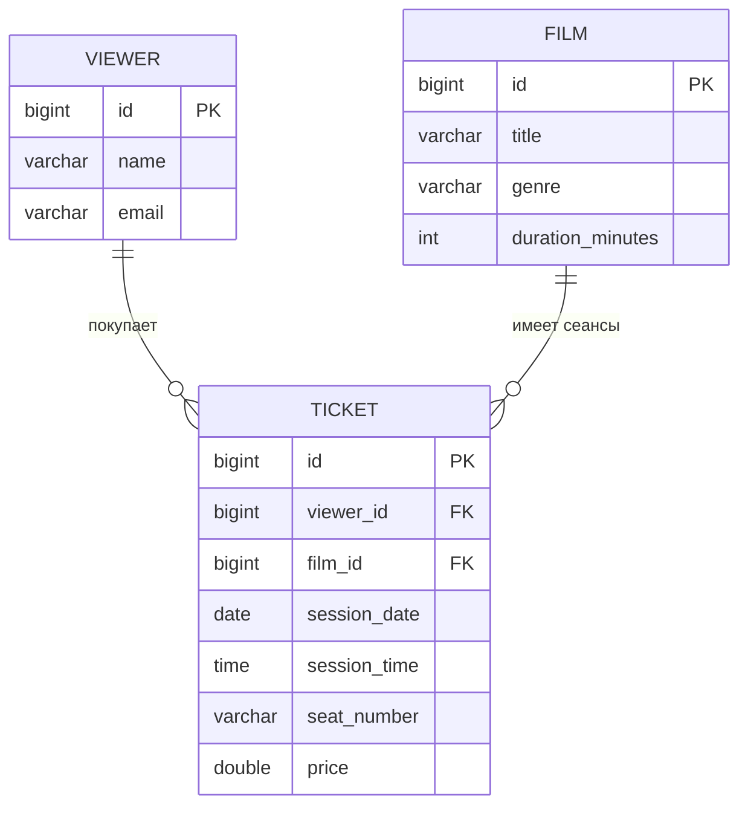

# Лабораторные №6–8: «Кинотеатр» (Cinema)

Учебный проект: **Spring Boot 4**, **Spring Data JPA**, **PostgreSQL** (на **отдельной** машине / стенде), **Flyway**, **Docker Compose** (**CRUD** + **Additional**; образы с **Docker Hub**). Предметная область — бронирование билетов (**Film**, **Viewer**, **Ticket**): REST API, HTML-формы, аналитика по билетам. Опциональный профиль **`inmemory`** (без БД).

**Лаб. 6** (текст **`ТЗ_6лаба.txt`**): развёртывание на **персональной ВМ**, образ в **Docker Hub**, лимиты **CPU/RAM**, **SSH-туннель** к **8080**, нагрузка **k6**. Раздел **«Лабораторная работа №6»** ниже — шпаргалка по этой работе.

**Лаб. 7–8** (тексты **`ТЗ_7лаба.txt`**, **`ТЗ_8лаба.txt`**) — **одна логическая лабораторная** в README:  
- **Часть 7 — БД на отдельном узле:** **PostgreSQL** на **другой ВМ** (в ТЗ часто **`hl12.zil`**), приложение на своей ВМ, **`DBHOST` / `DBPORT` / `DBNAME` / `SCHEMANAME`**, **`max_connections=1000`** на стороне Postgres, туннели к **pgAdmin**.  
- **Часть 8 — микросервис:** **Additional** (аналитика по **названию** фильма) вызывает основной CRUD по **HTTP** (**`RestTemplate`**), join в **Java**; **`docker-compose.yml`**: **`crud-app`** + **`additional-app`**, строка JDBC к **внешней** БД из **`.env`**; два образа в реестре; **k8** как LAB6 **server-server**, CPU **0.5** и **1.0** — **`k6/run-lab8-ratio-sweep.sh`**, PNG в **`png_k8/`**.

Раздел **`## Лабораторная работа №7–8`** ниже объединяет обе части (**сначала лаб. 7, затем лаб. 8**).

**Тот же репозиторий** содержит материалы **лаб. 5** (сидирование), **лаб. 4** (k6), **лаб. 3** (Docker/Flyway) — как справка.

**Навигация:** эндпоинты, требования, быстрый старт Docker → **лаб. 6** (в т.ч. **«Полный порядок: hl03 + k6-ВМ + ПК»**) → **лаб. 7–8** → лаб. 5 → лаб. 4 → прочее.

## Защита лаб. 6: шпаргалка (k6, график vs CPU)

В **`k6/`** в репозитории остались только артефакты **лаб. 8** (**`cinema-lab8-constant.js`**, **`run-lab8-ratio-sweep.sh`**, **`plot_lab6_from_results.py`** для PNG). Отдельные сценарии **лаб. 6** (п. 10 ТЗ) удалены — текст задания в **`ТЗ_6лаба.txt`**, при необходимости восстановите файлы из истории **git**.

Порядок работ для **лаб. 8** (нагрузка, два URL, CPU 0.5 / 1.0): раздел **«Лабораторная работа №7–8»** ниже, **`k6/run-lab8-ratio-sweep.sh`**, на ПК — **`scripts/sync-results-from-k6-vm.sh`** и **`scripts/lab8-plot-png.sh`**.

## Эндпоинты

### OpenAPI / Swagger UI (документация REST)

Подключён **SpringDoc OpenAPI 3** (`springdoc-openapi-starter-webmvc-ui`). В спецификацию попадают только пути **`/api/**`** (HTML-страницы и служебные пути в Swagger не дублируются).

| Метод | Путь | Назначение |
|---|---|---|
| GET | `/v3/api-docs` | OpenAPI 3 в формате JSON. |
| GET | `/swagger-ui.html` | Интерактивная документация и **Try it out** для REST. |

На главной HTML-странице (`GET /`) в навигации есть ссылка **Swagger UI**. **Один порт** (по умолчанию **8080**) обслуживает и веб-страницы, и REST, и Swagger — это нормальная схема для Spring Boot.

**Важно:** глобальный обработчик ошибок приложения настроен только на контроллеры пакета `ru.hse.lab2.controller`, чтобы не маскировать сбои SpringDoc ответом «Unexpected server error».

### HTML (страницы и формы)

| Метод | Путь | Назначение |
|---|---|---|
| GET | `/` | Главная HTML-страница с навигацией по разделам. |
| GET | `/films/page` | Список фильмов в веб-интерфейсе. |
| GET | `/films/page/create` | Форма создания фильма. |
| POST | `/films/page/create` | Создание фильма из HTML-формы. |
| GET | `/viewers/page` | Список зрителей в веб-интерфейсе. |
| GET | `/viewers/page/create` | Форма создания зрителя. |
| POST | `/viewers/page/create` | Создание зрителя из HTML-формы. |
| GET | `/tickets/page` | Список билетов в веб-интерфейсе. |
| GET | `/tickets/page/create` | Форма создания билета. |
| POST | `/tickets/page/create` | Создание билета из HTML-формы. |

### REST API: Films

| Метод | Путь | Назначение |
|---|---|---|
| GET | `/api/films` | Получить список фильмов. |
| POST | `/api/films` | Создать новый фильм. |
| GET | `/api/films/{id}` | Получить фильм по идентификатору. |
| PUT | `/api/films/{id}` | Обновить фильм по идентификатору. |
| DELETE | `/api/films/{id}` | Удалить фильм по идентификатору. |

### REST API: Viewers

| Метод | Путь | Назначение |
|---|---|---|
| GET | `/api/viewers` | Получить список зрителей. |
| POST | `/api/viewers` | Создать нового зрителя. |
| GET | `/api/viewers/{id}` | Получить зрителя по идентификатору. |
| PUT | `/api/viewers/{id}` | Обновить зрителя по идентификатору. |
| DELETE | `/api/viewers/{id}` | Удалить зрителя по идентификатору. |

### REST API: Tickets

| Метод | Путь | Назначение |
|---|---|---|
| GET | `/api/tickets` | Получить список билетов. |
| POST | `/api/tickets` | Создать новый билет. |
| GET | `/api/tickets/{id}` | Получить билет по идентификатору. |
| PUT | `/api/tickets/{id}` | Обновить билет по идентификатору. |
| DELETE | `/api/tickets/{id}` | Удалить билет по идентификатору. |

### REST API: Analytics

| Метод | Путь | Назначение |
|---|---|---|
| GET | `/api/tickets/analytics/max-viewers?filmId=...` | Найти день с максимальным числом уникальных зрителей для выбранного фильма. |
| GET | `/api/tickets/analytics/top-film-by-day?date=YYYY-MM-DD` | Найти самый посещаемый фильм за указанную дату. |

### REST API: администрирование (очистка таблиц; только БД, профиль не `inmemory`)

| Метод | Путь | Назначение |
|---|---|---|
| DELETE | `/api/admin/clear/tickets` | Очистить таблицу `tickets` (`TRUNCATE … RESTART IDENTITY CASCADE`). |
| DELETE | `/api/admin/clear/films` | Удалить билеты и фильмы. |
| DELETE | `/api/admin/clear/viewers` | Удалить билеты и зрителей. |
| DELETE | `/api/admin/clear/all` | Очистить `tickets`, `films`, `viewers`. |

Ответы: **204 No Content**. В учебном стенде без авторизации; в реальном проекте такие операции нужно защищать.

## Требования

- Java 25
- Docker + Docker Compose
- Gradle Wrapper (`./gradlew`)
- **Лаб. 6 (сдача):** **`ТЗ_6лаба.txt`** — **SSH**, **Git**; для **лаб. 8** — **`rsync`**, **Python 3** + **matplotlib** для **`k6/plot_lab6_from_results.py`** (скрипт **`k6/run-lab8-ratio-sweep.sh`**, **`cinema-lab8-constant.js`**).
- **Лаб. 7–8:** SSH к **персональной ВМ** и при необходимости к **серверу БД** (часто **2312**); **`docker-compose.yml`** (**внешняя БД** + **`crud-app`** + **`additional-app`**); см. раздел **«Лабораторная работа №7–8»**
- **Лаб. 4:** [k6](https://k6.io/docs/get-started/installation/); сценарии sweep для классической лаб. 4 в **`k6/`** не входят — см. раздел **«Лабораторная работа №4»**. Для графиков: Python 3 + **`matplotlib`**: `pip install "matplotlib>=3.7"`.
- **Лаб. 5:** Python 3.10+; зависимости сидера — `pip install -r tools/requirements-seed.txt` **или** запуск **`./tools/run-seed.sh`** (на Linux при ограничении системного `pip`, PEP 668, скрипт создаёт **`tools/.venv`** и ставит пакеты туда)

## Быстрый старт: Docker Compose

1) В **`.env`** задайте **`DBHOST`**, **`DBPORT`**, **`DBNAME`**, **`SCHEMANAME`**, учётные данные к PostgreSQL и при необходимости **`DOCKER_IMAGE_ADDITIONAL`**.

2) Поднять **CRUD** и **Additional**:

```bash
docker compose --env-file .env pull crud-app additional-app
docker compose --env-file .env up -d
```

Сборка образов локально вместо pull — см. **`Dockerfile`** и **`Dockerfile.additional-service`**.

3) Проверить:

- в логах: `docker compose logs -f crud-app` — должно быть `Started Lab2Application`;
- в браузере: `http://localhost:8080/` (HTML, REST на CRUD), Swagger и т.д.

4) Остановить контейнеры приложений:

```bash
docker compose down
```

Полный сброс данных делается **на сервере БД** (не в этом compose): удаление/пересоздание базы или восстановление из бэкапа.

**Вариант для разработки на хосте:** сервис **`app` в Docker и `./gradlew bootRun` на хосте не могут одновременно слушать один и тот же порт 8080.** Либо остановите контейнер приложения (`docker stop lab2_crud_app`), либо поднимите локальный запуск на другом порту: `SERVER_PORT=8081 ./gradlew bootRun`. Подробнее — в **«Подробный runbook»**, п. 2.

## Обновление приложения в Docker (после правок Java / HTML в контроллерах)

Имя образа задаётся **`DOCKER_IMAGE_APP`** (см. **`.env`**). Внутри контейнера **`lab2_crud_app`** выполняется собранный **`app.jar`**. Пока не подтянут **новый** образ и не пересоздан контейнер, в браузере будет старая версия.

**Вариант A — Docker Hub (как на учебном сервере):** на машине с исходниками после правок:

```bash
docker build -t "${DOCKER_IMAGE_APP:-lavrentiyermakov/lab2_rovnyagin:latest}" .
docker push "${DOCKER_IMAGE_APP:-lavrentiyermakov/lab2_rovnyagin:latest}"
```

На сервере:

```bash
docker compose pull crud-app additional-app
docker compose up -d --force-recreate crud-app additional-app
```

**Вариант B — только локально, без Hub:**

```bash
docker compose up -d --build --force-recreate crud-app additional-app
```

Полная пересборка без кэша: **`docker compose build --no-cache app`** (затем **`push`** или **`up`**).

**Проверка, что отдаётся новая главная** (плашка с пояснением про порт в текущей версии кода отсутствует):

```bash
curl -s http://localhost:8080/ | grep -i 'Почему сайт' || echo "OK: старого текста нет"
```

## Профили запуска

### Default (без профиля)

- Используется PostgreSQL (`spring.datasource.*` в `application.properties`, URL на `localhost` при запуске с хоста)
- Включены Flyway-миграции **`V1`** (DDL) и **`V2`** (стартовые тестовые строки)
- Hibernate работает в `ddl-auto=validate`

### `docker` (запуск приложения в контейнере)

- Включается переменной `SPRING_PROFILES_ACTIVE=docker` в сервисе **`crud-app`** в **`docker-compose.yml`**
- В **`application-docker.properties`** — шаблон JDBC (фактический URL в контейнере задаёт **`SPRING_DATASOURCE_URL`** в compose, см. **`.env`**: **DBHOST**, **DBPORT**, **DBNAME**)

### `inmemory` (режим совместимости)

Запуск:

```bash
./gradlew bootRun --args='--spring.profiles.active=inmemory'
```

Особенности:

- отключены автоконфигурации DataSource/JPA/Flyway;
- используются in-memory store на `HashMap`;
- сохраняется поведение доменных инвариантов (включая аналитику max viewers и каскадное удаление зависимых ticket).

## API (REST)

Базовые CRUD ресурсы:

- `/api/films`
  - `GET /api/films`
  - `GET /api/films/{id}`
  - `POST /api/films`
  - `PUT /api/films/{id}`
  - `DELETE /api/films/{id}`
- `/api/viewers`
  - `GET /api/viewers`
  - `GET /api/viewers/{id}`
  - `POST /api/viewers`
  - `PUT /api/viewers/{id}`
  - `DELETE /api/viewers/{id}`
- `/api/tickets`
  - `GET /api/tickets`
  - `GET /api/tickets/{id}`
  - `POST /api/tickets`
  - `PUT /api/tickets/{id}`
  - `DELETE /api/tickets/{id}`
  - `GET /api/tickets/analytics/max-viewers?filmId={id}`
  - `GET /api/tickets/analytics/top-film-by-day?date=YYYY-MM-DD`

## HTML страницы

- `GET /` - главная страница навигации
- `GET /films/page` - список фильмов
- `GET /films/page/create` - форма создания фильма
- `GET /viewers/page` - список зрителей
- `GET /viewers/page/create` - форма создания зрителя
- `GET /tickets/page` - список билетов
- `GET /tickets/page/create` - форма создания билета

Формы создают сущности через POST:

- `POST /films/page/create`
- `POST /viewers/page/create`
- `POST /tickets/page/create`

## Миграции и БД

Схема и небольшой стартовый набор строк задаются **Flyway** при старте приложения; массовое наполнение перед k6 — через **`tools/`** (лаб. 5).

- Каталог: `src/main/resources/db/migration`
  - `V1__create_schema.sql` — **DDL** (создание таблиц `viewers`, `films`, `tickets`, ключи и ограничения)
  - `V2__seed_test_data.sql` — **DML** (небольшой набор `INSERT` и `setval` для последовательностей)
- Для **большого** объёма данных перед k6 можно дополнительно использовать `tools/seed_rest_data.py` (см. **лаб. 5**): он вызывает `DELETE /api/admin/clear/...` и создаёт сущности через REST.
- Flyway применяет скрипты при старте приложения (в контейнере или при `./gradlew bootRun`).
- Таблицы домена: `films`, `viewers`, `tickets`.

## Postman

Артефакты:

- `postman/cinema-lab2.postman_collection.json`
- `postman/local.postman_environment.json`

Как запустить smoke:

1) Импортировать collection и environment в Postman.
2) Выбрать environment `Cinema LAB2 Local`.
3) Выполнить базовый сценарий: создать `film`, `viewer`, `ticket`, затем вызвать аналитику.

## Что перенесено из lab1 и что изменено

Перенесено:

- бизнес-сущности `Film/Viewer/Ticket`;
- CRUD сценарии в REST и HTML;
- прикладной сценарий аналитики max viewers.

Изменено/не перенесено намеренно:

- канонический формат id после merge: `Long` (JPA/DB identity);
- legacy UUID back-compat из lab1 не поддерживается;
- источником данных по умолчанию является PostgreSQL (не HashMap).

## Подробный runbook

**Требования:** Java 25, Docker Desktop (или Docker Engine + Compose), Gradle Wrapper (`./gradlew`).

### 1. Полный стенд в Compose (внешняя БД)

В **`.env`** задайте доступ к вашей PostgreSQL (**DBHOST**, **DBPORT**, **DBNAME**, **SCHEMANAME**, учётные данные; при необходимости **`DOCKER_IMAGE_ADDITIONAL`**). В корне проекта:

```bash
docker compose --env-file .env up -d
```

После изменения кода: **локально** — `docker compose up -d --build --force-recreate crud-app additional-app`; **через Hub** — `docker build -t "${DOCKER_IMAGE_APP:-lavrentiyermakov/lab2_rovnyagin:latest}" . && docker push "${DOCKER_IMAGE_APP:-lavrentiyermakov/lab2_rovnyagin:latest}"` (и при необходимости образ Additional), на сервере — `docker compose pull crud-app additional-app && docker compose --env-file .env up -d --force-recreate crud-app additional-app`.

Дождитесь **Up** у **`crud-app`** и **`additional-app`** (`docker compose ps`, `docker compose logs crud-app`).

### 2. Запуск приложения на хосте при той же внешней БД

Если не хотите конфликта порта **8080** с контейнером **`lab2_crud_app`**:

```bash
docker stop lab2_crud_app
./gradlew bootRun
```

(в **`.env`/IDE** укажите ту же БД, что и для контейнера; профиль **`docker`** для `bootRun` обычно не нужен — достаточно **DBHOST** в окружении или `application.properties`.)

Если **`lab2_crud_app` запущен** на `8080`, `bootRun` завершится с ошибкой *Port 8080 was already in use*. Варианты: остановить контейнер (см. выше) или запустить локально на другом порту:

```bash
SERVER_PORT=8081 ./gradlew bootRun
```

или:

```bash
./gradlew bootRun --args='--server.port=8081'
```

Альтернатива в IntelliJ IDEA: переменная окружения **`SERVER_PORT=8081`** в Run Configuration или аргумент **`--server.port=8081`**, если Docker держит **8080**.

### 2.1 Режим совместимости `inmemory` (opt-in)
По умолчанию приложение работает в режиме `JPA + Flyway + PostgreSQL`.

Для запуска режима совместимости с HashMap-данными явно включите профиль:
```bash
./gradlew bootRun --args='--spring.profiles.active=inmemory'
```

В этом профиле:
- отключаются `DataSource/JPA/Flyway` автоконфигурации;
- используются in-memory хранилища на базе `HashMap`;
- бизнес-инварианты согласованы с JPA: аналитика `/api/tickets/analytics/max-viewers` считает `DISTINCT` зрителей по дню, а удаление `Film/Viewer` каскадно удаляет связанные `Ticket`;
- поднимаются демо-данные для базовых сценариев (`films`, `viewers`, `tickets`).

### 3. Проверка запуска приложения

В логах контейнера **`crud-app`** или консоли `bootRun` должно быть: `Started Lab2Application in ... seconds`. После старта Flyway применит миграции `V1` и `V2`.

Корневой URL (`http://localhost:8080/`, если порт не меняли) обслуживается `HtmlPageController` и возвращает HTML home page. Документация REST: **`/swagger-ui.html`**, **`/v3/api-docs`**.

### 4. Postman: где файлы и smoke-check
Postman-артефакты лежат в директории `postman/`:
- `postman/cinema-lab2.postman_collection.json`
- `postman/local.postman_environment.json`

Быстрый smoke (после старта приложения, без ручного редактирования payload):
1. Импортируйте коллекцию и environment в Postman.
2. Выберите environment `Cinema LAB2 Local` (в нем уже есть `baseUrl` и id-переменные для типового запуска).
3. Последовательно выполните запросы:
   - `POST /api/films`
   - `POST /api/viewers`
   - `POST /api/tickets`
   - `GET /api/tickets/analytics/max-viewers?filmId=...`
4. Убедитесь, что первые 3 запроса возвращают `201`, аналитика — `200`.

### 5. Остановка
```bash
docker compose down
```
---
## Описание проекта
Проект демонстрирует работу с PostgreSQL через Spring Data JPA в области «Кинотеатр» и **развёртывание в Docker Compose**.
Реализована система бронирования билетов, включающая связь One-to-Many между сущностями:
- Film (Фильм): один фильм может иметь много билетов.
- Viewer (Зритель): один зритель может купить много билетов.
- Ticket (Билет): связующая сущность, которая ассоциирует зрителя с конкретным фильмом, датой и местом.

### Шаблонный проект (референс)
Текущая реализация повторяет структуру и ключевые практики шаблонного проекта из Bitbucket (ветка со Spring Data JPA + PostgreSQL), но в доменной области «Кинотеатр».
Краткое соответствие «в шаблоне -> в этом проекте»:
- JPA-сущности и таблицы -> `Film`, `Viewer`, `Ticket`; таблицы `films`, `viewers`, `tickets` создаются Flyway-миграцией `V1__create_schema.sql`.
- Связи One-to-Many / Many-to-One -> `Film 1:N Ticket` и `Viewer 1:N Ticket` через `@OneToMany` и `@ManyToOne`.
- Репозитории Spring Data -> отдельные `FilmRepository`, `ViewerRepository`, `TicketRepository` (на базе `JpaRepository`).
- Кастомный JPQL-запрос -> аналитический запрос в `TicketRepository` для поиска дня с максимальным числом зрителей по фильму.
- Инициализация схемы и базовых тестовых данных -> Flyway-миграции `V1__create_schema.sql` и `V2__seed_test_data.sql` применяются при старте; при необходимости — доп. сид **лаб. 5** (`tools/seed_rest_data.py`).
- PostgreSQL-конфигурация -> подключение к PostgreSQL (Docker Compose), в контейнере приложения — профиль `docker` и `application-docker.properties`.
- Контейнеризация (лаб. 3) -> `Dockerfile` (multi-stage, Java 25), **`crud-app`** / **`additional-app`** в `docker-compose.yml`.
Ссылка на шаблон (ветка `feature/spring-boot-data-jpa`): https://bitbucket.org/zil-courses/hl-module1/src/feature/spring-boot-data-jpa/
###  Что реализовано:
-  Контейнеризация Spring Boot (`Dockerfile`) и запуск приложения вместе с БД в `docker compose`
-  Подключение PostgreSQL через Docker
- Создание сущностей с аннотациями JPA
- Репозитории для работы с БД
- Создание схемы БД через Flyway-миграции
- Наполнение БД тестовыми данными через Flyway (`V2`) и при необходимости через Python-скрипт (лаб. 5)
- Визуальное управление через pgAdmin
  #### Техническая часть
 - Инфраструктура (Docker): **`docker-compose.yml`** — **CRUD** и **Additional**; PostgreSQL на отдельном хосте (**`.env`**); образы — **`Dockerfile`**, **`Dockerfile.additional-service`**.
 -  ORM-маппинг (JPA): Hibernate работает в режиме валидации схемы (`ddl-auto=validate`), а создание структуры и базовый сид выполняет Flyway; массовое сидирование — опционально скрипт **лаб. 5**.
 -  Типизация данных: Корректное маппинг Java-типов (LocalDate, LocalTime, Double) на типы данных PostgreSQL (DATE, TIME, DOUBLE PRECISION).
 -  Аналитика (JPQL): Реализация кастомного запроса в репозитории для группировки и поиска дня с максимальной посещаемостью конкретного фильма.
  #### Бизнес-логика (Домен «Кинотеатр»)
  Сущности:
- Film (Фильм): название, жанр, длительность.
- Viewer (Зритель): имя, уникальный email.
- Ticket (Билет): место, цена, дата и время сеанса.

Связи:
-  One-to-Many: Один фильм может иметь много билетов.
-  One-to-Many: Один зритель может купить много билетов.
- Целостность данных: Настройка каскадных операций (cascade = ALL) и автоудаления сирот (orphanRemoval = true) — билет удаляется автоматически при удалении зрителя или фильма.
- Инициализация (Data Seeding): базовый набор через Flyway `V2__seed_test_data.sql`; расширенное — через `tools/seed_rest_data.py` после `DELETE /api/admin/clear/...`.
- Управление: Просмотр и правки в БД через **pgAdmin** (на стороне сервера БД), при необходимости Postman/Swagger.
---

## Используемые технологии

| Технология | Версия | Назначение |
|------------|--------|------------|
| Java | 25 | Язык программирования |
| Spring Boot | 4.0.3 | Фреймворк |
| Spring Data JPA | - | Работа с БД |
| Hibernate | управляется Spring Boot 4.0.3 | ORM |
| PostgreSQL | 15+ (стенд курса / своя ВМ) | База данных **вне** этого compose |
| Docker / Compose | - | Контейнеры **CRUD** и **Additional** |
| Dockerfile | multi-stage Temurin 25 | Сборка и запуск Spring Boot в контейнере |
| Gradle | wrapper | Сборка и запуск проекта |
| SpringDoc OpenAPI | 3.x (starter webmvc-ui) | `/v3/api-docs`, Swagger UI |
| Python | 3.10+ | Сидирование: `requests`, `faker`; график k6: `matplotlib` |
| k6 | см. [документацию](https://k6.io/docs/) | Нагрузочное тестирование (лаб. 4) |

---

## Структура проекта

```text
lab2_rovnyagin/
├── Dockerfile                      # Образ приложения (multi-stage)
├── src/main/java/ru/hse/lab2/
│   ├── Lab2Application.java        # Точка входа
│   ├── config/OpenApiConfig.java   # Заголовок/описание OpenAPI для Swagger
│   ├── controller/                 # REST, HTML (`HtmlPageController`), admin clear, `GlobalExceptionHandler`
│   ├── entity/
│   │   ├── Film.java               # Сущность "Фильм"
│   │   ├── Viewer.java             # Сущность "Зритель"
│   │   └── Ticket.java             # Сущность "Билет" (связка)
│   └── repository/
│       ├── FilmRepository.java     # CRUD для фильмов
│       ├── ViewerRepository.java   # CRUD для зрителей
│       └── TicketRepository.java   # CRUD + аналитические запросы
├── src/main/resources/
│   ├── application.properties       # Конфигурация (хост: localhost), порт, `springdoc.paths-to-match=/api/**`
│   ├── application-docker.properties # Профиль docker: JDBC (в compose задаётся SPRING_DATASOURCE_URL)
│   └── db/migration/               # Flyway: V1 DDL, V2 DML
├── docker-compose.yml # crud-app :8080 + additional-app :8081; БД снаружи (.env)
├── Dockerfile.additional-service # Лаб. 8: образ только Additional service
├── additional-service/           # Лаб. 8: второй Spring Boot (RestTemplate → CRUD)
├── .env.example        # Шаблон переменных для Compose (скопировать в .env)
├── tools/              # Лаб. 5: seed_rest_data.py, run-seed.sh, requirements-seed.txt
├── k6/                 # Лаб. 8: cinema-lab8-constant.js, run-lab8-ratio-sweep.sh, plot_lab6_from_results.py (общий plot)
├── scripts/            # ssh-tunnel-personal-vm.sh, sync-results-from-k6-vm.sh, lab8-plot-png.sh
└── README.md                       # Этот файл
```

## Скрипты Bash: подробное описание

В репозитории несколько **Bash**-скриптов (запуск из корня проекта). Они **не** заменяют **`./gradlew`**: это автоматизация **Docker / k6 / SSH / сидирования**.

### `scripts/ssh-tunnel-personal-vm.sh` (лаб. 6–8, доступ с ПК)

| | |
|---|---|
| **Зачем** | SSH-туннель с ПК к **персональной ВМ** (приложение **8080**, опционально pgAdmin). |
| **Где** | На **вашем компьютере**. |
| **Как** | `./scripts/ssh-tunnel-personal-vm.sh` — **`SSH_HOST`**, **`SSH_PORT`**, **`LOCAL_PORT`** в шапке файла. |

### `scripts/sync-results-from-k6-vm.sh` (лаб. 8)

**rsync** **`k6/cpu-runs/`** с k6-ВМ на ПК (хост **`hl-k6`** в **`~/.ssh/config`**). Затем **`lab8-plot-png.sh`** или ручной **`plot_lab6_from_results.py`**.

### `scripts/lab8-plot-png.sh` (лаб. 8)

PNG в **`png_k8/`** из локального **`k6/cpu-runs`** (**`lab8-summary-*.json`**).

### `k6/run-lab8-ratio-sweep.sh` (лаб. 8)

| | |
|---|---|
| **Зачем** | Три прогона по **`k6/cinema-lab8-constant.js`**; при **`RESULT_CPU`** — копии в **`k6/cpu-runs/cpu-0.5`** / **`cpu-1.0`**. |
| **Где** | Корень репозитория, **k6** в **`PATH`**. |
| **Переменные** | **`BASE_URL_MAIN`**, **`BASE_URL_ADDITIONAL`**, **`TARGET_VUS`**, **`DURATION`**, **`SUMMARY_LIMIT`**, **`K6_ROUTE`**, опционально **`RESULT_CPU`**. |

### `tools/run-seed.sh` (лаб. 5)

| | |
|---|---|
| **Зачем** | Обёртка над **`tools/seed_rest_data.py`**: массовое создание/очистка данных через REST (**Faker** + **requests**). |
| **Где** | Из корня репозитория; внутри при необходимости создаётся **`tools/.venv`** и ставятся зависимости из **`tools/requirements-seed.txt`**. |
| **Без аргументов** | Берёт **`BASE_URL`** (по умолчанию `http://localhost:8080`), **`ENDPOINT`** (по умолчанию **`all`**), **`COUNT`** (по умолчанию **500**). **`CLEAR=1`** — только очистка выбранного **`ENDPOINT`**. **`NO_PIP_INSTALL=1`** — не трогать pip/venv. |
| **С аргументами** | Всё передаётся в Python: **`./tools/run-seed.sh --endpoint tickets --count 100`** и т.д. |

### Вспомогательные Python-скрипты (кратко)

| Файл | Роль |
|------|------|
| **`k6/plot_lab6_from_results.py`** | Строит PNG по подпапкам **`k6/cpu-runs/cpu-*`** (лаб. 8: префикс **`lab8-summary`**, **`--png-prefix lab8-vs-cpu`** — см. **`lab8-plot-png.sh`**). Нужен **`lab6_meta`** в JSON (пишет **`cinema-lab8-constant.js`**). |
| **`tools/seed_rest_data.py`** | Сидирование; вызывается из **`run-seed.sh`**. |

## Структура базы данных

При первом запуске Flyway применяет SQL-миграции из `src/main/resources/db/migration`:
- `V1__create_schema.sql` — создание структуры БД;
- `V2__seed_test_data.sql` — небольшой набор тестовых строк.

Дополнительно большой объём данных перед k6 можно создать скриптом `tools/seed_rest_data.py` (лаб. 5).

Таблицы создаются Flyway (SQL-скриптами), а не Hibernate. Hibernate работает в режиме валидации схемы (`spring.jpa.hibernate.ddl-auto=validate`).

### Проверка Flyway
Подключитесь к PostgreSQL и выполните:
```sql
SELECT installed_rank, version, description, success
FROM flyway_schema_history
ORDER BY installed_rank;
```
Ожидаемо должны присутствовать успешные записи для версий `1` и `2`.

### Таблица `viewers`

| Поле | Тип данных | Ограничения | Описание |
|------|------------|-------------|----------|
| `id` | `BIGSERIAL` | `PRIMARY KEY`, `NOT NULL` | Уникальный идентификатор (автоинкремент) |
| `name` | `VARCHAR(255)` | `NOT NULL` | Имя зрителя |
| `email` | `VARCHAR(255)` | `UNIQUE`, `NOT NULL` | Адрес электронной почты |

### Таблица `films`

| Поле | Тип данных | Ограничения | Описание |
|------|------------|-------------|----------|
| `id` | `BIGSERIAL` | `PRIMARY KEY`, `NOT NULL` | Уникальный идентификатор (автоинкремент) |
| `title` | `VARCHAR(255)` | `NOT NULL` | Название фильма |
| `genre` | `VARCHAR(255)` | — | Жанр фильма |
| `duration_minutes` | `INTEGER` | — | Длительность в минутах |

### Таблица `tickets`

| Поле | Тип данных | Ограничения | Описание |
|------|------------|-------------|----------|
| `id` | `BIGSERIAL` | `PRIMARY KEY`, `NOT NULL` | Уникальный идентификатор (автоинкремент) |
| `viewer_id` | `BIGINT` | `NOT NULL`, `FOREIGN KEY` | Ссылка на `viewers.id` (владелец билета) |
| `film_id` | `BIGINT` | `NOT NULL`, `FOREIGN KEY` | Ссылка на `films.id` (фильм на сеансе) |
| `session_date` | `DATE` | `NOT NULL` | Дата сеанса |
| `session_time` | `TIME` | `NOT NULL` | Время начала сеанса |
| `seat_number` | `VARCHAR(255)` | `NOT NULL` | Номер места (напр. "A12") |
| `price` | `DOUBLE PRECISION` | — | Цена билета |
###  Схема связей
FILM (1) ───< (N) TICKET >─── (1)  VIEWER

```mermaid
erDiagram
    VIEWER ||--o{ TICKET : "покупает"
    FILM ||--o{ TICKET : "имеет сеансы"
    
    VIEWER {
        bigint id PK
        varchar name
        varchar email
    }
    FILM {
        bigint id PK
        varchar title
        varchar genre
        int duration_minutes
    }
    TICKET {
        bigint id PK
        bigint viewer_id FK
        bigint film_id FK
        date session_date
        time session_time
        varchar seat_number
        double price
    }
```
## Полезные SQL-запросы

### Просмотр данных

**Все фильмы:**
```sql
SELECT * FROM films ORDER BY title;
```
**Все зрители:**
```sql
SELECT * FROM viewers ORDER BY name;
```
**Все билеты с информацией о фильме и зрителе:**
```sql
SELECT 
    t.id AS ticket_id,
    v.name AS viewer_name,
    f.title AS film_title,
    t.session_date,
    t.session_time,
    t.seat_number,
    t.price
FROM tickets t
JOIN viewers v ON t.viewer_id = v.id
JOIN films f ON t.film_id = f.id
ORDER BY t.session_date, t.session_time;
```
### Аналитика
**Максимальное количество зрителей на фильме за день (из задания):**
Считаются уникальные зрители за день (эквивалент бизнес-логики max viewers).
```sql
SELECT 
    f.title AS film_title,
    t.session_date,
    COUNT(DISTINCT t.viewer_id) AS viewer_count
FROM tickets t
JOIN films f ON t.film_id = f.id
WHERE t.film_id = :filmId -- placeholder: подставьте filmId из API-контракта
GROUP BY f.title, t.session_date
ORDER BY viewer_count DESC, t.session_date ASC
LIMIT 1;
```
**Количество билетов по каждому фильму:**
```sql
SELECT 
    f.title AS film_title,
    COUNT(t.id) AS tickets_sold,
    SUM(t.price) AS total_revenue
FROM films f
LEFT JOIN tickets t ON f.id = t.film_id
GROUP BY f.id, f.title
ORDER BY tickets_sold DESC;
```
**Средняя цена билета по жанрам:**
```sql
SELECT 
    f.genre,
    COUNT(t.id) AS tickets_count,
    ROUND(AVG(t.price), 2) AS avg_price
FROM films f
JOIN tickets t ON f.id = t.film_id
GROUP BY f.genre
ORDER BY avg_price DESC;
```
**Зрители, купившие больше одного билета:**
```sql
SELECT 
    v.name,
    v.email,
    COUNT(t.id) AS tickets_count
FROM viewers v
JOIN tickets t ON v.id = t.viewer_id
GROUP BY v.id, v.name, v.email
HAVING COUNT(t.id) > 1
ORDER BY tickets_count DESC;
```
### Управление данными
**Добавить нового зрителя:**
```sql
INSERT INTO viewers (name, email) 
VALUES ('Анна Смирнова', 'anna@test.ru');
```
**Удалить зрителя:**
```sql
DELETE FROM viewers WHERE id = 1;
```
**Удалить фильм:**
```sql
DELETE FROM films WHERE id = 1;
```
**Забронировать билет:**
```sql
INSERT INTO tickets (viewer_id, film_id, session_date, session_time, seat_number, price)
VALUES (1, 2, '2026-04-25', '19:00', 'C5', 500.0);
```
**Удалить все билеты на определенную дату:**
```sql
DELETE FROM tickets WHERE session_date = '2026-04-20';
```
**Обновить цену билета:**
```sql
UPDATE tickets 
SET price = 600.0 
WHERE film_id = 1 AND session_date = '2026-04-25';
```

## Лабораторная работа №6: ВМ, Docker, env, лимиты ресурсов, SSH, k6

Текст задания: **`ТЗ_6лаба.txt`**. Ниже — что **реализовано в репозитории** и как пользоваться на сервере и локально (графики по CPU — **`k6/plot_lab6_from_results.py`** / **`scripts/lab8-plot-png.sh`**, каталоги **`k6/cpu-runs/cpu-*`**, для лаб. 8 — **`png_k8/`**).

### Быстрый запуск лаб. 6 «с нуля» (одна шпаргалка)

Ниже — минимальная цепочка «ничего не настроено → можно показать работающую лабу». Детали, порты и переменные — в следующих подразделах.

**A. Персональная ВМ (первый раз)**  
1. Подключение: `ssh -p <порт_из_таблицы> hl@hlssh.zil.digital` (пример порта **2303**).  
2. По методичке: обновление ОС, свой **`id_rsa.pub`** в **`~/.ssh/authorized_keys`**, **git**, SSH-ключ к GitHub, **`docker login`**.  
3. Клон репозитория и конфиг:
   ```bash
   git clone git@github.com:<ваш_логин>/lab2_rovnyagin.git
   cd lab2_rovnyagin
   git checkout <нужная_ветка>   # например lab_4_plus_lab5
   cp .env.example .env
   nano .env   # DOCKER_IMAGE_APP; POSTGRES_DB и DBNAME — одно имя БД (часто hl3); SCHEMANAME при необходимости
   ```
4. Чистый старт БД и подъём стека:
   ```bash
   docker compose down -v
   docker compose pull crud-app additional-app
   docker compose up -d
   docker compose ps    # lab2_crud_app, lab2_additional_app — Up
   curl -s -o /dev/null -w "%{http_code}\n" http://127.0.0.1:8080/   # ожидается 200
   ```
5. При необходимости данных для аналитики k6: на ВМ или с ПК через туннель — **`./tools/run-seed.sh`** (см. лаб. 5). Для лаб. 8 k6 создаёт зрителей самим POST; для GET сводки в БД должны быть фильмы (Flyway **`V2`** или сидер).

**B. ПК: туннель и проверка ТЗ п. 5–6**  
1. Остановите локальный **`docker compose`** на ПК, если он занимает **8080**, либо не запускайте его параллельно туннелю.  
2. В каталоге клона на ПК: **`./scripts/ssh-tunnel-personal-vm.sh`** (при другом SSH-порте: **`SSH_PORT=... ./scripts/ssh-tunnel-personal-vm.sh`**).  
3. Браузер: **`http://localhost:8080/`**, **`http://localhost:8080/swagger-ui.html`**.

**C. Нагрузка п. 10 / лаб. 8 (минимум)**  
- **С ПК на сервер** (туннель открыт): на ПК установлен **k6**, затем  
  `export BASE_URL_MAIN=http://127.0.0.1:8080 BASE_URL_ADDITIONAL=http://127.0.0.1:8081 TARGET_VUS=30` и **`./k6/run-lab8-ratio-sweep.sh`**.  
- **Сервер на сервер**: на машине, откуда виден API (часто та же ВМ или общая k6-ВМ),  
  выставьте **`BASE_URL_MAIN`** / **`BASE_URL_ADDITIONAL`** на URL **8080** / **8081**, доступные **с этой машины** (не `localhost` чужого ПК), и снова **`./k6/run-lab8-ratio-sweep.sh`**.  
- Серия по CPU: на ВМ в **`.env`** меняете **`APP_CPU_LIMIT`** (типично **0.5** и **1.0**), **`docker compose up -d --force-recreate crud-app additional-app`**, после каждого — sweep с совпадающим **`RESULT_CPU`** (**`0.5`** или **`1.0`**).  
- Графики: с ПК подтянуть **`k6/cpu-runs/`** (**`./scripts/sync-results-from-k6-vm.sh`**, в `ssh/config` нужен хост **`hl-k6`**), затем **`./scripts/lab8-plot-png.sh`** или вручную **`python3 k6/plot_lab6_from_results.py`** с **`--summary-prefix lab8-summary`** (нужен **matplotlib**). Подробнее — **«Полный порядок: hl03 + k6-ВМ + ПК»** и раздел **«Лабораторная работа №7–8»**.

**D. Локально на ПК без ВМ (только разработка)**  
```bash
cd lab2_rovnyagin && cp -n .env.example .env
docker compose up -d --build
curl -s -o /dev/null -w "%{http_code}\n" http://127.0.0.1:8080/
```  
Для сдачи по ТЗ опирайтесь на стенд **на учебной ВМ**, а не только на этот вариант.

### Полный порядок: hl03 (приложение) + k6-ВМ + ПК (PNG)

Типичная схема курса: **персональная ВМ** поднимает **`lab2_crud_app`**, **отдельная машина** (общая k6-ВМ) гоняет **`k6`**, **ПК** забирает JSON и строит графики.

| Роль | Пример хоста | Что делать |
|------|----------------|------------|
| Приложение | персональная ВМ (**hl03**) | **`docker compose`** только в **корне клона** (`~/lab2_rovnyagin`), не в `~/` и **не** на k6-ВМ. Лимит CPU — **`APP_CPU_LIMIT`** в **`.env`**. |
| Нагрузка | k6-ВМ (**hl11** и т.д.) | Клон или копия репозитория на машине с **`k6`** в **`PATH`**. Сюда же складываются **`k6/cpu-runs/cpu-*`**. |
| Отчёт | ПК | **`scripts/sync-results-from-k6-vm.sh`**, затем **`scripts/lab8-plot-png.sh`** (лаб. 8 → **`png_k8/`**) или вручную **`k6/plot_lab6_from_results.py`**; Python + **matplotlib**. |

**Связка CPU и папок `k6/cpu-runs/cpu-*`:** в каждой точке серии **сначала** на hl03 выставляете **`APP_CPU_LIMIT`** (например **0.5** затем **1.0**), **пересоздаёте** контейнер приложения, **затем** на k6-ВМ запускаете sweep с **тем же** **`RESULT_CPU`**. Нельзя вызывать sweep подряд без смены лимита на Docker — иначе метки **`cpu-*`** не соответствуют реальному CPU.

**Шаг 1 — Один ярус CPU (hl03, каталог с `docker-compose.yml`):**

```bash
cd ~/lab2_rovnyagin
nano .env    # APP_CPU_LIMIT=0.5  (далее 1.0 и при необходимости 1.5, 2)
docker compose up -d --force-recreate crud-app additional-app
curl -sS -o /dev/null -w '%{http_code}\n' http://127.0.0.1:8080/
```

Проверка фактического лимита: **`docker inspect lab2_crud_app --format '{{.HostConfig.NanoCpus}}'`** (ядра ≈ значение / 1 000 000 000).

**Шаг 2 — Один прогон лаб. 8 на k6-ВМ** (три смеси 5/95, 50/50, 95/5 подряд):

На **k6-ВМ** **`BASE_URL_MAIN`** (порт **8080**) и **`BASE_URL_ADDITIONAL`** (**8081**) должны открываться **с этой машины**. Узнайте IP ВМ с приложением (**`hostname -I`** на hl03), с k6-ВМ проверьте **`curl`** к **`:8080`** и **`:8081`**. Ошибка **`connection refused`** означает неверный IP, контейнер не слушает или сеть недоступна.

```bash
cd ~/path/to/lab2_rovnyagin   # или ваш каталог с k6/
export BASE_URL_MAIN=http://<IP_CRUD>:8080
export BASE_URL_ADDITIONAL=http://<IP_Additional>:8081
export K6_ROUTE=server-to-server
export TARGET_VUS=400
export DURATION=90s
export RESULT_CPU=0.5
./k6/run-lab8-ratio-sweep.sh
```

Повторите **шаг 1** и **шаг 2** для следующего лимита (**`RESULT_CPU=1.0`**; при полном ТЗ — другие точки CPU по методичке).

**Важно:** при заданном **`RESULT_CPU`** скрипт **удаляет** прежние **`lab8-summary-*.json`** в **`k6/cpu-runs/cpu-*`** и кладёт только файлы текущего прогона. В имени файла есть **`vus-<TARGET_VUS>`**.

**Шаг 3 — С ПК: забрать `k6/cpu-runs/` с k6-ВМ, построение PNG**

В **`~/.ssh/config`** должен быть **`Host hl-k6`** (как в **`sync-results-from-k6-vm.sh`**). При необходимости задайте **`K6_RESULTS_REMOTE`**.

```bash
cd ~/path/to/lab2_rovnyagin
./scripts/sync-results-from-k6-vm.sh
./scripts/lab8-plot-png.sh
# либо вручную: python3 k6/plot_lab6_from_results.py k6/cpu-runs -o png_k8 \
#   --summary-prefix lab8-summary --vus 400 --png-prefix lab8-vs-cpu …
```

- **`--vus`** у **`plot_lab6_from_results.py`** должен совпадать с **`TARGET_VUS`** в именах JSON.
- SSH по паролю: **`RSH_CMD='ssh -o BatchMode=no' ./scripts/sync-results-from-k6-vm.sh`**.

**Выход (лаб. 8):** три PNG в **`png_k8/`** (префикс **`lab8-vs-cpu-…`**) — см. **`scripts/lab8-plot-png.sh`**.

**Если на ПК нет k6:** установите **k6** на k6-ВМ и запускайте sweep там, либо скопируйте каталог репозитория на машину с **k6** — отдельных скриптов «sync-and-run» в репозитории нет.

### Если открыли лаб. 6 через время и ничего не помните

**За что отвечает лабораторная (одно предложение):** поднять **кинотеатр** в **Docker Compose** на **учебной ВМ**, настроить **CPU/RAM** и **переменные окружения** (БД, Tomcat, отключение SQL в логах), открыть API с **ПК** через **SSH-туннель**, снять **k6**-прогоны с **постоянными VU** и тремя смесями **POST/GET**, построить **графики** «время отклика vs лимит CPU».

**Карта «кто где живёт» (запомнить раз и навсегда):**

- **ПК** — браузер, опционально **k6**, скрипт **`ssh-tunnel-personal-vm.sh`**. `localhost:8080` на ПК при туннеле — это **не** локальный Docker, а «окно» на порт **8080 ВМ**.
- **Персональная ВМ (hl03)** — **`docker compose`**: PostgreSQL, **pgAdmin**, контейнер **`lab2_crud_app`**. Здесь правите **`.env`**, **`APP_CPU_LIMIT`**, делаете **`pull`/`up`**.
- **Общая k6-ВМ** (если есть в курсе) — машина, куда **`rsync`** каталога **`k6/`** и откуда запускают **`k6 run`**; **`BASE_URL`** должен быть **доступен с неё** (внутренний IP приложения, не `localhost` ПК).

**В каком порядке листать этот README, если память обнулилась:**

1. Подраздел **«Быстрый запуск … с нуля»** — восстановить рабочую цепочку.  
2. Таблица **«Соответствие пунктам ТЗ»** — вспомнить, что от вас ждут по номерам.  
3. **«Как показать преподавателю…»** — что приложить к отчёту.  
4. **«Порты»** и **«Переменные окружения»** — когда снова ловите «не подключается» / «не тот хост».

**Запишите себе в заметки (подставьте свои значения):**

| Что | Пример | Зачем |
|-----|--------|--------|
| SSH к персональной ВМ | `ssh -p 2303 hl@hlssh.zil.digital` | не искать порт в переписке |
| Имя БД в `.env` | `hl3` или `lab2_db` | **`POSTGRES_DB`** = **`DBNAME`** (и при необходимости **`SCHEMANAME`**) |
| Образ приложения | `логин/lab2_rovnyagin:latest` | **`DOCKER_IMAGE_APP`** |
| IP приложения для k6 с другой ВМ | из таблицы курса | **`BASE_URL`**, иначе k6 бьёт не туда |

**Три диагностических вопроса перед паникой:**

1. **Где сейчас должен работать `lab2_crud_app`?** Только ВМ / только ПК / оба? От этого зависит, что значит **`curl localhost:8080`** на ПК.  
2. **`docker compose ps` на ВМ** — **`lab2_crud_app` Up или Restarting?** Если **Restarting** — почти всегда **`docker compose logs crud-app`** (частые причины: нет БД **`hl3`**, несовпадение **`.env`** и тома Postgres).  
3. **k6 пишет ошибки соединения?** Проверьте **`BASE_URL`** с **той машины, где запущен k6**, а не «как удобно с ПК».

**Частые симптомы (лаб. 6) — куда копать**

| Симптом | Вероятная причина | Что сделать |
|--------|-------------------|-------------|
| На ПК `localhost:8080` открывает не то / пусто | Нет туннеля или локальный Docker перехватил порт | **`ss -tlnp \| grep 8080`** на ПК: если **`ssh`** — туннель к ВМ; если **`docker-proxy`** — это локальный контейнер. |
| `address already in use` при `docker compose up` на ПК | Туннель или другой процесс на **8080** | Остановить туннель / локальный **`lab2_crud_app`** или сменить публикацию порта в compose. |
| `database "hl3" does not exist` | **`SPRING_DATASOURCE_URL`** с **`hl3`**, а в Postgres база не создана | Выровнять **`.env`** и том: **`docker compose down -v`** и **`up -d`**, либо **`CREATE DATABASE hl3`**. |
| k6: много **4xx/5xx** на GET сводки / POST зрителей | Пустая БД, неверные URL **8080**/**8081**, лимиты | Flyway **V2** или **`./tools/run-seed.sh`**, проверить **`GET /api/films`**, **`BASE_URL_MAIN`** / **`BASE_URL_ADDITIONAL`**. |
| Забыли, какие JSON уже относились к какому CPU | Не задавали **`RESULT_CPU`** | Перегонять sweep с **`RESULT_CPU=0.5`** … для каждого лимита — скрипт раскладывает по **`k6/cpu-runs/cpu-*`**. |
| k6: **`connection refused`** на **`http://…:8080`** | **`BASE_URL`** не тот для машины, где запущен k6; приложение не поднято; неверный IP между подсетями | Проверить **`curl`** **с той же ВМ, что и k6**; **`docker compose ps`** на hl03; IP взять с **`hostname -I`** на ВМ приложения. |
| **`docker compose`: no configuration file** | Команда не из каталога с **`docker-compose.yml`** | **`cd ~/lab2_rovnyagin`** (или ваш путь к клону). На **k6-ВМ** compose приложения обычно **не** запускают. |
| plot: нет **`*-vus-400.json`** в части **`cpu-*`** | На k6-ВМ не все прогоны при **`TARGET_VUS=400`** | Догнать sweep для недостающих **`RESULT_CPU`** или у **`plot_lab6_from_results.py`** указать **`--vus 30`**, если полная серия только на 30. |

**Микро-шпаргалка команд «всё остановить и поднять чисто» (на ВМ, в каталоге проекта):**

```bash
docker compose down -v
docker compose pull crud-app additional-app
docker compose up -d
docker compose ps
curl -s -o /dev/null -w "%{http_code}\n" http://127.0.0.1:8080/
```

**Смысл лабы простыми словами:** вы учитесь вести приложение как **сервис в проде**: образ из **реестра**, конфиг через **env**, ресурсы в **лимитах**, доступ админа через **безопасный канал (SSH)**, нагрузка и **метрики** — отдельным инструментом (**k6**), а не «на глаз».

### Соответствие пунктам `ТЗ_6лаба.txt`

| № | Требование ТЗ | Репозиторий / ваши действия |
|---|----------------|----------------------------|
| **1** | ВМ, порт из таблицы курса, обновление ОС | Выполняете на ВМ; в репозитории не фиксируется. |
| **2** | Свой `id_rsa.pub` в `authorized_keys`; не менять пароли `hl` / `root` | На ВМ; см. раздел «Подготовка на ВМ». |
| **3** | Git, ключ в GitHub, clone, `docker login` | На ВМ; образ задаётся **`DOCKER_IMAGE_APP`** (см. ниже). |
| **4** | Развернуть в Docker Compose | **`docker-compose.yml`**: **`crud-app`**, **`additional-app`**; **внешняя** БД в **`.env`**. |
| **5** | SSH `-L 8080:localhost:8080` | Скрипт **`scripts/ssh-tunnel-personal-vm.sh`** и команда в разделе «SSH-туннель». |
| **6** | Проверка приложения, Swagger | **`OpenApiConfig`**, SpringDoc: **`/swagger-ui.html`**, **`/v3/api-docs`**. |
| **7** | Явно CPU/RAM контейнера приложения | У **`crud-app`**: **`cpus`**, **`mem_limit`** из **`APP_CPU_LIMIT`** / **`APP_MEMORY_LIMIT`** (лимиты без Swarm; см. **`docker inspect lab2_crud_app`**). У **`additional-app`** — **`ADDITIONAL_*`**. |
| **8** | БД и потоки Tomcat через **переменные окружения** (`server.tomcat.max-threads` в ТЗ) | В Compose: **`SPRING_DATASOURCE_*`**, **`SERVER_TOMCAT_THREADS_MAX`** → свойство **`server.tomcat.threads.max`** (актуальный аналог `max-threads`). См. [Spring: внешняя конфигурация](https://docs.spring.io/spring-boot/reference/features/external-config.html), [Baeldung: env → properties](https://www.baeldung.com/spring-boot-properties-env-variables). |
| **9** | Отключение `spring.jpa.show-sql` через переменную | **`SPRING_JPA_SHOW_SQL`** в Compose и плейсхолдер в **`application.properties`**. |
| **10** | График: время отклика vs CPU (шаг **0.5**), **const VU**, смеси **5/95, 50/50, 95/5**; опыты **с ПК на сервер** и **с сервера на сервер** | В этом репозитории: **`k6/cinema-lab8-constant.js`**, **`k6/run-lab8-ratio-sweep.sh`**, папки **`k6/cpu-runs/cpu-*`**, **`k6/plot_lab6_from_results.py`** / **`scripts/lab8-plot-png.sh`** → PNG. Порядок «приложение + k6-ВМ + ПК» — **«Полный порядок: hl03 + k6-ВМ + ПК»**. По ТЗ п. 10 суть нагрузки та же (POST/GET, три смеси); эндпоинты лаб. 8 — см. **`cinema-lab8-constant.js`**. |

### Как в коде и скриптах выполнена лабораторная 6

- **Контейнеризация и конфигурация:** в **`docker-compose.yml`** у **`crud-app`** (и **`additional-app`**) заданы лимиты **CPU/RAM**, параметры JDBC к **внешней** БД и образы Hub через **`.env`** / **`environment`**.
- **Доступ с ПК к приложению на ВМ:** отдельный скрипт **`scripts/ssh-tunnel-personal-vm.sh`** повторяет требование ТЗ **`ssh -L 8080:localhost:8080`** (с учётом нестандартного SSH-порта курса).
- **Нагрузка по ТЗ п. 10 (лаб. 8 в репо):** **`k6/cinema-lab8-constant.js`** — **фиксированное число VU** и **`duration`**; в каждой итерации с вероятностью **`POST_SHARE`** — **POST** зрителей на CRUD, иначе **GET** сводки по фильмам. **`k6/run-lab8-ratio-sweep.sh`** три раза подряд меняет **`POST_SHARE`** (5/95, 50/50, 95/5). Дальше — **`plot_lab6_from_results.py`** с **`--summary-prefix lab8-summary`** по **`k6/cpu-runs/cpu-*`** или **`scripts/lab8-plot-png.sh`**.
- **С ПК:** **`scripts/sync-results-from-k6-vm.sh`** подтягивает **`k6/cpu-runs/`** с k6-ВМ; затем **`lab8-plot-png.sh`** или **`plot_lab6_from_results.py`**. Флаг **`--vus`** — тот же **`TARGET_VUS`**, что в именах JSON.

### Файлы, связанные с лаб. 6 (что делает каждый)

| Файл | Назначение |
|------|------------|
| **`scripts/ssh-tunnel-personal-vm.sh`** | Запуск на **ПК**: SSH с **`-L 8080:localhost:8080`** к персональной ВМ (по умолчанию порт SSH **2303**). Пока скрипт/сессия живы, браузер на ПК открывает приложение по **`http://localhost:8080`**. |
| **`k6/cinema-lab8-constant.js`** | Лаб. 8: **`vus` + `duration`**, в итерации **`Math.random() < POST_SHARE`** → POST `/api/viewers`, иначе GET `/api/cinema/films/max-viewers-summary`; метрики **`post_ms`** / **`get_ms`**. |
| **`k6/run-lab8-ratio-sweep.sh`** | Три прогона подряд с **`POST_SHARE`** 0.05 / 0.5 / 0.95; **`k6/reports/lab8-summary-*.json`**; при **`RESULT_CPU`** копирует в **`k6/cpu-runs/cpu-0.5`** или **`cpu-1.0`**. |
| **`k6/plot_lab6_from_results.py`** | По папкам **`k6/cpu-runs/cpu-*`** строит PNG (в т.ч. **`--summary-prefix lab8-summary`** для лаб. 8). Нужен **matplotlib**. |
| **`scripts/sync-results-from-k6-vm.sh`** | С **ПК**: **rsync** **`k6/cpu-runs/`** с k6-ВМ (хост **`hl-k6`** в **`ssh/config`**). |
| **`scripts/lab8-plot-png.sh`** | Лаб. 8: PNG в **`png_k8/`** из локального **`k6/cpu-runs`** (**`lab8-summary-*.json`**). |
| **`ТЗ_6лаба.txt`** | Текст задания из курса. |
| **`.env.example`** | Шаблон переменных для Compose и приложения (скопировать в **`.env`**). |

### Порты: что куда стучится

| Порт (на хосте, если не указано иначе) | Где используется | Зачем |
|----------------------------------------|------------------|--------|
| **8080** | Публикует **`crud-app`** | HTTP: HTML, REST, Swagger (основной CRUD). На **ПК** часто то же через **SSH-туннель**. |
| **8081** | Публикует **`additional-app`** (опционально) | Сервис аналитики; CRUD проксирует часть запросов на него по внутренней сети compose. |
| **DBPORT** | Хост **внешней** PostgreSQL | Не обязательно **5432** — смотрите **`.env`** (**DBHOST** / **DBPORT**). |
| **SSH к персональной ВМ** | Из таблицы курса (пример **2303**) | Вход **`ssh -p <порт> hl@…`**. |
| **SSH к общей k6-ВМ** | В примерах скриптов часто **2311** | Машина с **k6**. |

### Переменные окружения (`.env` / Compose): зачем каждая

Значения задаются в **`.env`** в корне репозитория (шаблон — **`.env.example`**). Compose подставляет их в контейнеры.

**Образы и профиль**

| Переменная | Где | Смысл |
|------------|-----|--------|
| **`DOCKER_IMAGE_APP`** | **`crud-app`** | Образ основного приложения на Docker Hub. |
| **`DOCKER_IMAGE_ADDITIONAL`** | **`additional-app`** | Образ Additional на Hub. |
| **`SPRING_PROFILES_ACTIVE`** | **`crud-app`**, в **`docker-compose.yml`** = `docker` | Профиль **`application-docker.properties`**. |

**Подключение CRUD к PostgreSQL (внешняя машина)**

| Переменная | Смысл |
|------------|--------|
| **`DBHOST`**, **`DBPORT`**, **`DBNAME`**, **`SCHEMANAME`** | JDBC с точки зрения контейнера **`crud-app`**. |
| **`SPRING_DATASOURCE_USERNAME`**, **`SPRING_DATASOURCE_PASSWORD`** | Учётка БД. |
| **`SPRING_DATASOURCE_URL`** | Обычно собирается в compose; можно переопределить целиком. |

**Памятка: `POSTGRES_*` в `.env`** — для документирования/сидов; контейнер Postgres в этом репозитории **не** поднимается.

**Tomcat / JPA (п. 8–9 ТЗ)**

| Переменная | Смысл |
|------------|--------|
| **`SERVER_TOMCAT_THREADS_MAX`** | `server.tomcat.threads.max`. |
| **`SPRING_JPA_SHOW_SQL`** | `false` — тише лог. |
| **`SPRING_JPA_PROPERTIES_HIBERNATE_FORMAT_SQL`** | Обычно `false` под нагрузкой. |

**Лимиты контейнеров (п. 7 ТЗ)**

| Переменная | Смысл |
|------------|--------|
| **`APP_CPU_LIMIT`** | CPU для **`crud-app`**. |
| **`APP_MEMORY_LIMIT`** | RAM для **`crud-app`**. |
| **`ADDITIONAL_CPU_LIMIT`**, **`ADDITIONAL_MEMORY_LIMIT`** | Лимиты **`additional-app`**. |

**Переменные только для запуска k6 (не в Compose)**

| Переменная | Смысл |
|------------|--------|
| **`BASE_URL_MAIN`**, **`BASE_URL_ADDITIONAL`** | Базовые URL основного CRUD (**8080**) и Additional (**8081**) для **`cinema-lab8-constant.js`**. С ПК через туннели оба могут быть **`http://127.0.0.1:8080`** и **`http://127.0.0.1:8081`**. С k6-ВМ — URL, **доступные с той машины**. |
| **`TARGET_VUS`**, **`DURATION`**, **`SUMMARY_LIMIT`**, **`K6_ROUTE`** | Число VU, длительность, **`limit`** для GET сводки, метка маршрута (в JSON). |
| **`RESULT_CPU`** | Для лаб. 8: **`0.5`** или **`1.0`** — копирование **`lab8-summary-*.json`** в **`k6/cpu-runs/cpu-*`**. |
| **`LAB8_AUTO_PLOT`** | Если **`1`**, **`run-lab8-ratio-sweep.sh`** после копирования в **`cpu-runs`** вызывает **`plot_lab6_from_results.py`** (PNG в **`png_k8/`**). |

### Пошагово: подключиться к ВМ и запустить стек

Все команды — с **персональной ВМ** (после SSH), в каталоге с клоном репозитория, если не сказано иначе.

1. **SSH с ПК на ВМ** (порт из таблицы курса):
   ```bash
   ssh -p 2303 hl@hlssh.zil.digital
   ```
2. **Репозиторий и конфиг:**
   ```bash
   cd ~/lab2_rovnyagin   # или ваш путь
   cp -n .env.example .env
   # отредактируйте .env: DOCKER_IMAGE_APP, POSTGRES_DB и SPRING_DATASOURCE_URL (одинаковое имя БД), при необходимости hl3
   ```
3. **Docker Hub (один раз на ВМ):** `docker login`
4. **Поднять сервисы:**
   ```bash
   docker compose pull crud-app additional-app
   docker compose up -d
   ```
5. **Проверка на ВМ:**
   ```bash
   docker compose ps
   curl -s -o /dev/null -w "%{http_code}\n" http://127.0.0.1:8080/
   ```

**Доступ с ПК через туннель (п. 5 ТЗ):** на **своём компьютере** в каталоге репозитория:

```bash
./scripts/ssh-tunnel-personal-vm.sh
```

В браузере ПК: **`http://localhost:8080/`**, Swagger: **`http://localhost:8080/swagger-ui.html`**. На ПК при этом не должен занимать **8080** другой локальный **`lab2_crud_app`** (или остановите локальный compose).

**Полный сброс данных БД на ВМ** (если меняли **`POSTGRES_DB`** или «битый» том):

```bash
docker compose down -v
docker compose up -d
```

### Замечания (чтобы не путаться при сдаче)

- **Два стенда:** приложение может крутиться и **на ПК** в Docker, и **на ВМ**. Для формулировок ТЗ опирайтесь на **ВМ**; локальный compose — удобство разработки.
- **Лимит CPU в Compose** — это **ограничение планировщика Docker**, а не «физические ядра»; для лабы важно менять **`APP_CPU_LIMIT`** предсказуемо и фиксировать значения в отчёте.
- **Имя БД:** ошибка `database "hl3" does not exist` означает рассинхрон **`POSTGRES_DB`** и **`SPRING_DATASOURCE_URL`** или старый том PostgreSQL — см. **`.env.example`** и **`docker compose down -v`**.
- **Два типа прогонов k6 (п. 10):** сохраните артефакты для «**ПК → сервер**» (туннели + k6 на ПК) и для «**сервер → сервер**» (k6 там, откуда видны **`BASE_URL_MAIN`** / **`BASE_URL_ADDITIONAL`**).

### Как показать преподавателю, что лабораторная 6 сделана и работает

Преподаватель обычно смотрит на **соответствие пунктам ТЗ** и на **воспроизводимые артефакты**. Имеет смысл подготовить отчёт (PDF/Docs) или репозиторий с приложенными файлами и **краткой инструкцией повторения** из блока «Быстрый запуск» выше.

**1. Пункты 1–3 (ВМ, SSH, git, Docker Hub)**  
- Устно / скрин: вход на персональную ВМ **без пароля** по ключу; **пароли `hl`/`root` не менялись**.  
- Скрин или вывод: **`git remote -v`**, **`git log -1 --oneline`** на ВМ в каталоге проекта.  
- Устно: выполнен **`docker login`**; в **`.env`** указан ваш **`DOCKER_IMAGE_APP`**.

**2. Пункт 4 (Compose)**  
- Файл **`docker-compose.yml`** из репозитория (**`crud-app`** и **`additional-app`**; БД снаружи).  
- Скрин или текст вывода на ВМ:
  ```bash
  docker compose ps
  ```
  Оба контейнера приложений в статусе **Up**.

**3. Пункты 5–6 (туннель, приложение, Swagger)**  
- Скрин браузера на **ПК**: **`http://localhost:8080/`** и **Swagger** при **открытом** **`./scripts/ssh-tunnel-personal-vm.sh`** (или эквивалентная команда **`ssh -L ...`**).  
- Либо вывод на ПК: **`curl -s -o /dev/null -w "%{http_code}\n" http://127.0.0.1:8080/swagger-ui.html`** (часто **302** — нормально).

**4. Пункт 7 (лимиты CPU/RAM)**  
- Фрагмент **`docker-compose.yml`** у **`crud-app`**: ключи **`cpus`** и **`mem_limit`** (подставляются из **`APP_CPU_LIMIT`** / **`APP_MEMORY_LIMIT`**).  
- Дополнительно на ВМ (показывает фактические лимиты у контейнера):
  ```bash
  docker inspect lab2_crud_app --format '{{.HostConfig.NanoCpus}} {{.HostConfig.Memory}}'
  ```
  (интерпретация: NanoCpus / 1e9 ≈ доля CPU; Memory — лимит RAM в байтах.)

**5. Пункты 8–9 (переменные окружения)**  
- Скрин **`.env`** с **замазанными** паролями или список имён переменных без секретов.  
- Вывод на ВМ (видно, что приложение получило env из Compose):
  ```bash
  docker compose exec crud-app env | sort | grep -E 'SPRING_DATASOURCE|SERVER_TOMCAT|SPRING_JPA_SHOW_SQL'
  ```
- В отчёте: одна фраза, что **`SERVER_TOMCAT_THREADS_MAX`** соответствует **`server.tomcat.threads.max`** (аналог **`max-threads`** из формулировки ТЗ).

**6. Пункт 10 (k6 и графики)**  
- Каталог **`k6/reports/`** или **`k6/cpu-runs/cpu-*`** с **`lab8-summary-*.json`** (для серии по CPU — отдельно **`cpu-0.5`**, **`cpu-1.0`**).  
- Три файла **PNG** из **`./scripts/lab8-plot-png.sh`** или **`python3 k6/plot_lab6_from_results.py … --summary-prefix lab8-summary`** (папка **`png_k8/`**).  
- В тексте отчёта **явно разделите два эксперимента**:  
  - **«ПК → сервер»:** k6 на ПК, **`BASE_URL_MAIN`/`ADDITIONAL`** через туннели к **8080**/**8081** ВМ.  
  - **«Сервер → сервер»:** k6 на машине с доступом к приложению, **`BASE_URL_*`** — реальные URL с этой машины.  
- По желанию: фрагмент **`k6/cinema-lab8-constant.js`** (`export default`, **`POST_SHARE`**, **`post_ms`/`get_ms`**).

**7. Если просят «показать на паре»**  
На ВМ: **`docker compose ps`**, **`curl localhost:8080`**. На ПК: поднять туннель, открыть Swagger. При необходимости один короткий прогон k6 с **`TARGET_VUS=5`** и **`DURATION=30s`**, чтобы не ждать минуты.

### Подготовка на ВМ (выполняете вы)

- Подключение по SSH (порт из [таблицы курса](https://docs.google.com/spreadsheets/); пример для порта **2303**):  
  `ssh -p 2303 hl@hlssh.zil.digital`
- Обновление ОС, **`~/.ssh/authorized_keys`** со своим `id_rsa.pub`, **git**, ключ для GitHub, **`docker login`**, клонирование репозитория — по методичке; пароли пользователей **`hl`** и **root** не менять.

### Образ приложения в Docker Hub (сборка → push, на сервере → pull)

Сервис **`crud-app`** в **`docker-compose.yml`** использует **`image: ${DOCKER_IMAGE_APP:-…}`**. Локально образ собираете **`docker build`**, пушите в Hub; **на учебной ВМ** достаточно **`git pull`**, **`docker login`** и **`docker compose pull`**.

1. На [Docker Hub](https://hub.docker.com/) создайте **публичный** репозиторий, например **`lab2_rovnyagin`** (имя должно совпадать с путём образа).
2. В **`.env`** задайте **`DOCKER_IMAGE_APP=<ваш_логин>/lab2_rovnyagin:latest`** и **`DOCKER_IMAGE_ADDITIONAL`** для второго сервиса.
3. Для **`docker push`** нужен токен с правами **Read & Write**. Выполните **`docker login`**, затем на машине, где собираете образы:
   ```bash
   docker build -t "${DOCKER_IMAGE_APP:-lavrentiyermakov/lab2_rovnyagin:latest}" .
   docker push "${DOCKER_IMAGE_APP:-lavrentiyermakov/lab2_rovnyagin:latest}"
   # Additional: из корня — по Dockerfile.additional-service (см. документацию курса)
   ```
4. **На сервере** (после `docker login` при необходимости):
   ```bash
   docker compose pull crud-app additional-app
   docker compose --env-file .env up -d
   ```

После правок Java: снова **`build` + `push`**, на сервере — **`pull crud-app additional-app`** и **`up -d`**.

### Docker Compose: лимиты CPU/RAM и переменные окружения

В **`docker-compose.yml`** для **`crud-app`** заданы **`cpus`** и **`mem_limit`** (без Swarm). **`additional-app`** — свои лимиты (**`ADDITIONAL_*`**).

- Переопределение через **`.env`** (**`APP_CPU_LIMIT`**, **`APP_MEMORY_LIMIT`**, …)

**Подключение к внешней БД и Tomcat через env** (п. 8 ТЗ):

| Переменная | Назначение |
|------------|------------|
| **`SPRING_DATASOURCE_URL`** | JDBC URL; задаётся в compose из **DBHOST** / **DBPORT** / **DBNAME** / **SCHEMANAME** |
| **`SPRING_DATASOURCE_USERNAME`**, **`SPRING_DATASOURCE_PASSWORD`** | Учётка БД |
| **`DBHOST`**, **`DBPORT`**, **`DBNAME`**, **`SCHEMANAME`** | Компоненты URL к **внешнему** PostgreSQL |
| **`POSTGRES_*`** в **`.env`** | Опционально, для справки; контейнер БД в этом репозитории не используется |
| **`SERVER_TOMCAT_THREADS_MAX`** | **`server.tomcat.threads.max`** |
| **`SPRING_JPA_SHOW_SQL`**, **`SPRING_JPA_PROPERTIES_HIBERNATE_FORMAT_SQL`** | Тишина/детализация SQL в логе |
| **`DOCKER_IMAGE_APP`**, **`DOCKER_IMAGE_ADDITIONAL`** | Имена образов на Hub |

В **`application.properties`** заданы плейсхолдеры для **`spring.jpa.show-sql`**, **`hibernate.format_sql`** и **`server.tomcat.threads.max`**, чтобы локально без Docker можно было задавать те же переменные.

В Docker по умолчанию **`SPRING_JPA_SHOW_SQL=false`** (тише логи контейнера).

### SSH-туннель к приложению на сервере

Если приложение в контейнере слушает **8080** на ВМ:

```bash
ssh -p <ВАШ_SSH_ПОРТ> -L 8080:localhost:8080 hl@hlssh.zil.digital
```

То же одной командой из корня репозитория (на ПК; порт **2303** можно заменить через `SSH_PORT=...`):

```bash
./scripts/ssh-tunnel-personal-vm.sh
```

Дальше на своём ПК: **`http://localhost:8080/`**, **`http://localhost:8080/swagger-ui.html`**.

### Swagger

OpenAPI/Swagger уже подключены (**`/swagger-ui.html`**, **`/v3/api-docs`**). После деплоя проверьте в браузере или `curl -s -o /dev/null -w "%{http_code}\n" http://localhost:8080/v3/api-docs`.

### Нагрузочное тестирование (ТЗ п. 10 / лаб. 8 в репозитории)

Нужны **постоянные VU** и три соотношения **вставка/чтение**. В **`cinema-lab8-constant.js`**: **POST** `/api/viewers` и **GET** `/api/cinema/films/max-viewers-summary`. Смеси **5/95**, **50/50**, **95/5** — три прогона с **`POST_SHARE`**: **`0.05`**, **`0.5`**, **`0.95`**.

- Сценарий: **`k6/cinema-lab8-constant.js`**
- Три прогона подряд: **`./k6/run-lab8-ratio-sweep.sh`** (результаты: **`k6/reports/lab8-summary-*.json`**)
- Серия CPU: после каждого **`APP_CPU_LIMIT`** задайте **`RESULT_CPU`** (**`0.5`** или **`1.0`**) — JSON попадут в **`k6/cpu-runs/cpu-0.5`**, **`cpu-1.0`**. Подробный порядок — **«Полный порядок: hl03 + k6-ВМ + ПК»** выше.
- Графики: **`./scripts/sync-results-from-k6-vm.sh`**, затем **`./scripts/lab8-plot-png.sh`** или **`plot_lab6_from_results.py`** с **`--summary-prefix lab8-summary`**.

Переменные: **`BASE_URL_MAIN`**, **`BASE_URL_ADDITIONAL`**, **`TARGET_VUS`**, **`DURATION`**, **`SUMMARY_LIMIT`**, **`K6_ROUTE`**, **`RESULT_CPU`**.

**Серия «время отклика vs число CPU»:** на **ВМ приложения** меняйте **`APP_CPU_LIMIT`** в **`.env`**, перезапуск: **`docker compose up -d --force-recreate crud-app additional-app`**. Для **каждого** лимита выполните sweep на **той машине, где установлен k6** (три смеси за один вызов **`run-lab8-ratio-sweep.sh`**). Типичный набор точек: **0.5** и **1.0** vCPU; при необходимости — по методичке **1.5**, **2** (скрипт копирует в **`cpu-runs`** только **0.5** и **1.0**; для других меток — скопируйте JSON вручную или расширьте локально **`normalize_result_cpu`** в скрипте).

#### П. 10 ТЗ: сценарий «локальная машина → сервер»

На **ПК** установите [k6](https://k6.io/docs/get-started/installation/). На **ВМ** приложения: **8080** (CRUD) и **8081** (Additional).

1. Поднимите стек на ВМ: **`docker compose up -d`**.
2. На ПК откройте туннель к **8080** (**`./scripts/ssh-tunnel-personal-vm.sh`**). Для лаб. 8 нужен доступ и к **8081** (второй туннель вручную: **`ssh … -L 8081:localhost:8081`** или см. вашу методичку).
3. На ПК выполните (пример **30 VU**):
   ```bash
   export BASE_URL_MAIN=http://127.0.0.1:8080
   export BASE_URL_ADDITIONAL=http://127.0.0.1:8081
   export TARGET_VUS=30
   ./k6/run-lab8-ratio-sweep.sh
   ```
   Сохраните **`k6/reports/*.json`** (и при **`RESULT_CPU`** — **`k6/cpu-runs/cpu-*`**) для отчёта.

#### П. 10 ТЗ: сценарий «сервер на сервер»

k6 на машине, которая **по сети достигает** **8080** и **8081** (часто k6-ВМ → IP ВМ приложения), либо на **той же ВМ**:

```bash
export BASE_URL_MAIN=http://127.0.0.1:8080
export BASE_URL_ADDITIONAL=http://127.0.0.1:8081
export TARGET_VUS=30
./k6/run-lab8-ratio-sweep.sh
```

Если **Additional** доступен по другому хосту/порту — задайте **`BASE_URL_ADDITIONAL`** соответственно.

### Быстрый чеклист после правок кода

**На машине разработчика** (сборка и публикация образа):

```bash
docker build -t "${DOCKER_IMAGE_APP:-lavrentiyermakov/lab2_rovnyagin:latest}" .
docker push "${DOCKER_IMAGE_APP:-lavrentiyermakov/lab2_rovnyagin:latest}"
```

**На сервере** (только подтягивание образа и перезапуск):

```bash
docker compose pull crud-app additional-app
docker compose up -d --force-recreate crud-app additional-app
```

Локально без Hub по-прежнему можно собрать и запустить: **`docker build -t "${DOCKER_IMAGE_APP:-lavrentiyermakov/lab2_rovnyagin:latest}" . && docker compose up -d`**.

---

## Лабораторная работа №7–8: БД на hl12 (лаб. 7) и Additional service (лаб. 8)

Две части одной связки по курсу: сначала вынесенная **PostgreSQL** и приложение по **`ТЗ_7лаба.txt`**, затем микросервис **Additional** и нагрузочные графики по **`ТЗ_8лаба.txt`**.

### Лаб. 7 — PostgreSQL на отдельном узле (hl12.zil)

Текст задания: **`ТЗ_7лаба.txt`**. Кратко по ТЗ:

1. **БД на отдельном узле** (**`hl12.zil`** — сервер баз данных курса).
2. **PostgreSQL в контейнере**, запуск через **Docker Compose** вместе с **pgAdmin**.
3. У процесса Postgres в команде запуска: **`postgres -c max_connections=1000`**.
4. В **`application.properties`** строка подключения в форме  
   `jdbc:postgresql://${DBHOST:…}:${DBPORT:…}/${DBNAME:…}?currentSchema=${SCHEMANAME:…}`  
   с именем БД из [таблицы курса](https://docs.google.com/spreadsheets/d/1CoubOXgx3PPpACLwhk_1lJ7QfoCFjmLf9jEzhSnu0qM/edit?gid=0#gid=0) (у разных студентов **`hl1`…`hl10`**).

В репозитории шаблон URL задан в **`src/main/resources/application.properties`** и **`application-docker.properties`**; реальные **`DBHOST`**, **`DBPORT`**, **`DBNAME`**, **`SCHEMANAME`** и учётные данные задаются через **`.env`** и **`docker-compose`** (секреты в Git не коммитятся — см. **`.env.example`**).

### Пример из ТЗ и чем он отличается от файлов в репозитории

В **`ТЗ_7лаба.txt`** приведена **готовая форма** свойства (значения после двоеточия — **примеры умолчаний** Spring; **`hl5`** не означает «всем студентам hl5», а иллюстрирует синтаксис):

```properties
spring.datasource.url=jdbc:postgresql://${DBHOST:localhost}:${DBPORT:5432}/${DBNAME:hl5}?currentSchema=${SCHEMANAME:hl5}
```

- Синтаксис **`${ИМЯ:значение_если_нет_переменной}`**: если в окружении контейнера / JVM задана переменная **`ИМЯ`**, подставляется она; иначе — текст после двоеточия. На лаб. 7 вы **явно** задаёте **`DBHOST`**, **`DBPORT`**, **`DBNAME`**, **`SCHEMANAME`** в **`.env`**, чтобы попасть в **свою** базу из таблицы.
- В **репозитории** для локальной работы без Docker в **`application.properties`** по умолчанию **`DBNAME=lab2_db`**, **`SCHEMANAME=public`**, **`DBHOST=localhost`** — это удобнее, чем тащить **`hl*`** на ноутбук.
- В **`application-docker.properties`** (профиль **`docker`**) — шаблон **`spring.datasource.url`**; в контейнере **`crud-app`** фактический JDBC задаёт **`SPRING_DATASOURCE_URL`** в **`docker-compose.yml`** из **`.env`** (**DBHOST**, **DBPORT**, …).
- Хвост **`?currentSchema=${SCHEMANAME:…}`** задаёт **схему по умолчанию** для JDBC-сессии. В проекте Flyway и Hibernate тоже используют **`SCHEMANAME`**; если преподаватель требует схему не **`public`**, выставьте **`SCHEMANAME`** согласованно с миграциями.

### Фрагмент `max_connections` (на стороне PostgreSQL)

Требование ТЗ — **`postgres -c max_connections=1000`** на **сервере БД**. В этом репозитории Postgres не в compose; проверка: на хосте БД в **psql** выполнить **`SHOW max_connections;`**.

```yaml
# Пример для compose на узле БД (не из этого репо):
command: ["postgres", "-c", "max_connections=1000"]
```

### Суть архитектуры

| Узел | Роль |
|------|------|
| **Сервер БД** (`hl12`, сеть **`10.60.3.0/24`**, в ТЗ **`hl12.zil`**) | Контейнеры **PostgreSQL** + **pgAdmin**, общие для группы; базы **`hl1`…`hl10`** по строкам таблицы. |
| **Персональная ВМ** (SSH-порт из таблицы, напр. **2303**) | Контейнеры **`crud-app`** и **`additional-app`**; JDBC на **внешний** узел БД (**DBHOST** / **DBPORT**). |
| **ПК** | Браузер и опционально **k6**; доступ к **8080** ВМ и к **pgAdmin** через **SSH-туннели**. |

Приложение не обязано резолвить **`hl12.zil`**: часто в **`.env`** указывают IP узла БД (например **`10.60.3.9`**) при условии доступности порта из подсети курса.

### Файлы в репозитории (внешняя БД)

| Файл | Назначение |
|------|------------|
| **`docker-compose.yml`** | **CRUD** (**`crud-app`**) + **Additional** (**`additional-app`**); **без** Postgres. Строка JDBC к **внешней** БД через **`.env`**. |

### Конфигурация Spring (где «прописывается» URL)

- **`src/main/resources/application.properties`** — базовый шаблон **`spring.datasource.url`** с **`${DBHOST}`**, **`${DBPORT}`**, **`${DBNAME}`**, **`${SCHEMANAME}`**; Flyway и Hibernate используют **`SCHEMANAME`** для схемы.
- **`src/main/resources/application-docker.properties`** — то же для профиля **`docker`** (включается **`SPRING_PROFILES_ACTIVE=docker`** в compose).
- На стенде с **внешней** БД строку JDBC часто задают **`SPRING_DATASOURCE_URL`** в **`docker-compose.yml`**, чтобы переопределить настройки внутри JAR без пересборки образа.

**Расшифровка переменных для лаб. 7**

| Переменная | Что задаёт | Типичная ошибка |
|------------|------------|-----------------|
| **`DBHOST`** | Хост **с точки зрения контейнера `crud-app`**: IP сервера БД (напр. **`10.60.3.9`**) или DNS. | Пустой / неверный хост → ошибки подключения к PostgreSQL. |
| **`DBPORT`** | Порт **на хосте hl12**, который проброшен на Postgres (**часто `5433`**, см. **`5433:5432`** в compose). | Путать с **5432**: внутри контейнера БД слушает **5432**, снаружи на ВМ приложения вы стучитесь в **опубликованный** порт (**5433** и т. д.). |
| **`DBNAME`** | Имя базы **из таблицы** (**`hl1`…`hl10`**). | Взять чужую базу или опечататься — приложение подключится не к той БД. |
| **`SCHEMANAME`** | Схема внутри выбранной БД (**часто `public`**). | Несовпадение с тем, что ожидают миграции Flyway → ошибки при старте. |
| **`SPRING_DATASOURCE_USERNAME` / `PASSWORD`** | Учётка Postgres для приложения (на общем стенде часто пользователь **`postgres`** и пароль из **`POSTGRES_PASSWORD`** на **hl12**). | Путать пароль **входа в веб pgAdmin** с паролем **роли Postgres**. |

### Типичный стенд курса (общий Postgres на hl12)

Часто на **`hl12`** одногруппники уже подняли **один** **`docker-compose`**: Postgres наружу на порту **`5433`** (**`5433:5432`**), pgAdmin на **`5051`** (или **15432** в других шаблонах). Скриптом **`createDB.sh`** создают базы **`hl1`…`hl10`**. Пароль суперпользователя **`postgres`** и пароли pgAdmin лежат в **`.env` на hl12** (**`POSTGRES_PASSWORD`**, **`PGADMIN_DEFAULT_*`**).

**На персональной ВМ** в **`.env`** (не в Git), например:

- **`DBHOST=10.60.3.9`** (или **`hl12.zil`**, если резолвится и открыт тот же порт);
- **`DBPORT=5433`** (как проброс на **hl12**, не путать с **5432** внутри контейнера);
- **`DBNAME=hl3`** (из таблицы; у другого студента — своё имя);
- **`SCHEMANAME=public`** или по методичке (иногда совпадает с именем базы);
- **`SPRING_DATASOURCE_USERNAME`** / **`SPRING_DATASOURCE_PASSWORD`** — как **`POSTGRES_*`** на **hl12** (для просмотра всех баз через **`postgres`**).

Проверка сети с ВМ приложения:

```bash
nc -zv 10.60.3.9 5433
```

Запуск **CRUD + Additional** при внешней БД:

```bash
docker compose --env-file .env pull crud-app additional-app   # или build
docker compose --env-file .env up -d
curl -s -o /dev/null -w "%{http_code}\n" http://127.0.0.1:8080/
```

Логи: **`docker compose logs crud-app`**. Ошибка **`UnknownHostException: postgresdb`** обычно значит, что в контейнер не попали **`SPRING_DATASOURCE_URL`** / корректный **`DBHOST`** для внешней БД — проверьте **`.env`** и пересоздайте контейнеры (**`--force-recreate`**).

После **`up -d`** первый ответ **`curl`** может быть **`000`** или **5xx**: Spring поднимает контекст и гоняет Flyway — подождите **10–30 с** и повторите **`curl`**; в логах ищите успешный старт и строку JDBC с вашим **`DBHOST:DBPORT/DBNAME`**.

### Вариант «поднимаю узел БД сам» (по ТЗ с нуля)

Стек **Postgres + pgAdmin** на машине БД поднимают по методичке курса. На ВМ приложений — **`docker-compose.yml`** с **`DBHOST`** / **`DBPORT`** на этот хост.

### pgAdmin с домашнего ПК

Прямой **`http://<IP_hl12>:5051`** с ПК часто **закрыт**; используйте **SSH-туннель** на порт SSH **сервера БД** из таблицы (часто **2312**):

```bash
ssh -p 2312 -N -L 5051:127.0.0.1:5051 hl@hlssh.zil.digital
```

Браузер: **`http://127.0.0.1:5051`**. Вход в веб-интерфейс — **`PGADMIN_DEFAULT_EMAIL`** / **`PGADMIN_DEFAULT_PASSWORD`** с **hl12**.

**Register → Server** (подключение к Postgres из контейнера pgAdmin): **Host `postgres`**, **Port `5432`**, пользователь **`postgres`**, пароль **`POSTGRES_PASSWORD`** (не путать с паролем веб-входа). В дереве смотреть только **свою** базу (**`hl3`** и т. д.).

### Скрипт с ПК: Swagger + pgAdmin + автозапуск app на ВМ

**`scripts/ssh-tunnel-personal-vm.sh`** (запуск на **вашем компьютере**):

1. По SSH на **персональную ВМ** проверяет сервис **`crud-app`** в **`docker-compose.yml`**; если не **Up**, выполняет **`docker compose --env-file .env up -d`** в **`~/lab2_rovnyagin`** (отключить: **`AUTO_START_REMOTE_APP=0`**).
2. Фоном: туннель **5051** (pgAdmin через SSH **2312**).
3. Интерактивно: туннель **8080** на персональную ВМ (**2303**).

Пока открыта сессия: **`http://127.0.0.1:8080`**, **`http://127.0.0.1:5051`**. **Ctrl+C** завершает туннели.

Переменные см. в шапке скрипта (**`REMOTE_REPO_SUBDIR`**, **`REMOTE_COMPOSE_FILE`**, **`PGADMIN_TUNNEL=0`** только для **8080** и т. д.). При **`ssh … -f`** второй туннель pgAdmin автоматически не поднимается — см. подсказку в выводе скрипта.

### Соответствие ТЗ (чеклист для отчёта)

| Пункт ТЗ | Как показано |
|----------|----------------|
| БД на отдельном узле, в контейнере | Postgres на **hl12**, приложение на **персональной ВМ**. |
| Compose: БД + pgAdmin, **`max_connections=1000`** | Compose **на узле БД** курса / методичка; в этом репозитории сервиса Postgres нет. |
| **`application.properties`**: JDBC через **`DBHOST`**, **`DBPORT`**, **`DBNAME`**, **`SCHEMANAME`** | **`application.properties`** + **`.env`** + **`SPRING_DATASOURCE_URL`** в **`docker-compose.yml`**. |
| Имя БД из таблицы | Например **`hl3`** в **`DBNAME`**. |

### Показать преподавателю (лаб. 7)

Цель демонстрации: видно, что **приложение на одной ВМ**, **Postgres на другой (hl12)**, подключение через **переменные окружения**, а не «зашитый» хост в коде.

**1. Репозиторий и конфиг в коде (на ПК или через экран ВМ)**  
Открыть **`src/main/resources/application.properties`** (и при необходимости **`application-docker.properties`**): в **`spring.datasource.url`** фигурируют **`${DBHOST}`**, **`${DBPORT}`**, **`${DBNAME}`**, **`${SCHEMANAME}`** — не литерал **`10.60.3.9`** в JAR-настройках.

**2. На персональной ВМ — контейнеры CRUD и Additional**

```bash
docker compose ps
```

Ожидаются **`crud-app`** и **`additional-app`** в состоянии **Up**; **локального** контейнера **`postgres`** в этом compose **нет**.

**3. Переменные окружения (без паролей на общий экран)**  
Показать фрагмент **`.env`** или вывод (пароли можно закрыть рукой / заменить на `***`):

```bash
grep -E '^(DBHOST|DBPORT|DBNAME|SCHEMANAME|SPRING_DATASOURCE_USERNAME)=' .env
# пароль не светить: SPRING_DATASOURCE_PASSWORD — по запросу преподавателя отдельно
```

Либо: **`docker compose config`** и найти в выводе **`DBHOST`**, **`SPRING_DATASOURCE_URL`** (убедиться, что JDBC указывает на **узел БД** и **вашу** **`DBNAME`**).

**4. Логи приложения — факт подключения к удалённой БД**

```bash
docker compose logs crud-app 2>&1 | tail -n 80
```

Искать строки старта Spring и JDBC (**`jdbc:postgresql://...`** с вашим хостом/портом/именем БД). Ошибок **`UnknownHostException`**, **`Connection refused`** к неверному хосту быть не должно.

**5. HTTP-ответ приложения**

```bash
curl -s -o /dev/null -w "%{http_code}\n" http://127.0.0.1:8080/
```

Ожидается **`200`** (если сразу **`000`** — подождать и повторить после прогона Flyway).

**6. Узел БД (hl12) — по возможности**  
Если есть доступ с ВМ приложения или через pgAdmin: **`SHOW max_connections;`** должно быть **`1000`** (или показать скрин pgAdmin / вывод **psql**). На **общем** стенде это может подтвердить тот, кто админит **hl12**, либо преподаватель — главное, чтобы вы **не правили** чужой compose без нужды.

**7. С ПК через туннель (опционально)**  
Запуск **`scripts/ssh-tunnel-personal-vm.sh`**, в браузере **`http://127.0.0.1:8080`** и при необходимости **`http://127.0.0.1:5051`** (pgAdmin) — показывает, что API доступно, а pgAdmin смотрит на **Postgres внутри сети hl12**.

**Чего избегать при сдаче:** выкладывать скрин **`.env`** с паролями в отчёт; запускать **`docker compose down -v`** на **hl12**.

### Чего не делать на общем hl12

Не выполнять **`docker compose down -v`** на чужом стеке — снесёте данные **всем**. Не менять чужие базы **`hl1`…`hl10`** без согласования.

---

### Лаб. 8 — Additional service, RestTemplate, k6 как LAB6 (CPU 0.5 / 1.0)

Текст задания: **`ТЗ_8лаба.txt`**.

#### Идея

- **Основной CRUD** (этот репозиторий) хранит данные и отдаёт, в т. ч. **`GET /api/tickets/analytics/max-viewers?filmId=`** и **`GET /api/films`**.
- **Additional** (`additional-service/`, Spring Boot) по запросу с **названием фильма** сам вызывает CRUD (**`RestTemplate`**): список фильмов → поиск по `title` в **Java** → аналитика по `filmId`. **Join не в БД.**

#### Эндпоинт Additional

`GET /api/analytics/max-viewers-by-film-title?filmTitle=...` (порт по умолчанию **8081**, **`MAIN_CRUD_BASE_URL`** — URL контейнера/ВМ с CRUD).

#### Сборка и Docker

```bash
./gradlew :additional-service:bootJar
docker build -f Dockerfile.additional-service -t "$DOCKER_IMAGE_ADDITIONAL" .
```

Запуск **CRUD** + **Additional** (PostgreSQL задаёте в **`.env`** на внешний хост):

```bash
docker compose --env-file .env up -d
# при необходимости: --build; CRUD :8080, Additional :8081; CPU: APP_CPU_LIMIT / ADDITIONAL_CPU_LIMIT
```

В **`.env.example`** — **`DOCKER_IMAGE_ADDITIONAL`**, **`ADDITIONAL_PUBLISH_PORT`**, параметры БД.

#### k8 (сервер → сервер), только **0.5** и **1.0** vCPU

Для каждой точки: в **`.env`** выставить **`APP_CPU_LIMIT`** и **`ADDITIONAL_CPU_LIMIT`** (например оба **0.5**), пересоздать compose, на k6-ВМ:

```bash
export BASE_URL_MAIN=http://<хост_CRUD>:8080
export BASE_URL_ADDITIONAL=http://<хост_Additional>:8081
export K6_ROUTE=server-to-server
export TARGET_VUS=400
export FILM_TITLE=Интерстеллар
export RESULT_CPU=0.5
./k6/run-lab8-ratio-sweep.sh
```

Повторить с **1.0** vCPU и **`RESULT_CPU=1.0`**. В **`k6/cpu-runs/`** должны быть **`cpu-0.5/`** и **`cpu-1.0/`** с **`lab8-summary-*.json`**.

Графики (как LAB6, но префиксы lab8):

```bash
python3 k6/plot_lab6_from_results.py k6/cpu-runs -o png_k8 \
  --summary-prefix lab8-summary --vus 400 \
  --title-tag "Лаб. 8 (Additional→CRUD)" \
  --png-prefix lab8-vs-cpu \
  --post-legend "POST /api/viewers (среднее, мс)" \
  --get-legend "GET Additional→CRUD (среднее, мс)"
```

---

## Лабораторная работа №5: сидирование REST (Python + Faker)

Цель: при необходимости перед нагрузочным прогоном **очистить** таблицы и **массово** заполнить API тестовыми данными через **HTTP** (базовый набор уже вносит Flyway **`V2`**).

### Скрипт

| Файл | Назначение |
|------|------------|
| `tools/seed_rest_data.py` | `--base-url`, `--endpoint` **`films` \| `viewers` \| `tickets` \| `all`**, `--count` (по умолчанию **500**; при **`--clear`** не нужен). **`--even`** — билеты в **`tickets`** / **`all`**: round-robin по всем фильмам и зрителям (равномерно; по умолчанию билеты — **random**). **`--clear`** — только очистка: `films` → clear/films; `viewers` → clear/viewers; `tickets` → те же билеты+зрители (`clear/viewers`); `all` → clear/all. Сидирование: `films`/`viewers` — как раньше; **`tickets`** — `clear/tickets`, затем **`max(1, count // divisor)`** фильмов и столько же зрителей (`--divisor`, по умолчанию **10**), затем **`count`** билетов; **`all`** — по **`count`** каждого типа. |
| `tools/run-seed.sh` | Обёртка над **`seed_rest_data.py`**. Если нет `requests`/`faker`, создаёт **`tools/.venv`** и ставит зависимости туда (удобно при **PEP 668**). Без аргументов — `BASE_URL` / `ENDPOINT` / `COUNT` из окружения; с аргументами — проксирует в `seed_rest_data.py`. **`NO_PIP_INSTALL=1`** — не трогать venv/pip. |
| `tools/requirements-seed.txt` | `requests`, `faker` |

Установка зависимостей (вручную, если не используете `run-seed.sh`):

```bash
pip install -r tools/requirements-seed.txt
# либо виртуальное окружение:
python3 -m venv tools/.venv && tools/.venv/bin/pip install -r tools/requirements-seed.txt
```

### Типовая цепочка: стенд → сид → k6

1. Поднять API с актуальным кодом (локально: **`docker compose up -d --build --force-recreate crud-app additional-app`**; через Hub: **`build` + `push`**, на стенде **`pull crud-app additional-app` + `up -d`**).
2. **`./tools/run-seed.sh`** (или `COUNT=100 ENDPOINT=all ./tools/run-seed.sh`).
3. Нагрузка лаб. 8: **`./k6/run-lab8-ratio-sweep.sh`** (переменные **`BASE_URL_MAIN`**, **`BASE_URL_ADDITIONAL`** — см. раздел про k6 выше).

### Проверка и частые ситуации

| Симптом | Что делать |
|--------|------------|
| `GET /api/films` → `[]` | После **`clear`** таблицы пустые — снова запустите сидер; либо проверьте, что смотрите ту же БД, что и приложение. |
| `DELETE /api/admin/clear/...` → не **204** | Профиль **`inmemory`** не поддерживает clear; убедитесь, что образ **`app`** пересобран с классами `AdminMaintenance*`. |
| Данные в pgAdmin есть, API пустой | Разные хост/БД/порт в настройках подключения; сравните с `application.properties` / `application-docker.properties`. |
| `/swagger-ui.html` или `/v3/api-docs` → **500**, JSON с `"Unexpected server error"` | Часто **старый** образ или сбой SpringDoc; **`docker logs lab2_crud_app`**. Пересоберите/подтяните образы и выполните **`docker compose up -d --force-recreate crud-app additional-app`**. |
| Правили Java, в браузере всё по-старому | С Hub: **`push`**, на сервере **`docker compose pull crud-app additional-app`** и **`up -d --force-recreate crud-app additional-app`**. Локально: **`docker compose up -d --build --force-recreate crud-app additional-app`**. |
| `bootRun`: *Port 8080 was already in use* | На **8080** уже слушает **`lab2_crud_app`**: `docker stop lab2_crud_app` или локальный запуск с **`SERVER_PORT=8081`**. |

**IntelliJ IDEA:** Run **`Lab2Application`** (профиль не **`inmemory`**, PostgreSQL доступна), затем в терминале IDE: **`./tools/run-seed.sh`** или Run-конфигурация для **`seed_rest_data.py`** с аргументами `--endpoint all --count 50`.

Примеры:

```bash
# то же через shell (по умолчанию all, count 500, BASE_URL из окружения)
./tools/run-seed.sh

ENDPOINT=films COUNT=100 ./tools/run-seed.sh

# только фильмы (связанные билеты очищаются на стороне сервера)
python3 tools/seed_rest_data.py --endpoint films --count 500

# фильмы + зрители + билеты (по count записей каждого типа)
python3 tools/seed_rest_data.py --endpoint all --count 200
# то же, но билеты распределены равномерно по каждому фильму и зрителю (round-robin)
python3 tools/seed_rest_data.py --endpoint all --count 2000 --even

python3 tools/seed_rest_data.py --endpoint tickets --count 100 --divisor 10
python3 tools/seed_rest_data.py --endpoint viewers --clear
python3 tools/seed_rest_data.py --endpoint tickets --clear

./tools/run-seed.sh --endpoint all --count 50 --base-url http://localhost:8080
```

Для `--endpoint tickets` в БД уже должны быть фильмы и зрители (или сначала выполните `--endpoint all` / отдельно `films` и `viewers`).

После `--endpoint all` или `--endpoint films` первый созданный фильм обычно имеет **`id = 1`** (после полной очистки), что удобно для **`FILM_ID=1`** в k6. Без скрипта после чистого Flyway **`V2`** тоже создаёт фильм с **`id = 1`**.

**Профиль `inmemory`:** эндпоинты `/api/admin/clear/*` **не** поднимаются; сидер рассчитан на работу с PostgreSQL.

---

## Лабораторная работа №4: нагрузочное тестирование (k6)

В этом репозитории **в каталоге `k6/`** оставлен минимальный набор под **лаб. 7–8**: **`cinema-lab8-constant.js`**, **`run-lab8-ratio-sweep.sh`**, **`plot_lab6_from_results.py`** (общий построитель графиков для серий по CPU).

Типовая **лаб. 4** курса — нагрузка с **`ramping-vus`** и график **среднего времени отклика vs VU**; сценарии **`cinema-mixed.js`**, **`run-sweep.sh`**, **`plot_avg_vs_vus.py`** из старых версий репозитория **здесь не поставляются**. Имеет смысл восстановить их из истории git вашей ветки или написать свой k6-скрипт по методичке; установка k6: [k6.io/docs](https://k6.io/docs/get-started/installation/). Для графиков понадобится **Python 3** и **`matplotlib`**.

Связка **постоянных VU**, трёх смесей POST/GET и серии по **лимиту CPU** для отчётов в актуальной ветке — см. разделы **«Нагрузочное тестирование (ТЗ п. 10 / лаб. 8)»** и **«Лабораторная работа №7–8»** выше.

## Локальные адреса и порты

| Адрес | Сервис | Назначение |
|-------|--------|------------|
| `http://localhost:8080` | Spring Boot | Одно приложение: HTML (`/`, `/films/page`, …), REST (`/api/...`), Swagger (`/swagger-ui.html`), OpenAPI JSON (`/v3/api-docs`). Типично контейнер **`lab2_crud_app`** или локальный `bootRun`. |
| `http://localhost:8080/swagger-ui.html` | Swagger UI | Документация и вызовы REST (тот же порт, что и приложение). |
| `http://localhost:8080/v3/api-docs` | OpenAPI | Машиночитаемая спецификация API. |
| `http://localhost:15432` | pgAdmin 4 | Веб-интерфейс для визуального управления БД |
| `localhost:5432` | PostgreSQL | База данных (используется приложением для подключения) |

Порт приложения можно переопределить: **`SERVER_PORT=8081`** или **`--server.port=8081`** (тогда все URL выше — с **8081**).

### Учетные данные

**pgAdmin (доступ через браузер):**
- **Email:** `admin@admin.com`
- **Password:** `admin_password`

**PostgreSQL (для приложения Spring Boot):**
- **Username:** `postgres`
- **Password:** `lab2_password`
- **Database:** `lab2_db`
- **Host:** `localhost`
- **Port:** `5432`

**PostgreSQL (для добавления сервера в pgAdmin):**
- **Host name/address:** хост или IP **вашей** внешней БД (как в **`.env`**, **DBHOST**)
- **Port:** `5432`
- **Maintenance DB:** `lab2_db`
- **Username:** `postgres`
- **Password:** `lab2_password`
